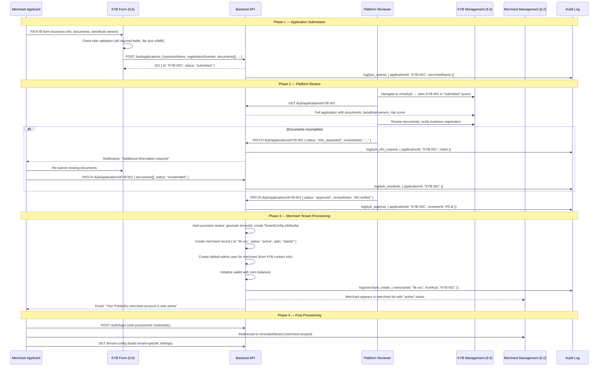
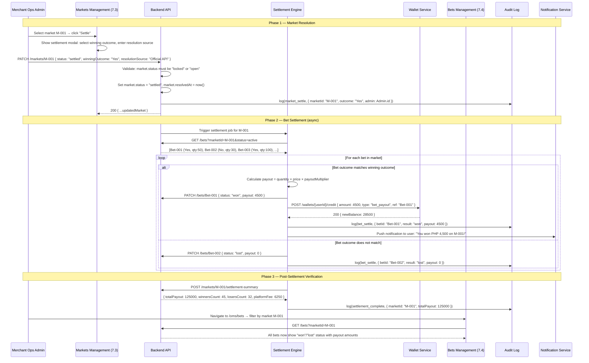
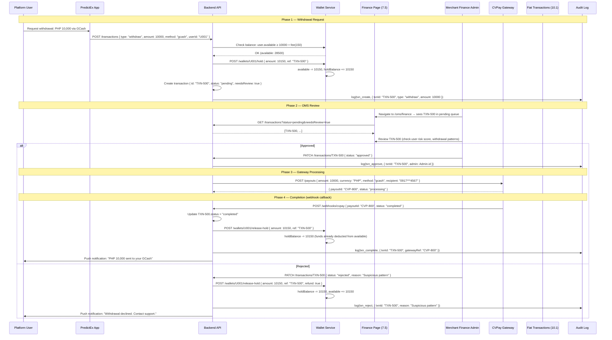
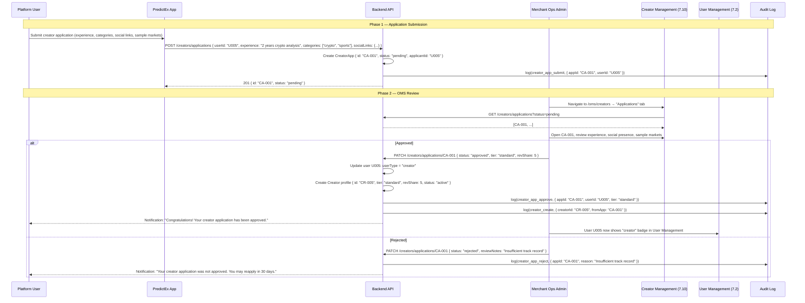
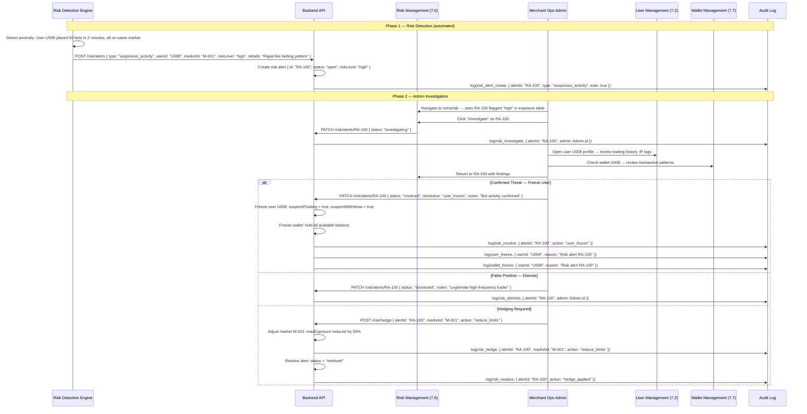

# PredictEx PaaS OMS - Product Requirements Document

**Version:** 1.4
**Date:** April 18, 2026
**Author:** Product Management
**Status:** Draft for Engineering Review
**Platform:** PredictEx PaaS (Platform-as-a-Service) Order Management System

---

## Table of Contents

1. [Executive Summary](#1-executive-summary)
2. [Product Overview](#2-product-overview)
3. [Architecture & Technical Foundation](#3-architecture--technical-foundation)
4. [Authentication & Access Control](#4-authentication--access-control)
5. [Module Index](#5-module-index)
6. [Platform-Level Modules](#6-platform-level-modules)
   - 6.1 [Platform Overview Dashboard](#61-platform-overview-dashboard)
   - 6.2 [Merchant Management](#62-merchant-management)
   - 6.3 [Merchant Detail](#63-merchant-detail)
   - 6.4 [Billing & Subscription](#64-billing--subscription)
   - 6.5 [KYB Management (Platform Review)](#65-kyb-management-platform-review)
   - 6.6 [KYB Application Form (Merchant-Facing)](#66-kyb-application-form-merchant-facing)
   - 6.7 [PaaS Admin Configuration](#67-paas-admin-configuration)
   - 6.8 [PaaS Merchant View](#68-paas-merchant-view)
   - 6.9 [Admin User Management](#69-admin-user-management)
   - 6.10 [Payment Providers](#610-payment-providers)
   - 6.11 [Payment Methods](#611-payment-methods)
7. [Merchant-Scoped Operations Modules](#7-merchant-scoped-operations-modules)
   - 7.1 [Merchant Dashboard](#71-merchant-dashboard)
   - 7.2 [User Management](#72-user-management)
   - 7.3 [Markets Management](#73-markets-management)
   - 7.4 [Bets Management](#74-bets-management)
   - 7.5 [Finance & Transactions](#75-finance--transactions)
   - 7.6 [Risk Management](#76-risk-management)
   - 7.7 [Wallet Management](#77-wallet-management)
   - 7.8 [Odds Configuration](#78-odds-configuration)
   - 7.9 [Fast Bet Configuration](#79-fast-bet-configuration)
   - 7.10 [Creator Management](#710-creator-management)
8. [Programs & Growth Modules](#8-programs--growth-modules)
   - 8.1 [Rewards Management](#81-rewards-management)
   - 8.2 [Affiliates Management](#82-affiliates-management)
   - 8.3 [Leaderboard Management](#83-leaderboard-management)
   - 8.4 [Promotions Management](#84-promotions-management)
9. [System & Infrastructure Modules](#9-system--infrastructure-modules)
   - 9.1 [Content Management](#91-content-management)
   - 9.2 [Notifications Management](#92-notifications-management)
   - 9.3 [Reports & Analytics](#93-reports--analytics)
   - 9.4 [Audit Trail](#94-audit-trail)
   - 9.5 [Support / Ticketing](#95-support--ticketing)
   - 9.6 [Settings](#96-settings)
10. [Finance Sub-Modules (CVPay Fiat Gateway)](#10-finance-sub-modules-cvpay-fiat-gateway)
    - 10.1 [Fiat Transactions](#101-fiat-transactions)
    - 10.2 [Fiat Gateway Configuration](#102-fiat-gateway-configuration)
    - 10.3 [CVPay Merchant Configuration](#103-cvpay-merchant-configuration)
11. [Shared Infrastructure & Components](#11-shared-infrastructure--components)
12. [Internationalization (i18n)](#12-internationalization-i18n)
13. [RBAC Permission Matrix](#13-rbac-permission-matrix)
14. [Tenant Configuration Schema](#14-tenant-configuration-schema)
15. [Audit Logging Specification](#15-audit-logging-specification)
16. [Non-Functional Requirements](#16-non-functional-requirements)
17. [Glossary](#17-glossary)
18. [API Contract Specifications](#18-api-contract-specifications)
    - 18.1 [API Conventions](#181-api-conventions)
    - 18.2 [Authentication APIs](#182-authentication-apis)
    - 18.3 [Merchant APIs](#183-merchant-apis)
    - 18.4 [User Management APIs](#184-user-management-apis)
    - 18.5 [Market APIs](#185-market-apis)
    - 18.6 [Bet APIs](#186-bet-apis)
    - 18.7 [Transaction & Finance APIs](#187-transaction--finance-apis)
    - 18.8 [Wallet APIs](#188-wallet-apis)
    - 18.9 [Risk APIs](#189-risk-apis)
    - 18.10 [Creator APIs](#1810-creator-apis)
    - 18.11 [Rewards & Promotions APIs](#1811-rewards--promotions-apis)
    - 18.12 [Affiliate APIs](#1812-affiliate-apis)
    - 18.13 [Leaderboard APIs](#1813-leaderboard-apis)
    - 18.14 [Content & Notification APIs](#1814-content--notification-apis)
    - 18.15 [Audit Log APIs](#1815-audit-log-apis)
    - 18.16 [Support Ticket APIs](#1816-support-ticket-apis)
    - 18.17 [Billing & Subscription APIs](#1817-billing--subscription-apis)
    - 18.18 [KYB APIs](#1818-kyb-apis)
    - 18.19 [Tenant Configuration APIs](#1819-tenant-configuration-apis)
    - 18.20 [Admin User APIs](#1820-admin-user-apis)
    - 18.21 [Payment Provider & Method APIs](#1821-payment-provider--method-apis)
    - 18.22 [CVPay / Fiat Gateway APIs](#1822-cvpay--fiat-gateway-apis)
    - 18.23 [Odds & Fast Bet APIs](#1823-odds--fast-bet-apis)
    - 18.24 [Reports & Analytics APIs](#1824-reports--analytics-apis)
    - 18.25 [Settings APIs](#1825-settings-apis)
    - 18.26 [Platform Overview APIs](#1826-platform-overview-apis)
    - 18.27 [Merchant Dashboard APIs](#1827-merchant-dashboard-apis)
    - 18.28 [Admin Notification Feed APIs](#1828-admin-notification-feed-apis)
    - 18.29 [Content Banner APIs](#1829-content-banner-apis)
    - 18.30 [Search APIs](#1830-search-apis)
    - 18.31 [Webhook Event Schemas](#1831-webhook-event-schemas)
    - 18.32 [Error Code Reference](#1832-error-code-reference)
    - 18.33 [Rate Limiting](#1833-rate-limiting)
19. [Sequence Diagrams](#19-sequence-diagrams)
    - 19.1 [KYB Approval → Merchant Creation](#191-kyb-approval--merchant-creation)
    - 19.2 [Market Settlement → Bet Payout](#192-market-settlement--bet-payout)
    - 19.3 [Fiat Withdrawal Flow](#193-fiat-withdrawal-flow)
    - 19.4 [Creator Application → Approval](#194-creator-application--approval)
    - 19.5 [Risk Alert → Investigation → Resolution](#195-risk-alert--investigation--resolution)
20. [KYC Module — Future Scope](#20-kyc-module--future-scope)
21. [Test Case Matrix](#21-test-case-matrix)
22. [Integration Dependency Graph](#22-integration-dependency-graph)
23. [Changelog](#23-changelog)

---

## 1. Executive Summary

PredictEx PaaS OMS is a **multi-tenant SaaS admin panel** that powers the operational backbone of the PredictEx prediction market ecosystem. It serves as the centralized management system for:

- **Platform Operators** (PredictEx staff) who oversee all merchants, billing, compliance (KYB), payment infrastructure, and global configurations
- **Merchant Operators** (B2B clients) who manage their own prediction market instances including users, markets, bets, finance, risk, content, and growth programs

The system currently comprises **35 pages** across **6 route groups**, with full RBAC authorization, 4-locale internationalization, client-side audit logging, tenant-scoped configuration management with schema versioning, and a comprehensive shared component library.

**Target Markets:** Philippines (primary), Southeast Asia expansion
**Currency:** PHP (Philippine Peso) primary, multi-currency capable
**Regulatory Context:** Philippine prediction market / e-gaming regulations

---

## 2. Product Overview

### 2.1 Vision

Deliver a white-label prediction market platform where any licensed operator can launch their own branded prediction market with full operational tooling in under 48 hours.

### 2.2 Key Value Props

| Stakeholder | Value |
|---|---|
| **PredictEx Platform** | Revenue via SaaS subscriptions + revenue share; centralized compliance |
| **Merchant Operators** | Turnkey prediction market with full admin tooling; focus on growth, not infrastructure |
| **End Users** | Localized, regulated prediction market experience |

### 2.3 Multi-Tenancy Model

```
PredictEx Platform (Super-tenant)
  |
  +-- MCH001: PredictEx (flagship, enterprise)
  +-- MCH002: BetManila (growth plan)
  +-- MCH003: Sugal PH (enterprise)
  +-- MCH004: PinoyBets (onboarding, starter)
  +-- MCH005: WagerPH (suspended, growth)
  +-- MCH006: Tongits Live (active, growth)
  +-- MCH007: ColorBet Arena (active, starter)
  +-- MCH008: MegaPusta (deactivated, starter)
```

Each merchant tenant has:
- Isolated user base, markets, bets, wallets, and financial data
- Configurable field visibility, permissions, and account policies (via [PaaS Admin Config](#67-paas-admin-configuration))
- Own domain, branding, and payment method configuration
- Scoped admin accounts with role-based access

### 2.4 Subscription Plans

| Plan | Price | Rev Share | Key Features |
|---|---|---|---|
| **Starter** | $499/mo | 15% GGR | Up to 10 markets, basic analytics |
| **Growth** | $1,499/mo | 10% GGR | Up to 50 markets, API access, custom branding |
| **Enterprise** | $4,999/mo | 5% GGR | Unlimited markets, dedicated support, SLA |
| **Custom** | Negotiated | Negotiated | Full white-label, custom features |

---

## 3. Architecture & Technical Foundation

### 3.1 Frontend Stack

| Layer | Technology |
|---|---|
| **Framework** | React 18+ with TypeScript |
| **Routing** | React Router v7 (Data mode with `createBrowserRouter`) |
| **Styling** | Tailwind CSS v4, Poppins/Inter fonts, `fontFeatureSettings: 'ss04'` |
| **Charts** | Recharts (AreaChart, BarChart, PieChart, LineChart) |
| **State** | React Context (Auth, Tenant Config, I18n) + useState |
| **Persistence** | localStorage (configs, audit logs, auth state) |
| **Build** | Lazy-loaded route modules via `React.lazy()` wrappers |

### 3.2 Route Structure

All OMS routes live under `/oms/*` with `OmsLayout` as the wrapper:

```
/oms                          -> Platform Overview (index)
/oms/merchants                -> Merchant list
/oms/merchants/:id            -> Merchant detail
/oms/billing                  -> Billing & Subscriptions
/oms/dashboard                -> Merchant Dashboard
/oms/users                    -> User Management
/oms/markets                  -> Markets Management
/oms/bets                     -> Bets Management
/oms/finance                  -> Finance & Transactions
/oms/finance/fiat-transactions -> Fiat Transaction Monitoring
/oms/finance/fiat-gateway-config -> Fiat Gateway Config
/oms/finance/cvpay-config     -> CVPay Merchant Config
/oms/risk                     -> Risk Management
/oms/wallet                   -> Wallet Management
/oms/odds                     -> Odds Configuration
/oms/fast-bet                 -> Fast Bet Configuration
/oms/creators                 -> Creator Management
/oms/rewards                  -> Rewards Programs
/oms/affiliates               -> Affiliate Management
/oms/leaderboard              -> Leaderboard Management
/oms/promos                   -> Promotions
/oms/content                  -> Content Management
/oms/notif-mgmt               -> Notification Management
/oms/reports                  -> Reports & Analytics
/oms/audit                    -> Audit Trail
/oms/support                  -> Support Ticketing
/oms/settings                 -> Merchant Settings
/oms/paas-config              -> PaaS Admin Configuration (Platform Only)
/oms/paas-merchant            -> PaaS Merchant View (Read-Only for Merchants)
/oms/payment-methods          -> Payment Method Config
/oms/payment-providers        -> Payment Provider Config (Platform Only)
/oms/admin-users              -> Admin User Management
/oms/kyb                      -> KYB Review (Platform Only)
/oms/kyb-apply                -> KYB Application (Standalone, no OMS layout)
```

### 3.3 Shared Component Library

Located in `/src/app/components/oms/`:

| File | Purpose | Key Exports |
|---|---|---|
| `oms-auth.tsx` | Auth context, login/2FA/password flows, merchant CRUD | `OmsAuthProvider`, `useOmsAuth`, `isPlatformUser`, `AdminUser`, `Merchant` |
| `oms-tenant-config.tsx` | Tenant config context, schema versioning, migrations | `TenantConfigProvider`, `useTenantConfig`, `loadConfig`, `TenantConfig`, `TenantRole` |
| `oms-rbac.tsx` | Role-based access control guards | `useRbac`, `RbacGuard`, `hasActionPermission` |
| `oms-i18n.tsx` | i18n provider, 4-locale translation dictionaries | `I18nProvider`, `useI18n`, `tNavLabel`, `OmsLocale` |
| `oms-audit-log.tsx` | Client-side audit trail, action logging | `logAudit`, `getAuditLog`, `AuditAction` |
| `oms-layout.tsx` | Sidebar nav, header, breadcrumb, login/2FA screens | `OmsLayout` |
| `oms-modal.tsx` | Modal system, form fields, toast notifications | `OmsModal`, `OmsField`, `OmsInput`, `showOmsToast` |
| `oms-pagination.tsx` | Table pagination component | `OmsPagination`, `paginate` |
| `oms-table-skeleton.tsx` | Loading skeleton for tables | `OmsTableSkeleton` |
| `oms-csv-export.tsx` | CSV download utility | `downloadCSV` |
| `oms-command-palette.tsx` | Cmd+K search palette | `CommandPalette` |
| `oms-notification-center.tsx` | In-app notification bell | `NotificationCenter` |
| `oms-breadcrumb.tsx` | Route-aware breadcrumb | `OmsBreadcrumb` |
| `oms-icons.tsx` | All OMS sidebar/UI icons | 25+ icon components |

### 3.4 Data Layer

Currently uses **mock data** in `/src/app/data/oms-mock.ts` with the following entity types:

- `OmsUserRecord` - End users (with wallet, PNL, trade history, KYC status)
- `OmsTransaction` - Deposits/withdrawals
- `OmsBet` - Bet records with type, status, odds
- `OmsWallet` - User wallets with balances, PNL, activity
- `OmsWalletTx` - Wallet transaction history (9 transaction types)
- `OmsCreator` / `OmsCreatorApp` - Creator profiles and applications
- `OmsNotification` - Admin notification feed (bell icon)
- `OmsUserFinancials` - Per-user financial summaries (balance, PNL, volume)
- `OmsPlatformStats` - Aggregated platform statistics
- `CommandEntry` - Command palette search entries
- Mock daily flow data, payment breakdowns

**Production Migration Notes:**
- All mock data to be replaced with API calls
- localStorage persistence (configs, audit logs) to migrate to server-side storage
- Tenant configs to be stored in a configuration service with versioning

---

## 4. Authentication & Access Control

### 4.1 Auth Flow

```
Login Screen (email + password)
    |
    +-- Validation against stored accounts
    |
    +-- Account Status Check:
    |     - "disabled" -> reject with "Account Disabled" message
    |     - "first_login" / needsPasswordChange -> Force Password Change screen
    |     - "active" -> proceed
    |
    +-- 2FA Gate (if applicable):
    |     - 6-digit verification code
    |     - Demo code displayed in UI for testing
    |
    +-- Success -> Auto-set active merchant based on merchantId
    |
    +-- Alternative: Email Verification Code Login
          - Request code -> Enter code -> Login
```

### 4.2 Password Policy

- Minimum 8 characters
- Must include at least 2 of: uppercase, lowercase, digit, special character
- Auto-generation available: 10-char passwords with guaranteed complexity
- First-login users MUST change their auto-generated password

### 4.3 Role Hierarchy

```
Level 6: platform_admin    - Full platform access, all merchants
Level 5: platform_ops      - Platform operations, billing, KYB, providers
Level 4: merchant_admin    - Full merchant-scoped access
Level 3: merchant_ops      - Operations: users, markets, bets, finance, export
Level 2: merchant_finance  - Finance-focused: transactions, wallets, reports
Level 1: merchant_support  - Support: tickets, user lookup, basic views
```

### 4.4 Admin Roles Detail

| Role | Scope | Description | Key Capabilities |
|---|---|---|---|
| `platform_admin` | Global | PredictEx super-admin | All operations, create/disable admins, delete merchants, PaaS config |
| `platform_ops` | Global | PredictEx operations | Billing, KYB review, payment providers, merchant management |
| `merchant_admin` | Tenant | Merchant administrator | Full merchant ops, create markets, resolve markets, manage settings |
| `merchant_ops` | Tenant | Merchant operations | User management, market ops, bet ops, data export |
| `merchant_finance` | Tenant | Merchant finance | Transactions, wallets, reports, financial data |
| `merchant_support` | Tenant | Merchant support | Support tickets, user lookup, basic read access |

### 4.5 RBAC Action Permission Map

See [Section 13: RBAC Permission Matrix](#13-rbac-permission-matrix) for the complete action-to-role mapping.

### 4.6 Tenant-Level Roles (PaaS Config)

In addition to the admin role hierarchy, the PaaS tenant configuration system defines **5 tenant-scoped roles** that control field visibility and granular permissions within the User Management module:

| Tenant Role | Maps From | Description |
|---|---|---|
| `merchant_admin` | `merchant_admin` | Full tenant access |
| `merchant_ops` | `merchant_ops` | Operations access |
| `merchant_finance` | `merchant_finance` | Financial data access |
| `merchant_support` | `merchant_support` | Support-level access |
| `agent` | (affiliate/agent) | Limited referral-focused access |

Platform roles (`platform_admin`, `platform_ops`) bypass tenant config entirely and have full access.

---

## 5. Module Index

| # | Module | Route | File | Access Level | Status |
|---|---|---|---|---|---|
| 1 | [Platform Overview](#61-platform-overview-dashboard) | `/oms` | `platform-overview.tsx` | Platform | Implemented |
| 2 | [Merchant Management](#62-merchant-management) | `/oms/merchants` | `merchants.tsx` | Platform | Implemented |
| 3 | [Merchant Detail](#63-merchant-detail) | `/oms/merchants/:id` | `merchant-detail.tsx` | Platform | Implemented |
| 4 | [Billing & Subscription](#64-billing--subscription) | `/oms/billing` | `billing.tsx` | Platform | Implemented |
| 5 | [KYB Management](#65-kyb-management-platform-review) | `/oms/kyb` | `kyb.tsx` | Platform | Implemented |
| 6 | [KYB Application](#66-kyb-application-form-merchant-facing) | `/oms/kyb-apply` | `kyb-apply.tsx` | Public | Implemented |
| 7 | [PaaS Admin Config](#67-paas-admin-configuration) | `/oms/paas-config` | `paas-config.tsx` | Platform | Implemented |
| 8 | [PaaS Merchant View](#68-paas-merchant-view) | `/oms/paas-merchant` | `paas-merchant.tsx` | All | Implemented |
| 9 | [Admin User Mgmt](#69-admin-user-management) | `/oms/admin-users` | `oms-admin-users.tsx` | Platform | Implemented |
| 10 | [Payment Providers](#610-payment-providers) | `/oms/payment-providers` | `payment-providers.tsx` | Platform | Implemented |
| 11 | [Payment Methods](#611-payment-methods) | `/oms/payment-methods` | `payment-methods.tsx` | Platform | Implemented |
| 12 | [Merchant Dashboard](#71-merchant-dashboard) | `/oms/dashboard` | `dashboard.tsx` | Merchant+ | Implemented |
| 13 | [User Management](#72-user-management) | `/oms/users` | `users.tsx` | Merchant+ | Implemented |
| 14 | [Markets Management](#73-markets-management) | `/oms/markets` | `markets-mgmt.tsx` | Merchant+ | Implemented |
| 15 | [Bets Management](#74-bets-management) | `/oms/bets` | `bets.tsx` | Merchant+ | Implemented |
| 16 | [Finance & Transactions](#75-finance--transactions) | `/oms/finance` | `finance.tsx` | Merchant+ | Implemented |
| 17 | [Risk Management](#76-risk-management) | `/oms/risk` | `risk.tsx` | Merchant+ | Implemented |
| 18 | [Wallet Management](#77-wallet-management) | `/oms/wallet` | `wallet.tsx` | Merchant+ | Implemented |
| 19 | [Odds Configuration](#78-odds-configuration) | `/oms/odds` | `odds.tsx` | Merchant+ | Implemented |
| 20 | [Fast Bet Config](#79-fast-bet-configuration) | `/oms/fast-bet` | `fast-bet-config.tsx` | Merchant+ | Implemented |
| 21 | [Creator Management](#710-creator-management) | `/oms/creators` | `creators.tsx` | Merchant+ | Implemented |
| 22 | [Rewards Management](#81-rewards-management) | `/oms/rewards` | `rewards-mgmt.tsx` | Merchant+ | Implemented |
| 23 | [Affiliates Management](#82-affiliates-management) | `/oms/affiliates` | `affiliates-mgmt.tsx` | Merchant+ | Implemented |
| 24 | [Leaderboard Mgmt](#83-leaderboard-management) | `/oms/leaderboard` | `leaderboard-mgmt.tsx` | Merchant+ | Implemented |
| 25 | [Promotions](#84-promotions-management) | `/oms/promos` | `promos.tsx` | Merchant+ | Implemented |
| 26 | [Content Management](#91-content-management) | `/oms/content` | `content.tsx` | Merchant+ | Implemented |
| 27 | [Notification Mgmt](#92-notifications-management) | `/oms/notif-mgmt` | `notifications-mgmt.tsx` | Merchant+ | Implemented |
| 28 | [Reports & Analytics](#93-reports--analytics) | `/oms/reports` | `reports.tsx` | Merchant+ | Implemented |
| 29 | [Audit Trail](#94-audit-trail) | `/oms/audit` | `audit.tsx` | Merchant+ | Implemented |
| 30 | [Support / Ticketing](#95-support--ticketing) | `/oms/support` | `support.tsx` | Merchant+ | Implemented |
| 31 | [Settings](#96-settings) | `/oms/settings` | `settings.tsx` | Merchant+ | Implemented |
| 32 | [Fiat Transactions](#101-fiat-transactions) | `/oms/finance/fiat-transactions` | `fiat-transactions.tsx` | Merchant+ | Implemented |
| 33 | [Fiat Gateway Config](#102-fiat-gateway-configuration) | `/oms/finance/fiat-gateway-config` | `fiat-gateway-config.tsx` | Merchant+ | Implemented |
| 34 | [CVPay Config](#103-cvpay-merchant-configuration) | `/oms/finance/cvpay-config` | `cvpay-config.tsx` | Merchant+ | Implemented |

---

## 6. Platform-Level Modules

> These modules are accessible only to `platform_admin` and `platform_ops` roles (or have platform-gated sections).

---

### 6.1 Platform Overview Dashboard

**Route:** `/oms` (index)
**File:** `platform-overview.tsx`
**Access:** `platform_admin`, `platform_ops`

#### Purpose
Aggregated cross-merchant view of the entire PredictEx PaaS platform performance.

#### Data Points
- **Total Platform Revenue** (weekly trend, AreaChart)
- **Active Merchants** count with status breakdown
- **Total Platform Users** (aggregated across all tenants)
- **Total Bets / Volume** (aggregated)
- **Merchant leaderboard** table (sortable by GGR, users, markets)
- **Revenue by day** chart (Mon-Sun)

#### Key Features
- Revenue charts with Recharts (AreaChart, BarChart)
- Click-through to individual merchant details
- CSV export of merchant performance data (RBAC: `export_data`)
- Loading skeletons via `OmsTableSkeleton`
- Data auto-adjusts based on merchant count

#### Functional Requirements
| ID | Requirement | Priority |
|---|---|---|
| PO-01 | Display aggregated platform KPIs (revenue, users, bets, merchants) | P0 |
| PO-02 | Weekly revenue trend chart (7 days) | P0 |
| PO-03 | Merchant performance table with sort/filter | P0 |
| PO-04 | Click merchant row to navigate to `/oms/merchants/:id` | P1 |
| PO-05 | CSV export of platform data | P1 |
| PO-06 | Loading skeleton while data loads | P1 |

#### Dependencies
- [Merchant Management](#62-merchant-management) (merchant data)
- [Reports & Analytics](#93-reports--analytics) (detailed breakdowns)

---

### 6.2 Merchant Management

**Route:** `/oms/merchants`
**File:** `merchants.tsx`
**Access:** `platform_admin`, `platform_ops`

#### Purpose
Full CRUD management of all merchant tenants on the platform.

#### Merchant Entity (`Merchant` interface)

```typescript
interface Merchant {
  id: string;           // e.g. "MCH001"
  name: string;         // e.g. "PredictEx"
  slug: string;         // URL-safe slug
  logo: string;         // 2-char abbreviation
  primaryDomain: string; // e.g. "predictex.ph"
  status: "active" | "onboarding" | "suspended" | "deactivated";
  plan: "starter" | "growth" | "enterprise" | "custom";
  country: string;
  currency: string;
  createdAt: string;
  ggr: number;          // Gross Gaming Revenue (PHP)
  users: number;
  markets: number;
}
```

#### Features
- **Search & Filter:** Text search, status filter, plan filter
- **Merchant Table:** ID, name, domain, status badge, plan badge, GGR, users, markets
- **Actions per merchant:**
  - View detail (navigate to `/oms/merchants/:id`)
  - Set as active merchant (switch tenant context)
  - Suspend / Activate (with confirmation modal)
  - Edit merchant info
- **Pagination:** `OmsPagination` component
- **Audit logging:** All status changes and edits logged

#### Functional Requirements
| ID | Requirement | Priority |
|---|---|---|
| MM-01 | List all merchants with status/plan badges | P0 |
| MM-02 | Search by name, ID, domain | P0 |
| MM-03 | Filter by status (active/onboarding/suspended/deactivated) | P0 |
| MM-04 | Filter by plan (starter/growth/enterprise/custom) | P1 |
| MM-05 | Suspend merchant with confirmation + audit log | P0 |
| MM-06 | Activate merchant with audit log | P0 |
| MM-07 | Navigate to merchant detail page | P0 |
| MM-08 | Switch active merchant context | P0 |
| MM-09 | Paginated table | P1 |

#### Dependencies
- [Merchant Detail](#63-merchant-detail) (drill-down)
- [KYB Management](#65-kyb-management-platform-review) (onboarding flow)
- [Billing](#64-billing--subscription) (plan management)

---

### 6.3 Merchant Detail

**Route:** `/oms/merchants/:id`
**File:** `merchant-detail.tsx`
**Access:** `platform_admin`, `platform_ops`

#### Purpose
Deep-dive into a single merchant's configuration, API keys, webhooks, admin users, URLs, and compliance status.

#### Tabs

| Tab | Content |
|---|---|
| **Overview** | Merchant info card, KPI summary, status, plan, creation date |
| **URLs** | Primary domain, custom domains, SSL status |
| **Webhooks** | Endpoint management: URL, events, status (active/disabled/failing), success rate, signing secret |
| **API Keys** | Live/test key management: create, rotate, revoke. Key prefix display, last-used tracking |
| **Users** | Admin users scoped to this merchant. Role badges, last login, status |
| **Settings** | Merchant-level configuration (branding, limits, features) |
| **Compliance** | KYB status, license info, regulatory documents |

#### Webhook Endpoint Entity

```typescript
interface WebhookEndpoint {
  id: string;
  url: string;
  events: string[];
  status: "active" | "disabled" | "failing";
  lastTriggered: string;
  successRate: number;
  signingSecret: string;
}
```

#### API Key Entity

```typescript
interface ApiKey {
  id: string;
  name: string;
  type: "live" | "test";
  prefix: string;
  createdAt: string;
  lastUsed: string;
}
```

#### Functional Requirements
| ID | Requirement | Priority |
|---|---|---|
| MD-01 | Display merchant overview with KPIs | P0 |
| MD-02 | Custom domain management (add/remove/verify) | P1 |
| MD-03 | Webhook CRUD with event subscription selection | P0 |
| MD-04 | API key generation (live + test), rotation, revocation | P0 |
| MD-05 | List merchant admin users with roles | P0 |
| MD-06 | Display compliance/KYB status | P1 |
| MD-07 | All actions audit-logged | P0 |

#### Dependencies
- [Merchant Management](#62-merchant-management) (parent list)
- [Admin User Management](#69-admin-user-management) (user CRUD)
- [KYB Management](#65-kyb-management-platform-review) (compliance status)

---

### 6.4 Billing & Subscription

**Route:** `/oms/billing`
**File:** `billing.tsx`
**Access:** `platform_admin`, `platform_ops`

#### Purpose
Manage merchant subscription plans, invoices, and platform revenue tracking.

#### Data Models

```typescript
interface Invoice {
  id: string;
  merchantId: string;
  merchantName: string;
  period: string;           // e.g. "March 2026"
  amount: number;           // Total invoice amount (PHP)
  platformFee: number;      // PredictEx platform fee
  status: "paid" | "pending" | "overdue" | "draft";
  dueDate: string;
  paidDate?: string;
}

interface PlanDef {
  name: string;
  key: string;
  price: string;
  revShare: string;
  features: string[];
  color: string;
}
```

#### Features
- **Plan comparison cards** (Starter / Growth / Enterprise / Custom)
- **Invoice table** with status badges, search, filter by status/merchant
- **Revenue summary** KPIs
- **Plan upgrade/downgrade** flow per merchant
- **Invoice generation** and payment tracking

#### Functional Requirements
| ID | Requirement | Priority |
|---|---|---|
| BL-01 | Display all subscription plans with feature comparison | P0 |
| BL-02 | Invoice list with status filtering | P0 |
| BL-03 | Generate invoices for merchants | P1 |
| BL-04 | Track payment status (paid/pending/overdue) | P0 |
| BL-05 | Change merchant plan with confirmation | P0 |
| BL-06 | Revenue summary dashboard | P1 |
| BL-07 | Audit log all billing actions | P0 |

#### Dependencies
- [Merchant Management](#62-merchant-management) (merchant context)

---

### 6.5 KYB Management (Platform Review)

**Route:** `/oms/kyb`
**File:** `kyb.tsx`
**Access:** `platform_admin`, `platform_ops`

#### Purpose
Review and process Know Your Business (KYB) applications from prospective merchants.

#### KYB Workflow States

```
submitted -> under_review -> approved -> credentials_sent
                          -> rejected
                          -> info_requested -> resubmitted -> under_review
```

#### Features
- **Application queue** with status filters
- **Document review panel** (SEC registration, DTI, BIR, etc.)
- **Approve / Reject / Request Info** actions with reason modals
- **Auto-credential generation** on approval (creates merchant + admin account)
- **Application timeline** showing all status transitions
- **Audit logging** for all review actions

#### Audit Actions
- `kyb_submit`, `kyb_review_start`, `kyb_approve`, `kyb_reject`, `kyb_request_info`, `kyb_credential_sent`

#### Functional Requirements
| ID | Requirement | Priority |
|---|---|---|
| KYB-01 | List all KYB applications with status badges | P0 |
| KYB-02 | Filter by status (submitted/under_review/approved/rejected) | P0 |
| KYB-03 | Review application details with document viewer | P0 |
| KYB-04 | Approve application with auto-merchant creation | P0 |
| KYB-05 | Reject with reason | P0 |
| KYB-06 | Request additional info with message | P1 |
| KYB-07 | Auto-generate admin credentials on approval | P0 |
| KYB-08 | Application timeline/history | P1 |
| KYB-09 | All review actions audit-logged | P0 |

#### Dependencies
- [KYB Application Form](#66-kyb-application-form-merchant-facing) (intake)
- [Merchant Management](#62-merchant-management) (merchant creation on approval)
- [Admin User Management](#69-admin-user-management) (credential creation)

---

### 6.6 KYB Application Form (Merchant-Facing)

**Route:** `/oms/kyb-apply` (standalone, no OMS layout)
**File:** `kyb-apply.tsx`
**Access:** Public (no auth required)

#### Purpose
Public-facing multi-step application form for prospective merchants to apply for a PredictEx PaaS merchant account.

#### Form Sections

| Step | Section | Fields |
|---|---|---|
| 1 | **Business Information** | Business name, type (corporation/partnership/sole_proprietor/cooperative), registration number, TIN, address, country, plan selection |
| 2 | **Contact Details** | Contact person name, email, phone, position |
| 3 | **Document Uploads** | SEC/DTI registration, BIR certificate, valid ID, proof of address, gaming license (optional) |
| 4 | **Domain & Branding** | Desired domain, brand name, logo upload |
| 5 | **Review & Submit** | Summary of all information with edit capability |

#### Document Upload Entity

```typescript
interface DocUpload {
  id: string;
  type: string;
  label: string;
  required: boolean;
  file?: File;
  status: "pending" | "uploaded" | "verified" | "rejected";
}
```

#### Functional Requirements
| ID | Requirement | Priority |
|---|---|---|
| KA-01 | Multi-step wizard with progress indicator | P0 |
| KA-02 | Business type selection with dynamic required fields | P0 |
| KA-03 | Document upload with file type validation | P0 |
| KA-04 | Plan selection (Starter/Growth/Enterprise) | P0 |
| KA-05 | Review summary before submission | P0 |
| KA-06 | Form validation with inline error messages | P0 |
| KA-07 | Success confirmation screen with application ID | P0 |
| KA-08 | No authentication required (standalone page) | P0 |

#### Dependencies
- [KYB Management](#65-kyb-management-platform-review) (review pipeline)

---

### 6.7 PaaS Admin Configuration

**Route:** `/oms/paas-config`
**File:** `paas-config.tsx`
**Access:** `platform_admin` only (hard guard)

#### Purpose
The central configuration hub for tenant-level field visibility, permission rules, account policies, channel configuration, and API limits. Changes here directly affect what merchant admins can see and do in their scoped OMS views.

#### Tabs

| Tab | Icon | Content |
|---|---|---|
| **Field Visibility** | Eye | Matrix of 15 user fields x 5 tenant roles. Toggle which fields each role can see. |
| **Permission Rules** | Lock | Matrix of 18 permissions x 5 roles. Severity levels: Standard, Elevated, FG ONLY (Critical). |
| **Account Policies** | Gear | 8 account-level policies. Toggle `fgOnly` and `merchantOverride` flags. |
| **Channel Config** | Antenna | 3 acquisition channels (PredictEx Direct, Organic, Agent Referral). Toggle enabled, requiresApproval, autoAssignAgent. |
| **Limits & API** | Wrench | Scalar settings: maxUsersPerTenant, maxCreatorsPerTenant, apiRateLimit, auditLogRetentionDays, webhookUrl, webhookSecret, PII masking, export toggle. |

#### Tenant Selector
- **Global Defaults** - applies to all newly onboarded merchants
- **Per-merchant override** - select any active/onboarding merchant to customize

#### Configuration Persistence
- Configs are persisted to localStorage keyed by merchant ID
- Schema versioned (`CURRENT_SCHEMA_VERSION = 1`) with automatic migrations
- Changes pushed to shared `TenantConfigProvider` context for live propagation to User Management page

#### Change Management
- All changes tracked with `hasChanges` state
- **Save** triggers a diff summary modal listing all changes
- **Confirm** applies changes, persists, and shows success toast
- All saves audit-logged as `config_save`

#### Field Visibility Schema

```typescript
interface FieldVisibility {
  key: string;                           // e.g. "wallet_address"
  label: string;                         // e.g. "Wallet Address"
  description: string;                   // e.g. "KMS-generated wallet address"
  category: "identity" | "activity" | "financial" | "system";
  roles: Record<TenantRole, boolean>;    // Per-role visibility toggle
}
```

**Default Fields (15):**

| Key | Label | Category | Admin | Ops | Finance | Support | Agent |
|---|---|---|---|---|---|---|---|
| `wallet_address` | Wallet Address | Identity | Yes | Yes | Yes | No | No |
| `uid` | UID | Identity | Yes | Yes | Yes | Yes | Yes |
| `nickname` | Nickname | Identity | Yes | Yes | Yes | Yes | Yes |
| `email` | Email (PII) | Identity | Yes | Yes | No | Yes | No |
| `user_type` | User Type | Identity | Yes | Yes | Yes | Yes | Yes |
| `channel` | Channel | Identity | Yes | Yes | Yes | Yes | Yes |
| `recent_ip` | Recent IP | Activity | Yes | Yes | No | No | No |
| `recent_geo` | Geo-location | Activity | Yes | Yes | No | Yes | No |
| `last_login` | Last Login Time | Activity | Yes | Yes | No | Yes | Yes |
| `source` | Source | Activity | Yes | Yes | Yes | No | Yes |
| `agent_name` | Agent Name | Activity | Yes | Yes | No | No | Yes |
| `total_asset` | Total Asset | Financial | Yes | No | Yes | No | No |
| `total_volume` | Total Volume | Financial | Yes | Yes | Yes | No | No |
| `settled_pnl` | Settled PNL | Financial | Yes | No | Yes | No | No |
| `withdraw_history` | Withdrawal History | Financial | Yes | No | Yes | No | No |
| `social_channel` | Social Channel | System | Yes | Yes | No | Yes | No |
| `contact_details` | Contact Details | System | Yes | Yes | No | Yes | No |

#### Permission Rules Schema

```typescript
interface PermissionRule {
  key: string;
  label: string;
  description: string;
  category: "user_mgmt" | "asset_mgmt" | "trading" | "role_mgmt" | "system";
  severity: "normal" | "elevated" | "critical";
  roles: Record<TenantRole, boolean>;
}
```

**Default Permissions (18):**

| Key | Label | Category | Severity | Admin | Ops | Finance | Support | Agent |
|---|---|---|---|---|---|---|---|---|
| `view_user_list` | View User List | User Mgmt | Standard | Yes | Yes | Yes | Yes | Yes |
| `search_users` | Search Users | User Mgmt | Standard | Yes | Yes | Yes | Yes | Yes |
| `export_users` | Export User Data | User Mgmt | Elevated | Yes | No | Yes | No | No |
| `view_assets` | View Asset Info | Asset Mgmt | Standard | Yes | No | Yes | No | No |
| `modify_suspend_trading` | Suspend Trading | Asset Mgmt | **FG ONLY** | No | No | No | No | No |
| `modify_suspend_deposit` | Suspend Deposit | Asset Mgmt | **FG ONLY** | No | No | No | No | No |
| `modify_suspend_withdraw` | Suspend Withdraw | Asset Mgmt | **FG ONLY** | No | No | No | No | No |
| `modify_withdraw_limits` | Modify Withdraw Limits | Asset Mgmt | **FG ONLY** | No | No | No | No | No |
| `modify_whitelist` | Modify Whitelist | Asset Mgmt | **FG ONLY** | No | No | No | No | No |
| `view_trading` | View Trading Info | Trading | Standard | Yes | Yes | Yes | No | No |
| `view_trade_history` | View Trade History | Trading | Standard | Yes | Yes | Yes | No | No |
| `view_user_settings` | View User Settings | Trading | Standard | Yes | Yes | No | Yes | No |
| `view_role` | View Role Info | Role Mgmt | Standard | Yes | Yes | No | No | No |
| `modify_role` | Change User Role | Role Mgmt | Elevated | Yes | No | No | No | No |
| `modify_contact` | Edit Contact Details | Role Mgmt | Standard | Yes | Yes | No | No | No |
| `view_audit_log` | View Audit Log | System | Standard | Yes | Yes | No | No | No |
| `access_api` | API Access | System | Elevated | Yes | No | No | No | No |

> **FG ONLY permissions** cannot be toggled by merchants. Only PredictEx Platform Admins can enable these critical asset management actions.

#### Account Policies Schema

```typescript
interface AccountPolicy {
  key: string;
  label: string;
  description: string;
  fgOnly: boolean;           // Only PredictEx platform can control
  merchantOverride: boolean; // Merchant can override this policy
}
```

**Default Policies (8):**

| Key | Label | FG Only | Merchant Override |
|---|---|---|---|
| `suspend_trading` | Suspend Trading | Yes | No |
| `suspend_deposit` | Suspend Deposit | Yes | No |
| `suspend_withdraw` | Suspend Withdraw | Yes | No |
| `withdraw_limits` | Withdraw Limits | Yes | No |
| `withdraw_fee` | Withdraw Fee | Yes | No |
| `whitelist_toggle` | Whitelist Management | Yes | No |
| `role_assignment` | Role Assignment | No | Yes |
| `contact_edit` | Contact Editing | No | Yes |

#### Channel Config Schema

```typescript
interface ChannelConfig {
  key: string;
  label: string;
  enabled: boolean;
  requiresApproval: boolean;
  autoAssignAgent: boolean;
}
```

**Default Channels (3):**

| Key | Label | Enabled | Approval Required | Auto-Assign Agent |
|---|---|---|---|---|
| `FG` | PredictEx Direct | Yes | No | No |
| `organic` | Organic | Yes | No | No |
| `agent` | Agent Referral | Yes | Yes | Yes |

#### Limits & API Defaults

| Setting | Default Value |
|---|---|
| `maxUsersPerTenant` | 1,000,000 |
| `maxCreatorsPerTenant` | 500 |
| `userExportEnabled` | true |
| `piiMaskingEnabled` | true |
| `auditLogRetentionDays` | 365 |
| `webhookUrl` | (empty) |
| `webhookSecret` | (empty) |
| `apiRateLimit` | 500 req/min |

#### Functional Requirements
| ID | Requirement | Priority |
|---|---|---|
| PC-01 | Field visibility matrix with per-role toggles | P0 |
| PC-02 | Permission rules matrix with severity badges | P0 |
| PC-03 | Critical (FG ONLY) permissions cannot be toggled by non-platform users | P0 |
| PC-04 | Account policy override management | P0 |
| PC-05 | Channel configuration toggles | P0 |
| PC-06 | Tenant selector (Global Defaults + per-merchant) | P0 |
| PC-07 | Category filter on field/permission tabs | P1 |
| PC-08 | Change diff summary modal before save | P0 |
| PC-09 | Config persistence to localStorage with schema versioning | P0 |
| PC-10 | Live propagation to User Management via shared context | P0 |
| PC-11 | Scalar limits configuration (users, creators, API rate, etc.) | P1 |
| PC-12 | Platform-only access guard | P0 |

#### Dependencies
- [PaaS Merchant View](#68-paas-merchant-view) (read-only counterpart)
- [User Management](#72-user-management) (consumes config for field visibility/permissions)
- [Tenant Config Schema](#14-tenant-configuration-schema) (shared types)

---

### 6.8 PaaS Merchant View

**Route:** `/oms/paas-merchant`
**File:** `paas-merchant.tsx`
**Access:** All authenticated OMS users

#### Purpose
Read-only view of the tenant configuration for the current merchant. Shows what the merchant's admins/ops can and cannot see or do, as configured by the platform admin.

#### Tabs

| Tab | Content |
|---|---|
| **Overview** | Role access summary, tenant limits (max users, max creators, API rate, audit retention, PII masking) |
| **Field Access** | Read-only field visibility matrix with role selector |
| **Permissions** | Read-only permission rules with severity/status badges and role selector |
| **Account Policies** | Policy list with FG ONLY / OVERRIDABLE badges |
| **Channel Settings** | Channel list with enabled/approval/agent flags |

#### Summary Cards (5)
- Field Access: `X/Y` visible for current role
- Your Permissions: `X/Y` granted for current role
- Account Policies: `N overridable`
- Channel Settings: `N active`
- API Limits: `N/min`

#### Functional Requirements
| ID | Requirement | Priority |
|---|---|---|
| PM-01 | Summary cards with current role's access counts | P0 |
| PM-02 | Read-only field visibility matrix with role switching | P0 |
| PM-03 | Read-only permission display with severity badges | P0 |
| PM-04 | Account policies with FG ONLY indicators | P0 |
| PM-05 | Channel status display | P0 |
| PM-06 | "Read-Only View" notice for non-platform users | P1 |

#### Dependencies
- [PaaS Admin Config](#67-paas-admin-configuration) (config source)

---

### 6.9 Admin User Management

**Route:** `/oms/admin-users`
**File:** `oms-admin-users.tsx`
**Access:** `platform_admin` (create/disable), `platform_ops` (view)

#### Purpose
Manage all OMS admin accounts across the platform, including account creation with auto-generated passwords, role assignment, enable/disable, and password resets.

#### Features
- **Admin user table** with role badges, status badges, last login, merchant association
- **Create admin** flow: email, name, role selection, merchant assignment, auto-generated password
- **Disable/Enable** accounts with confirmation
- **Reset password** with auto-generation
- **CSV export** of admin user list
- **Search & filter** by role, status, merchant
- **Pagination**

#### Admin Account States
- `active` - Normal operational state
- `first_login` - Auto-generated password, must change on first login
- `disabled` - Account locked by platform admin
- `password_expired` - Password past retention period

#### Audit Actions
- `admin_create`, `admin_edit`, `admin_disable`, `admin_enable`, `admin_reset_pw`, `admin_export_csv`

#### Functional Requirements
| ID | Requirement | Priority |
|---|---|---|
| AU-01 | List all admin users across all merchants | P0 |
| AU-02 | Create admin with auto-generated password meeting policy | P0 |
| AU-03 | Assign role and merchant to new admin | P0 |
| AU-04 | Disable/enable admin accounts | P0 |
| AU-05 | Reset admin password with auto-generation | P0 |
| AU-06 | Search/filter by role, status, merchant | P1 |
| AU-07 | CSV export of admin list | P1 |
| AU-08 | All actions audit-logged | P0 |

#### Dependencies
- [Auth System](#4-authentication--access-control) (account creation, password policy)
- [Merchant Management](#62-merchant-management) (merchant assignment)

---

### 6.10 Payment Providers

**Route:** `/oms/payment-providers`
**File:** `payment-providers.tsx`
**Access:** `platform_admin`, `platform_ops`

#### Purpose
Manage payment gateway providers that power the platform's deposit/withdrawal infrastructure.

#### Provider Entity

```typescript
type ProviderStatus = "active" | "degraded" | "testing" | "disabled" | "maintenance";
type ProviderType = "fiat" | "crypto" | "hybrid";
type RoutingPriority = "primary" | "fallback" | "disabled";
```

#### Features
- Provider list with status indicators (active/degraded/testing/disabled/maintenance)
- Provider type classification (fiat/crypto/hybrid)
- Routing priority configuration (primary/fallback/disabled)
- Health monitoring indicators
- Enable/disable providers
- Integration configuration

#### Functional Requirements
| ID | Requirement | Priority |
|---|---|---|
| PP-01 | List all payment providers with status | P0 |
| PP-02 | Configure routing priority per provider | P0 |
| PP-03 | Enable/disable providers | P0 |
| PP-04 | Display provider health status | P1 |
| PP-05 | Provider type classification | P1 |

#### Dependencies
- [Payment Methods](#611-payment-methods) (provider-method mapping)
- [CVPay Config](#103-cvpay-merchant-configuration) (CVPay-specific provider)

---

### 6.11 Payment Methods

**Route:** `/oms/payment-methods`
**File:** `payment-methods.tsx`
**Access:** `platform_admin`, `platform_ops`

#### Purpose
Configure available payment methods (e-wallets, bank transfers, OTC, crypto, stablecoins, cards) and their per-merchant availability.

#### Payment Method Entity

```typescript
type PaymentMethodCategory = "e_wallet" | "bank_transfer" | "otc" | "crypto" | "stablecoin" | "card";
type PaymentMethodStatus = "live" | "testing" | "maintenance" | "disabled";

interface PaymentMethodConfig {
  id: string;
  name: string;
  category: PaymentMethodCategory;
  status: PaymentMethodStatus;
  provider: string;
  minDeposit: number;
  maxDeposit: number;
  minWithdraw: number;
  maxWithdraw: number;
  depositFee: number;
  withdrawFee: number;
  // ... additional config
}
```

#### Features
- Payment method list grouped by category
- Status management (live/testing/maintenance/disabled)
- Deposit/withdrawal limits and fee configuration
- Per-merchant method availability
- Provider mapping

#### Functional Requirements
| ID | Requirement | Priority |
|---|---|---|
| PMT-01 | List payment methods by category | P0 |
| PMT-02 | Configure limits (min/max deposit/withdraw) per method | P0 |
| PMT-03 | Configure fees per method | P0 |
| PMT-04 | Status management per method | P0 |
| PMT-05 | Per-merchant method activation | P1 |
| PMT-06 | Provider association | P0 |

#### Dependencies
- [Payment Providers](#610-payment-providers) (provider source)
- [Settings](#96-settings) (merchant-level payment config)

---

## 7. Merchant-Scoped Operations Modules

> These modules operate within the context of the active merchant tenant. Platform users can switch between merchants; merchant-scoped users see only their own tenant's data.

---

### 7.1 Merchant Dashboard

**Route:** `/oms/dashboard`
**File:** `dashboard.tsx`
**Access:** All authenticated merchant+ roles

#### Purpose
Real-time operational dashboard for a single merchant tenant with key performance metrics.

#### Features
- **KPI Cards:** Today's Revenue, Active Users, Total Bets, Pending Withdrawals
- **Revenue Chart** (7-day AreaChart with per-day breakdown)
- **Bet Volume Chart** (BarChart)
- **Market Category Distribution** (PieChart)
- **Data scales dynamically** based on merchant profile (GGR, user count)
- Loading skeleton on mount

#### Merchant-Specific Data Scaling
Each merchant gets different data derived from their profile:
- `ggrFactor = merchant.ggr / 78400000` (normalized to PredictEx's scale)
- `userFactor = merchant.users / 485230`
- All KPI values multiply by these factors for realistic per-tenant data

#### Functional Requirements
| ID | Requirement | Priority |
|---|---|---|
| DB-01 | Display 4 KPI cards (revenue, users, bets, withdrawals) | P0 |
| DB-02 | Revenue trend chart (7-day) | P0 |
| DB-03 | Bet volume chart | P1 |
| DB-04 | Market category pie chart | P1 |
| DB-05 | Merchant-specific data scaling | P0 |
| DB-06 | Loading skeleton | P1 |

#### Dependencies
- [Auth Context](#4-authentication--access-control) (active merchant)
- [Finance & Transactions](#75-finance--transactions) (revenue, pending withdrawals)
- [Markets Management](#73-markets-management) (market category distribution)
- [Bets Management](#74-bets-management) (bet volume data)
- [Wallet Management](#77-wallet-management) (wallet balances)

---

### 7.2 User Management

**Route:** `/oms/users`
**File:** `users.tsx`
**Access:** All authenticated roles (field visibility controlled by [PaaS Config](#67-paas-admin-configuration))

#### Purpose
Core user management module with tenant-config-driven field visibility and permissions. The most complex module in the OMS, integrating with PaaS config for dynamic column display.

#### User Entity (`OmsUserRecord`)

There are **two user models** in the mock data layer:

**List Model** (`OmsUser`) — used in user list table, wallet, and lightweight lookups:

```typescript
interface OmsUser {
  id: string;            // e.g. "U001"
  name: string;
  email: string;
  nickname: string;
  userType: "user" | "creator";
  channel: "FG" | "organic" | "agent";
  source: string;        // e.g. "Direct", "Google", "Agent Link"
  agentName: string;     // e.g. "Tony (AG001)" or "-"
  registeredAt: string;
  lastLogin: string;
  recentIp: string;
  recentGeo: string;
  status: "active" | "suspended" | "frozen" | "restricted";
}
```

**Detail Model** (`OmsUserRecord`) — used in user detail modal with full asset, trade, and contact info:

```typescript
interface OmsUserRecord {
  id: string;
  uid: string;              // Numeric UID e.g. "1000001"
  walletAddress: string;    // e.g. "0x7a3B...F2c9"
  nickname: string;
  email: string;
  userType: "user" | "creator";
  channel: "FG" | "organic" | "agent";
  recentIP: string;
  recentGeo: string;
  lastLoginTime: string;
  source: "" | "agent";
  agentName: string;
  totalTrades: number;
  totalVolume: number;
  settledPNL: number;
  trades: OmsTradeRecord[];
  asset: OmsAssetInfo;
  socialChannel: string;         // e.g. "Twitter", "YouTube", "Twitch"
  contactPhone: string;
  contactTelegram: string;
  contactWhatsApp: string;
  language: string;              // e.g. "English", "Filipino"
  timezone: string;              // e.g. "Asia/Manila (UTC+8)"
  twoFactorEnabled: boolean;
  emailNotifications: boolean;
}

interface OmsTradeRecord {
  id: string;
  marketName: string;
  side: "Buy" | "Sell";
  outcome: string;
  quantity: number;
  tradeVolume: number;
  currency: "FGUSD" | "USDT" | "USDC";
  tradeTime: string;
}

interface OmsAssetInfo {
  totalAsset: number;
  available: number;
  positionValue: number;
  lockedBalance: number;
  withdrawFee: number;
  suspendTrading: boolean;
  suspendDeposit: boolean;
  suspendWithdraw: boolean;
  dailyWithdrawLimit: number;
  singleWithdrawMin: number;
  singleWithdrawMax: number;
  totalAnnualWithdrawal: number;
  whitelist: boolean;
  transactions: { hash: string; amount: number; type: string; time: string; chain: string }[];
}
```

> **Note:** The detail model `OmsUserRecord` is returned by `GET /users/:id`. The list model `OmsUser` is returned by `GET /users` (table rows). Fields like `walletAddress`, `kycStatus`, and contact details are only available in the detail view and are subject to `fieldVisibility` filtering.

#### Features
- **Dynamic column visibility** based on current user's tenant role (reads from `TenantConfig.fieldVisibility`)
- **Search** by UID, nickname, email, wallet address
- **Filter** by user type, channel, source
- **User detail modal** with tabs:
  - Asset Information (balances, deposit/withdraw history)
  - Trading Information (trade history, PNL)
  - User Settings (preferences)
  - Role Management (user/creator toggle, contact editing)
  - Audit Log (per-user action history)
- **CSV export** (RBAC-gated: `export_users`)
- **Pagination** with configurable page size
- **PII masking** when enabled in tenant config
- **Badge components:** TypeBadge (user/creator), ChannelBadge (FG/organic/agent)

#### PaaS Config Integration
- On render, reads `tenantConfig.fieldVisibility` to determine which columns to show
- Maps admin role to tenant role via `mapAdminToTenantRole()`
- Platform users bypass config and see all fields
- Permission checks via `tenantConfig.permissions` for actions (export, modify role, etc.)

#### Functional Requirements
| ID | Requirement | Priority |
|---|---|---|
| UM-01 | User table with dynamic column visibility from PaaS config | P0 |
| UM-02 | Search by UID, nickname, email, wallet | P0 |
| UM-03 | Filter by user type, channel, source | P0 |
| UM-04 | User detail modal with tabbed interface | P0 |
| UM-05 | Asset Information tab (balances, suspension toggles) | P0 |
| UM-06 | Trading Information tab (trade history) | P0 |
| UM-07 | Role Management tab (user/creator toggle) | P1 |
| UM-08 | Per-user audit log tab | P1 |
| UM-09 | CSV export with RBAC check | P0 |
| UM-10 | PII masking when config enabled | P1 |
| UM-11 | Pagination | P0 |
| UM-12 | Platform users see all fields regardless of config | P0 |

#### Dependencies
- [PaaS Admin Config](#67-paas-admin-configuration) (field visibility, permissions)
- [Tenant Config Context](#14-tenant-configuration-schema) (runtime config)

---

### 7.3 Markets Management

**Route:** `/oms/markets`
**File:** `markets-mgmt.tsx`
**Access:** `merchant_admin`+ (create/resolve requires `merchant_admin`)

#### Purpose
Full lifecycle management of prediction markets from creation to resolution.

#### Market Entity

```typescript
type MarketStatus = "open" | "locked" | "settled" | "voided" | "pending";
type MarketCategory = "basketball" | "boxing" | "esports" | "color_game" | "lottery" | "weather" | "economy" | "showbiz";

interface OmsMarket {
  id: string;          // e.g. "MKT001"
  title: string;
  category: MarketCategory;
  status: MarketStatus;
  totalVolume: number;
  betCount: number;
  creatorId: string | null;  // null = platform-created, "CR001" = community-created
  createdAt: string;
  closesAt: string;    // e.g. "2026-03-15 19:00 PHT"
}
```

#### Features
- **Market table** with status badges, category, volume, participants
- **Create market** modal (title, category, outcomes, expiration, odds type)
- **Resolve market** flow with outcome selection and confirmation
- **Cancel market** with reason
- **Pending review** queue for community-created markets
- **Search & filter** by status, category, creator
- **Pagination** and **CSV export**

#### Functional Requirements
| ID | Requirement | Priority |
|---|---|---|
| MK-01 | List all markets with status/category badges | P0 |
| MK-02 | Create market with full configuration | P0 |
| MK-03 | Resolve market with outcome confirmation | P0 |
| MK-04 | Cancel market with reason | P0 |
| MK-05 | Pending review queue for creator-submitted markets | P1 |
| MK-06 | Search/filter by status, category | P0 |
| MK-07 | Pagination and CSV export | P1 |
| MK-08 | All actions audit-logged | P0 |

#### Dependencies
- [Odds Configuration](#78-odds-configuration) (odds settings per market)
- [Bets Management](#74-bets-management) (bet data per market)

---

### 7.4 Bets Management

**Route:** `/oms/bets`
**File:** `bets.tsx`
**Access:** `merchant_ops`+

#### Purpose
Monitor and manage all bet records with void capability.

#### Bet Entity

```typescript
type BetStatus = "active" | "won" | "lost" | "void" | "pending";
type BetType = "standard" | "fast_bet" | "limit_order";

interface OmsBet {
  id: string;
  userId: string;
  user: string;          // Denormalized display name
  marketId: string;
  market: string;        // Denormalized market title
  type: BetType;
  selection: string;     // e.g. "Ginebra", "Pula", "ECHO"
  amount: number;
  odds: string;          // e.g. "1.65", "x6"
  potentialPayout: number;
  status: BetStatus;
  placedAt: string;
  suspicious: boolean;   // Flagged by risk engine
}
```

#### Features
- **Bet table** with status badges, type badges
- **Void bet** action with confirmation modal (RBAC: `void_bet`)
- **Bet detail** modal with full breakdown
- **Search** by bet ID, user ID, market title
- **Filter** by status, type
- **Pagination** and **CSV export**

#### Functional Requirements
| ID | Requirement | Priority |
|---|---|---|
| BT-01 | List all bets with status/type badges | P0 |
| BT-02 | Void bet with confirmation and reason | P0 |
| BT-03 | Bet detail modal | P0 |
| BT-04 | Search by bet ID, user ID, market | P0 |
| BT-05 | Filter by status, type | P0 |
| BT-06 | Pagination and CSV export | P1 |
| BT-07 | Audit log void actions | P0 |

#### Dependencies
- [Markets Management](#73-markets-management) (market context)
- [User Management](#72-user-management) (user context)

---

### 7.5 Finance & Transactions

**Route:** `/oms/finance`
**File:** `finance.tsx`
**Access:** `merchant_finance`+ (approve/reject requires `merchant_ops`+)

#### Purpose
Transaction monitoring hub with deposit/withdrawal management, daily flow charts, and payment breakdown analytics.

#### Transaction Entity

```typescript
type TxnType = "deposit" | "withdrawal";
type TxnStatus = "completed" | "processing" | "pending" | "failed" | "review";
type PaymentMethod = "GCash" | "Maya" | "Bank Transfer" | "7-Eleven" | "Cebuana";

interface OmsTransaction {
  id: string;
  userId: string;
  user: string;          // Denormalized display name
  type: TxnType;
  method: PaymentMethod;
  amount: number;
  fee: number;
  status: TxnStatus;
  reference: string;     // e.g. "MAYA-2026031345678"
  createdAt: string;
  needsReview: boolean;  // Flagged for manual review
}
```

#### Features
- **Transaction table** with status badges
- **Approve/Reject** pending transactions (RBAC-gated)
- **Daily flow chart** (BarChart: deposits vs withdrawals)
- **Payment breakdown** by method
- **Sub-navigation** links to:
  - [Fiat Transactions](#101-fiat-transactions)
  - [Fiat Gateway Config](#102-fiat-gateway-configuration)
  - [CVPay Config](#103-cvpay-merchant-configuration)
- **Search, filter, pagination, CSV export**

#### Audit Actions
- `txn_approve`, `txn_reject`

#### Functional Requirements
| ID | Requirement | Priority |
|---|---|---|
| FN-01 | Transaction list with status badges | P0 |
| FN-02 | Approve/reject pending transactions | P0 |
| FN-03 | Daily deposit/withdrawal flow chart | P1 |
| FN-04 | Payment method breakdown | P1 |
| FN-05 | Links to fiat sub-modules | P0 |
| FN-06 | Search, filter, pagination, export | P0 |
| FN-07 | Audit log approve/reject actions | P0 |

#### Dependencies
- [Fiat Transactions](#101-fiat-transactions) (fiat sub-module)
- [Wallet Management](#77-wallet-management) (wallet balances)

---

### 7.6 Risk Management

**Route:** `/oms/risk`
**File:** `risk.tsx`
**Access:** `merchant_ops`+ (investigate/resolve requires `merchant_ops`+)

#### Purpose
Monitor market exposure, detect suspicious activity, and manage risk mitigation.

#### Data Models

```typescript
type RiskLevel = "critical" | "high" | "medium" | "low";

interface MarketExposure {
  id: string;
  market: string;
  category: string;
  totalVolume: number;
  maxExposure: number;
  riskLevel: RiskLevel;
  // ...
}
```

#### Features
- **Market exposure table** with risk level badges (critical/high/medium/low)
- **Exposure charts** (AreaChart, BarChart)
- **Investigate** action on high-risk items
- **Resolve / Dismiss** risk alerts
- **Hedge** recommendations
- **CSV export**
- **Loading skeletons**

#### Audit Actions
- `risk_investigate`, `risk_resolve`, `risk_dismiss`, `risk_hedge`

#### Functional Requirements
| ID | Requirement | Priority |
|---|---|---|
| RK-01 | Market exposure table with risk badges | P0 |
| RK-02 | Risk level visualization charts | P1 |
| RK-03 | Investigate action on risk items | P0 |
| RK-04 | Resolve/dismiss risk alerts | P0 |
| RK-05 | Hedge recommendation display | P2 |
| RK-06 | CSV export and loading skeletons | P1 |

#### Dependencies
- [Markets Management](#73-markets-management) (market data)
- [Bets Management](#74-bets-management) (exposure calculation)

---

### 7.7 Wallet Management

**Route:** `/oms/wallet`
**File:** `wallet.tsx`
**Access:** `merchant_finance`+ (credit/debit/freeze requires `merchant_ops`+)

#### Purpose
Manage user wallet balances with credit, debit, and freeze capabilities.

#### Wallet Entity

```typescript
interface OmsWallet {
  id: string;         // Same as userId
  name: string;
  email: string;
  balance: number;
  holdBalance: number;      // Locked in active bets
  totalDeposits: number;
  totalWithdrawals: number;
  totalWinnings: number;
  totalLosses: number;
  pnl: number;              // Profit and loss
  activeBets: number;
  lastTx: string;           // e.g. "2 min ago"
  status: "active" | "frozen" | "restricted";
}

type WalletTxType = "credit" | "debit" | "deposit" | "withdrawal" | "bet_win" | "bet_loss" | "promo" | "refund" | "correction";

interface OmsWalletTx {
  id: string;
  type: WalletTxType;
  amount: number;      // Negative for debits/withdrawals/losses
  balance: number;     // Resulting balance after this tx
  reason: string;
  admin: string;       // "System" or admin name
  time: string;        // e.g. "2 min ago"
}
```

#### Features
- **Wallet table** with status badges (active/frozen/restricted)
- **Credit wallet** with amount and reason
- **Debit wallet** with amount and reason
- **Freeze/Unfreeze** wallet
- **Wallet transaction history** modal
- **Search, filter, pagination, CSV export**

#### Audit Actions
- `wallet_credit`, `wallet_debit`, `wallet_freeze`, `wallet_unfreeze`

#### Functional Requirements
| ID | Requirement | Priority |
|---|---|---|
| WL-01 | Wallet list with status/balance display | P0 |
| WL-02 | Credit wallet with reason | P0 |
| WL-03 | Debit wallet with reason | P0 |
| WL-04 | Freeze/unfreeze wallet | P0 |
| WL-05 | Wallet transaction history | P0 |
| WL-06 | Search, filter, pagination, export | P1 |
| WL-07 | All actions audit-logged | P0 |

#### Dependencies
- [User Management](#72-user-management) (user context)
- [Finance](#75-finance--transactions) (transaction records)

---

### 7.8 Odds Configuration

**Route:** `/oms/odds`
**File:** `odds.tsx`
**Access:** `merchant_admin` (manage_odds)

#### Purpose
Configure odds parameters, margins, and auto-adjustment rules per market category.

#### Features
- **Odds configuration table** per market/category
- **Margin configuration** (vig/juice settings)
- **Auto-adjustment rules** (volume-based, time-based)
- **Odds comparison charts** (BarChart)
- **CSV export**

#### Functional Requirements
| ID | Requirement | Priority |
|---|---|---|
| OD-01 | Odds configuration per market category | P0 |
| OD-02 | Margin/vig settings | P0 |
| OD-03 | Auto-adjustment rule configuration | P1 |
| OD-04 | Odds visualization charts | P2 |
| OD-05 | CSV export | P1 |

#### Dependencies
- [Markets Management](#73-markets-management) (market categories)

---

### 7.9 Fast Bet Configuration

**Route:** `/oms/fast-bet`
**File:** `fast-bet-config.tsx`
**Access:** `merchant_admin` (manage_fast_bet)

#### Purpose
Configure Fast Bet game types (color game, PBA quick, NBA quick, boxing, esports, bingo, lottery) with parameters, payout rules, and scheduling.

#### Game Config Entity

```typescript
interface GameConfig {
  id: string;
  name: string;
  type: "color-game" | "pba-quick" | "nba-quick" | "boxing-quick" | "esports-quick" | "bingo-quick" | "lottery-quick";
  status: string;
  minBet: number;
  maxBet: number;
  payoutMultiplier: number;
  roundDuration: number;
  // ...
}
```

#### Functional Requirements
| ID | Requirement | Priority |
|---|---|---|
| FB-01 | List all fast bet game types with status | P0 |
| FB-02 | Configure min/max bet, payout, round duration per game | P0 |
| FB-03 | Enable/disable game types | P0 |
| FB-04 | Schedule game availability | P1 |

#### Dependencies
- [Markets Management](#73-markets-management) (fast bet markets)

---

### 7.10 Creator Management

**Route:** `/oms/creators`
**File:** `creators.tsx`
**Access:** `merchant_admin`+ (manage_creators)

#### Purpose
Manage creator applications, profiles, and tier assignments.

#### Data Models

```typescript
type CreatorTier = "standard" | "verified" | "premium" | "elite";
type CreatorAppStatus = "pending" | "approved" | "rejected";

interface OmsCreator {
  id: string;
  name: string;
  email: string;
  tier: CreatorTier;
  status: "active" | "suspended" | "revoked";
  marketsCreated: number;
  marketsLive: number;
  totalVolume: number;
  revShare: number;       // Revenue share percentage (e.g. 2.5)
  earnings: number;       // Total earned (PHP)
  rating: number;         // e.g. 4.7
  joinDate: string;
  lastActive: string;     // e.g. "1 hr ago"
}

interface OmsCreatorApp {
  id: string;
  name: string;
  email: string;
  userId: string;
  appliedDate: string;
  status: CreatorAppStatus;
  reason: string;         // Applicant's motivation statement
  experience: string;
  categories: string[];   // e.g. ["Basketball", "Boxing"]
  socialLinks: string;
  followers: number;
}
```

#### Features
- **Application queue** (pending/approved/rejected)
- **Approve/Reject** applications with reason
- **Creator profile list** with tier badges
- **Suspend/Reinstate** creators
- **Tier management** (bronze/silver/gold/diamond)
- **CSV export, pagination**

#### Audit Actions
- `creator_approve`, `creator_reject`, `creator_suspend`, `creator_reinstate`, `creator_edit`

#### Functional Requirements
| ID | Requirement | Priority |
|---|---|---|
| CR-01 | Creator application queue with status filter | P0 |
| CR-02 | Approve/reject applications | P0 |
| CR-03 | Creator profile list with tier badges | P0 |
| CR-04 | Suspend/reinstate creators | P0 |
| CR-05 | Tier assignment management | P1 |
| CR-06 | CSV export, pagination | P1 |
| CR-07 | All actions audit-logged | P0 |

#### Dependencies
- [User Management](#72-user-management) (user/creator type toggle)

---

## 8. Programs & Growth Modules

---

### 8.1 Rewards Management

**Route:** `/oms/rewards`
**File:** `rewards-mgmt.tsx`
**Access:** `merchant_admin` (manage_rewards)

#### Purpose
Manage reward programs including welcome bonuses, referral rewards, weekly tasks, tier rewards, and promotional rewards.

#### Reward Program Entity

```typescript
interface RewardProgram {
  id: string;
  name: string;
  type: "welcome_bonus" | "referral" | "weekly_task" | "tier_reward" | "promo";
  status: "active" | "paused" | "expired" | "draft";
  budget: number;
  spent: number;
  participants: number;
  startDate: string;
  endDate: string;
}
```

#### Functional Requirements
| ID | Requirement | Priority |
|---|---|---|
| RW-01 | List reward programs with type/status badges | P0 |
| RW-02 | Create reward program with budget and rules | P0 |
| RW-03 | Pause/resume/expire programs | P0 |
| RW-04 | Budget tracking (spent vs allocated) | P0 |
| RW-05 | Participant tracking | P1 |
| RW-06 | Search and filter by type, status | P1 |
| RW-07 | CSV export of reward programs | P1 |
| RW-08 | Audit log all reward actions | P0 |

#### Audit Actions
- `reward_create`, `reward_edit`, `reward_pause`, `reward_resume`, `reward_expire`

#### Dependencies
- [Promotions](#84-promotions-management) (promo-type rewards)
- [User Management](#72-user-management) (participant data)
- [Wallet Management](#77-wallet-management) (reward crediting)

---

### 8.2 Affiliates Management

**Route:** `/oms/affiliates`
**File:** `affiliates-mgmt.tsx`
**Access:** `merchant_admin` (manage_affiliates)

#### Purpose
Manage affiliate/agent network with tier system, referral tracking, and payout management.

#### Affiliate Entity

```typescript
interface AffiliateRecord {
  id: string;
  name: string;
  email: string;
  tier: "Bronze" | "Silver" | "Gold" | "Diamond";
  referrals: number;
  activeReferrals: number;
  totalEarnings: number;
  pendingPayout: number;
  status: string;
}
```

#### Functional Requirements
| ID | Requirement | Priority |
|---|---|---|
| AF-01 | Affiliate list with tier badges | P0 |
| AF-02 | Referral tracking (total, active) | P0 |
| AF-03 | Earnings and payout tracking | P0 |
| AF-04 | Tier management | P1 |
| AF-05 | Payout processing | P1 |
| AF-06 | Search and filter by tier, status | P1 |
| AF-07 | CSV export of affiliate list | P1 |
| AF-08 | Pagination | P1 |
| AF-09 | Audit log all affiliate actions | P0 |

#### Audit Actions
- `affiliate_create`, `affiliate_edit`, `affiliate_tier_change`, `affiliate_payout`, `affiliate_suspend`, `affiliate_activate`

#### Dependencies
- [User Management](#72-user-management) (referred user data)
- [Finance & Transactions](#75-finance--transactions) (payout processing)

---

### 8.3 Leaderboard Management

**Route:** `/oms/leaderboard`
**File:** `leaderboard-mgmt.tsx`
**Access:** `merchant_admin` (manage_leaderboard)

#### Purpose
Configure and manage leaderboard periods (weekly, monthly, seasonal, special events).

#### Leaderboard Period Entity

```typescript
interface LeaderboardPeriod {
  id: string;
  name: string;
  type: "weekly" | "monthly" | "seasonal" | "special";
  status: string;
  startDate: string;
  endDate: string;
  prizePool: number;
  participants: number;
}
```

#### Functional Requirements
| ID | Requirement | Priority |
|---|---|---|
| LB-01 | Leaderboard period management (CRUD) | P0 |
| LB-02 | Period type configuration | P0 |
| LB-03 | Prize pool management | P0 |
| LB-04 | Participant tracking | P1 |
| LB-05 | Ranking display per period | P0 |
| LB-06 | CSV export of rankings | P1 |
| LB-07 | Audit log all leaderboard actions | P0 |

#### Audit Actions
- `leaderboard_create`, `leaderboard_edit`, `leaderboard_close`, `leaderboard_payout`

#### Dependencies
- [User Management](#72-user-management) (participant user data)
- [Markets Management](#73-markets-management) (volume/PNL calculation)
- [Wallet Management](#77-wallet-management) (prize distribution)

---

### 8.4 Promotions Management

**Route:** `/oms/promos`
**File:** `promos.tsx`
**Access:** `merchant_admin` (create_promo)

#### Purpose
Create and manage promotional codes and campaigns.

#### Promo Entity

```typescript
interface PromoCode {
  id: string;
  code: string;
  type: string;
  discount: number;
  maxUses: number;
  usedCount: number;
  status: string;
  startDate: string;
  endDate: string;
}
```

#### Functional Requirements
| ID | Requirement | Priority |
|---|---|---|
| PR-01 | Promo code CRUD | P0 |
| PR-02 | Usage tracking (used/max) | P0 |
| PR-03 | Date-range activation | P0 |
| PR-04 | Status management | P0 |
| PR-05 | Search and filter by status, type | P1 |
| PR-06 | CSV export of promo codes | P1 |
| PR-07 | Audit log all promo actions | P0 |

#### Audit Actions
- `promo_create`, `promo_edit`, `promo_delete`, `promo_activate`, `promo_deactivate`

#### Dependencies
- [Rewards Management](#81-rewards-management) (promo-type reward linkage)
- [User Management](#72-user-management) (usage tracking per user)
- [Wallet Management](#77-wallet-management) (credit application)

---

## 9. System & Infrastructure Modules

---

### 9.1 Content Management

**Route:** `/oms/content`
**File:** `content.tsx`
**Access:** `merchant_admin` (manage_content)

#### Purpose
Manage market categories, promotional banners, and push notification campaigns displayed on or sent to the user portal. This module has **3 tabs**: Categories, Banners, and Push Notifications.

#### Tab Structure

| Tab | Icon | Content |
|---|---|---|
| **Categories** | Grid | Market category CRUD with emoji, hot flags, sort order |
| **Banners** | Image | Promotional banner CRUD with placement, scheduling, analytics |
| **Push Notifications** | Bell | Push notification campaigns with audience targeting and delivery tracking |

> **Note:** The Push Notifications tab provides a quick-access view of notification campaigns. For full notification management including drafts, scheduling, and detailed analytics, see [Notifications Management](#92-notifications-management).

#### Category Entity

```typescript
interface Category {
  slug: string;       // URL-safe identifier e.g. "basketball"
  name: string;       // Display name e.g. "Basketball"
  emoji: string;      // e.g. "🏀"
  markets: number;    // Active market count
  status: "active" | "hidden";
  hot: boolean;       // Featured/trending flag
  order: number;      // Sort order (1-based)
}
```

#### Banner Entity

```typescript
interface BannerItem {
  id: string;            // e.g. "BNR001"
  title: string;
  placement: "homepage" | "markets" | "sidebar";
  status: "active" | "scheduled" | "expired" | "draft";
  startDate: string;
  endDate: string;
  impressions: number;
  clicks: number;
  ctr: string;          // Click-through rate e.g. "5.0%"
  targetUrl: string;    // Redirect URL e.g. "/rewards"
}
```

#### Push Notification Entity (Content Tab)

```typescript
interface PushNotification {
  id: string;          // e.g. "PUSH001"
  title: string;
  message: string;
  audience: string;    // e.g. "All Users", "Active Users", "Market Participants"
  sentAt: string;
  recipients: number;
  opened: number;
  openRate: string;    // e.g. "30%"
  status: "sent" | "scheduled" | "draft";
}
```

#### Features
- **Category management:** slug, name, emoji, market count, status (active/hidden), hot flag, sort order
- **Category CRUD** with inline editing
- **Banner management:** CRUD with placement targeting (homepage/markets/sidebar), date-range scheduling, impression/click/CTR analytics
- **Push notification management:** send, schedule, and track push campaigns
- **CSV export** for categories
- **Pagination** on all tabs

#### Functional Requirements
| ID | Requirement | Priority |
|---|---|---|
| CT-01 | Market category CRUD (slug, name, emoji, order) | P0 |
| CT-02 | Category status toggle (active/hidden) | P0 |
| CT-03 | Hot category flag | P1 |
| CT-04 | Sort order management | P0 |
| CT-05 | CSV export of categories | P1 |
| CT-06 | Banner CRUD (title, placement, dates, target URL) | P0 |
| CT-07 | Banner placement management (homepage/markets/sidebar) | P0 |
| CT-08 | Banner scheduling with date range (start/end) | P0 |
| CT-09 | Banner impression and click tracking with CTR display | P1 |
| CT-10 | Banner status management (active/scheduled/expired/draft) | P0 |
| CT-11 | Push notification create with audience targeting | P1 |
| CT-12 | Push notification delivery tracking (recipients, opens, open rate) | P1 |
| CT-13 | Push notification scheduling | P1 |

#### Audit Actions
- `category_create`, `category_edit`, `category_delete`, `category_reorder`
- `banner_create`, `banner_edit`, `banner_delete`, `banner_status_change`
- `push_notification_send`, `push_notification_schedule`

#### Dependencies
- [Notifications Management](#92-notifications-management) (full notification management)
- [Markets Management](#73-markets-management) (category-market association)

---

### 9.2 Notifications Management

**Route:** `/oms/notif-mgmt`
**File:** `notifications-mgmt.tsx`
**Access:** `merchant_admin` (manage_notifications)

#### Purpose
Create, schedule, and manage in-app and push notifications sent to users.

#### Notification Entity

```typescript
type NotifType = "bet_result" | "deposit" | "withdrawal" | "market_update" | "promo" | "system" | "reward" | "leaderboard";
type NotifStatus = "sent" | "scheduled" | "draft" | "failed";

interface InAppNotification {
  id: string;
  type: NotifType;
  title: string;
  body: string;
  status: NotifStatus;
  targetAudience: string;
  sentAt?: string;
  scheduledAt?: string;
  recipients: number;
  readRate: number;
}
```

#### Functional Requirements
| ID | Requirement | Priority |
|---|---|---|
| NF-01 | Notification list with type/status badges | P0 |
| NF-02 | Create notification (type, title, body, audience) | P0 |
| NF-03 | Schedule notifications for future delivery | P1 |
| NF-04 | Delivery tracking (recipients, read rate) | P1 |
| NF-05 | Filter by type, status | P0 |

---

### 9.3 Reports & Analytics

**Route:** `/oms/reports`
**File:** `reports.tsx`
**Access:** `merchant_ops`+ (view_reports)

#### Purpose
Comprehensive analytics dashboards with GGR reports, user analytics, market performance, and financial summaries.

#### Features
- **GGR Monthly Trend** (AreaChart)
- **Revenue Breakdown** (by market category, by payment method)
- **User Analytics** (registration trends, active user trends)
- **Market Performance** (volume, resolution rate)
- **Financial Summary** (deposits, withdrawals, net flow)
- **CSV export** for all data sets

#### Functional Requirements
| ID | Requirement | Priority |
|---|---|---|
| RP-01 | GGR monthly trend chart | P0 |
| RP-02 | Revenue breakdown by category | P0 |
| RP-03 | User registration/activity trends | P1 |
| RP-04 | Market performance metrics | P1 |
| RP-05 | Financial summary (deposit/withdrawal/net) | P0 |
| RP-06 | CSV export for all datasets | P0 |

---

### 9.4 Audit Trail

**Route:** `/oms/audit`
**File:** `audit.tsx`
**Access:** `merchant_ops`+

#### Purpose
Searchable, filterable log of all admin actions performed in the OMS. Client-side implementation using localStorage with server-side migration planned.

#### Audit Entry Entity

```typescript
interface AuditEntry {
  id: string;
  timestamp: string;
  adminEmail: string;
  adminRole: string;
  action: AuditAction;
  target: string;
  detail?: string;
  merchantId?: string;
  ip?: string;
}
```

#### Features
- **Full audit log table** (unified from live audit + mock historical data)
- **Search** by admin email, action, target
- **Filter** by action type, severity, date range
- **Severity badges:** info (blue), warning (amber), critical (red)
- **Detail expansion** per entry
- **CSV export**
- **Pagination**

See [Section 15: Audit Logging Specification](#15-audit-logging-specification) for the complete action taxonomy.

#### Functional Requirements
| ID | Requirement | Priority |
|---|---|---|
| AL-01 | Unified audit log table | P0 |
| AL-02 | Search by admin, action, target | P0 |
| AL-03 | Filter by action type, severity | P0 |
| AL-04 | Date range filter | P1 |
| AL-05 | CSV export | P0 |
| AL-06 | Severity-based visual indicators | P1 |
| AL-07 | Pagination | P0 |

---

### 9.5 Support / Ticketing

**Route:** `/oms/support`
**File:** `support.tsx`
**Access:** `merchant_support`+ (all roles can view; support roles can manage)

#### Purpose
Customer support ticket management with priority levels, status tracking, and assignment.

#### Ticket Entity

```typescript
type Priority = "critical" | "high" | "medium" | "low";
type TicketStatus = "open" | "in_progress" | "waiting" | "resolved" | "closed";

interface SupportTicket {
  id: string;
  userId: string;
  subject: string;
  priority: Priority;
  status: TicketStatus;
  assignedTo?: string;
  createdAt: string;
  updatedAt: string;
  messages: TicketMessage[];
}
```

#### Features
- **Ticket queue** with priority/status badges
- **Assign ticket** to support agent
- **Reply** to ticket
- **Resolve / Close** ticket
- **Priority escalation**
- **Search, filter, pagination, CSV export**

#### Functional Requirements
| ID | Requirement | Priority |
|---|---|---|
| SP-01 | Ticket list with priority/status badges | P0 |
| SP-02 | Assign tickets to agents | P0 |
| SP-03 | Reply to tickets | P0 |
| SP-04 | Resolve/close tickets | P0 |
| SP-05 | Priority escalation | P1 |
| SP-06 | Search, filter, pagination | P0 |

---

### 9.6 Settings

**Route:** `/oms/settings`
**File:** `settings.tsx`
**Access:** `merchant_admin` (manage_settings)

#### Purpose
Merchant-level configuration including branding, payment methods toggle, feature flags, and integration settings.

#### Features
- **General Settings** (merchant name, domain, timezone, currency)
- **Payment Method toggles** (links to [Payment Methods](#611-payment-methods))
- **Feature flags** (enable/disable specific features)
- **Branding** (colors, logo, theme)
- **Integration settings** (webhook URLs, API keys)

#### Functional Requirements
| ID | Requirement | Priority |
|---|---|---|
| ST-01 | General merchant settings | P0 |
| ST-02 | Payment method availability toggles | P0 |
| ST-03 | Feature flag management | P1 |
| ST-04 | Branding configuration | P1 |
| ST-05 | Integration settings | P1 |

---

## 10. Finance Sub-Modules (CVPay Fiat Gateway)

> These modules extend the [Finance](#75-finance--transactions) module specifically for fiat currency operations via the CVPay gateway.

---

### 10.1 Fiat Transactions

**Route:** `/oms/finance/fiat-transactions`
**File:** `fiat-transactions.tsx`
**Access:** `merchant_finance`+ (approve/reject: `merchant_ops`+)

#### Purpose
Monitor and manage all CVPay fiat deposit/withdrawal transactions with approve/reject/export capabilities.

#### Features
- Fiat transaction table (shadcn/ui components: Card, Table, Badge, Select)
- Transaction status management
- Approve/reject pending fiat transactions
- Filter by status, type, date range
- Export capability

#### RBAC Actions
- `fiat:approve` (level 3+)
- `fiat:reject` (level 3+)
- `fiat:export` (level 3+)

#### Functional Requirements
| ID | Requirement | Priority |
|---|---|---|
| FT-01 | Fiat transaction list with status | P0 |
| FT-02 | Approve/reject fiat transactions | P0 |
| FT-03 | Filter by status, type, date | P0 |
| FT-04 | Export transactions | P1 |

---

### 10.2 Fiat Gateway Configuration

**Route:** `/oms/finance/fiat-gateway-config`
**File:** `fiat-gateway-config.tsx`
**Access:** `merchant_admin` (write: `fiat:config:write`), `merchant_finance`+ (read: `fiat:config:read`)

#### Purpose
Multi-tenant CVPay gateway settings management for the merchant, including API credentials, payment channels, limits, and webhook configuration.

#### Features
- Gateway credential management (API key, secret, endpoint URLs)
- Payment channel configuration
- Transaction limit settings
- Fee structure configuration
- Webhook URL setup
- Test/live mode toggle

#### RBAC Actions
- `fiat:config:read` (level 2+)
- `fiat:config:write` (level 4+)

#### Functional Requirements
| ID | Requirement | Priority |
|---|---|---|
| FG-01 | Gateway credential management | P0 |
| FG-02 | Payment channel configuration | P0 |
| FG-03 | Transaction limit settings | P0 |
| FG-04 | Fee structure configuration | P1 |
| FG-05 | Webhook configuration | P0 |
| FG-06 | Test/live mode toggle | P1 |

---

### 10.3 CVPay Merchant Configuration

**Route:** `/oms/finance/cvpay-config`
**File:** `cvpay-config.tsx`
**Access:** `merchant_admin`+

#### Purpose
Merchant-facing page to configure CVPay gateway credentials, payment methods, limits, fees, webhooks, and stablecoin settings.

#### Features
- API credential management (with show/hide toggle)
- Payment method enable/disable per channel
- Deposit/withdrawal limit configuration
- Fee configuration (percentage + flat)
- Webhook endpoint management
- Stablecoin settlement configuration
- Connection test capability
- Configuration save with confirmation

#### Icon Set Used
Eye, EyeOff, TestTube, Save, RefreshCw, Shield, Wallet, CheckCircle, XCircle, AlertTriangle, Copy, ExternalLink (from lucide-react)

#### Functional Requirements
| ID | Requirement | Priority |
|---|---|---|
| CV-01 | API credential management with secret masking | P0 |
| CV-02 | Per-method enable/disable | P0 |
| CV-03 | Limit and fee configuration | P0 |
| CV-04 | Webhook management | P0 |
| CV-05 | Stablecoin settlement settings | P1 |
| CV-06 | Connection test functionality | P0 |
| CV-07 | Audit logging for all config changes | P0 |

#### Dependencies
- [Payment Methods](#611-payment-methods) (method configuration)
- [Payment Providers](#610-payment-providers) (CVPay as provider)

---

## 11. Shared Infrastructure & Components

### 11.1 OMS Layout (`oms-layout.tsx`)

The master layout component wrapping all `/oms/*` routes.

#### Architecture
```
OmsAuthProvider
  -> TenantConfigProvider
    -> I18nProvider
      -> OmsLayoutInner
        -> Login Screen (if !authenticated)
        -> 2FA Verification (if pending2FA)
        -> Force Password Change (if needsPasswordChange)
        -> Main Layout (if authenticated)
          -> Sidebar (collapsible)
          -> Header (breadcrumb, search, notifications, locale, merchant switcher)
          -> Content Area (<Outlet />)
          -> Toast Container
          -> Command Palette (Cmd+K)
```

#### Sidebar Navigation Sections

| Section | Items | Platform Only |
|---|---|---|
| **PLATFORM** | Platform Overview, Merchants, Billing | Yes |
| **MERCHANT OPS** | Dashboard, Users, Markets, Bets | No |
| **OPERATIONS** | Finance, Risk, Wallet, Odds, Fast Bet, Creators | No |
| **PROGRAMS** | Rewards, Affiliates, Leaderboard, Promos | No |
| **SYSTEM** | Content, Notifications, Reports, Audit, Support, Settings | No |
| **ADMIN** | PaaS Config, PaaS Merchant, Payment Methods, Payment Providers, Admin Users, KYB | Mixed |

#### Mode Colors
- **Platform mode** (platform_admin/ops): Purple accent (`#8b5cf6`)
- **Merchant mode** (merchant roles): Orange accent (`#ff5222`)

### 11.2 Modal System (`oms-modal.tsx`)

Reusable modal components used across all OMS pages:

| Component | Purpose |
|---|---|
| `OmsModal` | Base modal with title, subtitle, close button |
| `OmsField` | Form field wrapper with label |
| `OmsInput` | Styled text input |
| `OmsTextarea` | Styled textarea |
| `OmsSelect` | Styled select dropdown |
| `OmsBtn` | Button (primary/secondary/danger variants) |
| `OmsButtonRow` | Button group container |
| `OmsConfirmContent` | Confirmation dialog content |
| `showOmsToast` | Toast notification (success/error/info) |
| `OmsToastContainer` | Toast rendering container |

### 11.3 Pagination (`oms-pagination.tsx`)

- `paginate(items, page, pageSize)` - slice array for current page
- `OmsPagination` component with page numbers, prev/next, page size selector

### 11.4 CSV Export (`oms-csv-export.tsx`)

- `downloadCSV(data, filename)` - converts array of objects to CSV and triggers download
- Used across: Platform Overview, Users, Bets, Finance, Risk, Wallet, Admin Users, Audit, Support, Reports, Odds, Creators

### 11.5 Table Skeleton (`oms-table-skeleton.tsx`)

Loading skeleton component with configurable rows/columns for table loading states.

### 11.6 Command Palette (`oms-command-palette.tsx`)

`Cmd+K` / `Ctrl+K` search palette for quick navigation across all OMS pages.

### 11.7 Notification Center (`oms-notification-center.tsx`)

Bell icon in header with dropdown showing recent admin notifications. Supports mark-as-read and mark-all-read.

> **Note:** These are *admin-facing* operational notifications (the bell icon), not outbound user notification campaigns managed in [Notifications Management](#92-notifications-management).

#### OmsNotification Entity

```typescript
type NotifType = "alert" | "info" | "warning" | "success" | "system";
type NotifPriority = "low" | "medium" | "high" | "critical";

interface OmsNotification {
  id: string;
  type: NotifType;
  priority: NotifPriority;
  title: string;
  message: string;
  timestamp: string;       // e.g. "2 min ago"
  read: boolean;
  actionUrl?: string;      // e.g. "/oms/finance"
  source: string;          // e.g. "Risk Engine", "Finance", "Creator Mgmt"
}
```

#### Sources
Notifications are generated by various OMS subsystems:
- **Risk Engine** — Suspicious patterns, high-value transaction flags
- **Finance** — Pending withdrawal queues, failed transactions
- **Creator Mgmt** — New creator applications
- **Settlement** — Market settlement results
- **Reports** — Daily report generation
- **Compliance** — Account freeze events
- **Support** — New support tickets
- **System** — Schema migrations, maintenance notices

### 11.8 Breadcrumb (`oms-breadcrumb.tsx`)

Route-aware breadcrumb component showing current location in the OMS hierarchy.

---

## 12. Internationalization (i18n)

### 12.1 Supported Locales

| Code | Language | Flag | Status |
|---|---|---|---|
| `en` | English | US | Primary, complete |
| `zh-TW` | Traditional Chinese | TW | Complete |
| `vi` | Vietnamese | VN | Complete |
| `fil` | Filipino | PH | Complete |

### 12.2 Implementation

- **Provider:** `I18nProvider` wrapping OMS layout
- **Hook:** `useI18n()` returns `{ t, locale, setLocale }`
- **Translation function:** `t(key)` looks up translation dictionary
- **Storage:** Locale persisted to `localStorage` key `oms_locale`
- **Helper functions:**
  - `tNavLabel(label, locale)` - translates sidebar nav items
  - `tSectionTitle(title, locale)` - translates section headers

### 12.3 Translation Key Namespaces

| Namespace | Example Keys | Usage |
|---|---|---|
| `nav.*` | `nav.platform`, `nav.merchant_ops` | Sidebar section titles |
| `sidebar.*` | `sidebar.dashboard`, `sidebar.users` | Sidebar item labels |
| `common.*` | `common.save`, `common.cancel` | Shared UI strings |
| `paas.*` | `paas.field_access`, `paas.merchant_title` | PaaS config/merchant strings |
| `dashboard.*` | `dashboard.revenue`, `dashboard.users` | Dashboard labels |

### 12.4 Locale Switcher

Located in the OMS header. Displays flag + native language name. Changes propagate immediately to all translated strings.

---

## 13. RBAC Permission Matrix

### 13.1 Action-Level Permissions (Role Hierarchy)

| Action | Min Level | platform_admin (6) | platform_ops (5) | merchant_admin (4) | merchant_ops (3) | merchant_finance (2) | merchant_support (1) |
|---|---|---|---|---|---|---|---|
| `create_admin` | 6 | Yes | No | No | No | No | No |
| `disable_admin` | 6 | Yes | No | No | No | No | No |
| `delete_merchant` | 6 | Yes | No | No | No | No | No |
| `paas_config` | 5 | Yes | Yes | No | No | No | No |
| `manage_billing` | 5 | Yes | Yes | No | No | No | No |
| `manage_kyb` | 5 | Yes | Yes | No | No | No | No |
| `manage_payment_providers` | 5 | Yes | Yes | No | No | No | No |
| `manage_payment_methods` | 5 | Yes | Yes | No | No | No | No |
| `create_market` | 4 | Yes | Yes | Yes | No | No | No |
| `resolve_market` | 4 | Yes | Yes | Yes | No | No | No |
| `void_bet` | 4 | Yes | Yes | Yes | No | No | No |
| `manage_odds` | 4 | Yes | Yes | Yes | No | No | No |
| `manage_fast_bet` | 4 | Yes | Yes | Yes | No | No | No |
| `create_promo` | 4 | Yes | Yes | Yes | No | No | No |
| `manage_rewards` | 4 | Yes | Yes | Yes | No | No | No |
| `manage_leaderboard` | 4 | Yes | Yes | Yes | No | No | No |
| `manage_content` | 4 | Yes | Yes | Yes | No | No | No |
| `manage_notifications` | 4 | Yes | Yes | Yes | No | No | No |
| `manage_creators` | 4 | Yes | Yes | Yes | No | No | No |
| `manage_affiliates` | 4 | Yes | Yes | Yes | No | No | No |
| `manage_settings` | 4 | Yes | Yes | Yes | No | No | No |
| `export_data` | 3 | Yes | Yes | Yes | Yes | No | No |
| `fiat:approve` | 3 | Yes | Yes | Yes | Yes | No | No |
| `fiat:reject` | 3 | Yes | Yes | Yes | Yes | No | No |
| `fiat:export` | 3 | Yes | Yes | Yes | Yes | No | No |
| `approve_txn` | 3 | Yes | Yes | Yes | Yes | No | No |
| `reject_txn` | 3 | Yes | Yes | Yes | Yes | No | No |
| `credit_wallet` | 3 | Yes | Yes | Yes | Yes | No | No |
| `debit_wallet` | 3 | Yes | Yes | Yes | Yes | No | No |
| `freeze_wallet` | 3 | Yes | Yes | Yes | Yes | No | No |
| `risk_investigate` | 3 | Yes | Yes | Yes | Yes | No | No |
| `fiat:config:read` | 2 | Yes | Yes | Yes | Yes | Yes | No |
| `fiat:config:write` | 4 | Yes | Yes | Yes | No | No | No |
| `assign_ticket` | 1 | Yes | Yes | Yes | Yes | Yes | Yes |
| `reply_ticket` | 1 | Yes | Yes | Yes | Yes | Yes | Yes |
| `resolve_ticket` | 1 | Yes | Yes | Yes | Yes | Yes | Yes |
| `view_users` | 1 | Yes | Yes | Yes | Yes | Yes | Yes |
| `view_reports` | 1 | Yes | Yes | Yes | Yes | Yes | Yes |

### 13.2 RBAC Guard Components

```typescript
// Hook usage
const { can, hasTenantPerm, isPlatform, isAdmin, isOps, role } = useRbac();

// Component usage
<RbacGuard action="void_bet">
  <VoidButton />
</RbacGuard>

<RbacGuard permission="export_users" fallback={<UpgradePrompt />}>
  <ExportButton />
</RbacGuard>
```

---

## 14. Tenant Configuration Schema

### 14.1 Schema Version

Current: `CURRENT_SCHEMA_VERSION = 1`

### 14.2 Full Schema (`TenantConfig`)

```typescript
interface TenantConfig {
  schemaVersion: number;           // Schema version for migrations
  merchantId: string;              // Owner merchant ID or "GLOBAL"
  fieldVisibility: FieldVisibility[];  // 15+ field configs
  permissions: PermissionRule[];       // 18+ permission configs
  accountPolicies: AccountPolicy[];    // 8 policy configs
  channels: ChannelConfig[];           // 3 channel configs
  maxUsersPerTenant: number;
  maxCreatorsPerTenant: number;
  userExportEnabled: boolean;
  piiMaskingEnabled: boolean;
  auditLogRetentionDays: number;
  webhookUrl: string;
  webhookSecret: string;
  apiRateLimit: number;
}
```

### 14.3 Migration System

```typescript
interface Migration {
  from: number;
  to: number;
  migrate: (old: any, defaults: TenantConfig) => TenantConfig;
}
```

- Migrations run automatically on `loadConfig()` when `schemaVersion < CURRENT_SCHEMA_VERSION`
- `mergeKeyedArray()` helper preserves user customizations while adding new fields from defaults
- Version 0 -> 1 migration: stamps schemaVersion, merges missing fields/perms/policies

### 14.4 Persistence

- **Key format:** `oms_tenant_config_{merchantId}` in localStorage
- **Load:** `loadConfig(merchantId)` -> check localStorage -> migrate if needed -> return
- **Save:** Push to shared context + persist to localStorage
- **List:** `listSavedMerchantIds()` returns all persisted merchant IDs
- **Clear:** `clearPersistedConfig(merchantId)` removes from localStorage
- **Schema info:** `getSchemaInfo()` returns version and migration count

### 14.5 Context Integration

```typescript
const { config, setConfig, isFieldVisible, hasPermission } = useTenantConfig();

// Check field visibility for a role
isFieldVisible("email", "merchant_ops"); // true/false

// Check permission for a role
hasPermission("export_users", "merchant_finance"); // true/false
```

---

## 15. Audit Logging Specification

### 15.1 Complete Action Taxonomy

| Action | Category | Severity | Description |
|---|---|---|---|
| `login` | Auth | Info | Admin login |
| `logout` | Auth | Info | Admin logout |
| `page_view` | Navigation | Info | Page navigation |
| `search` | Navigation | Info | Search performed |
| `notification_read` | Notification | Info | Notification read |
| `notification_mark_all_read` | Notification | Info | All notifications marked read |
| `txn_approve` | Finance | Warning | Transaction approved |
| `txn_reject` | Finance | Warning | Transaction rejected |
| `bet_void` | Trading | Warning | Bet voided |
| `wallet_credit` | Finance | Warning | Wallet credited |
| `wallet_debit` | Finance | Warning | Wallet debited |
| `wallet_freeze` | Finance | Critical | Wallet frozen |
| `wallet_unfreeze` | Finance | Warning | Wallet unfrozen |
| `creator_approve` | Creator | Warning | Creator approved |
| `creator_reject` | Creator | Warning | Creator rejected |
| `creator_suspend` | Creator | Critical | Creator suspended |
| `creator_reinstate` | Creator | Warning | Creator reinstated |
| `creator_edit` | Creator | Info | Creator profile edited |
| `config_save` | System | Warning | Config saved |
| `export_data` | System | Warning | Data exported |
| `user_role_change` | User | Warning | User role changed |
| `password_change` | Auth | Warning | Password changed |
| `admin_create` | Admin | Critical | Admin account created |
| `admin_edit` | Admin | Warning | Admin account edited |
| `admin_disable` | Admin | Critical | Admin account disabled |
| `admin_enable` | Admin | Warning | Admin account enabled |
| `admin_reset_pw` | Admin | Warning | Admin password reset |
| `admin_export_csv` | Admin | Warning | Admin list exported |
| `kyb_submit` | Compliance | Info | KYB application submitted |
| `kyb_review_start` | Compliance | Info | KYB review started |
| `kyb_approve` | Compliance | Critical | KYB approved |
| `kyb_reject` | Compliance | Warning | KYB rejected |
| `kyb_request_info` | Compliance | Info | Additional info requested |
| `kyb_credential_sent` | Compliance | Critical | Credentials sent to merchant |
| `merchant_suspend` | Merchant | Critical | Merchant suspended |
| `merchant_activate` | Merchant | Warning | Merchant activated |
| `merchant_edit` | Merchant | Info | Merchant edited |
| `risk_investigate` | Risk | Warning | Risk investigation opened |
| `risk_resolve` | Risk | Warning | Risk resolved |
| `risk_dismiss` | Risk | Info | Risk dismissed |
| `risk_hedge` | Risk | Warning | Hedge action taken |
| `fiat_txn_approve` | Fiat | Warning | Fiat transaction approved |
| `fiat_txn_reject` | Fiat | Warning | Fiat transaction rejected |
| `fiat_config_update` | Fiat | Warning | Fiat gateway config updated |
| `cvpay_config_save` | Fiat | Warning | CVPay config saved |
| `cvpay_connection_test` | Fiat | Info | CVPay connection tested |
| `payment_method_update` | Payment | Warning | Payment method updated |
| `payment_method_toggle` | Payment | Warning | Payment method toggled |
| `payment_provider_update` | Payment | Warning | Provider updated |
| `provider_status_change` | Payment | Warning | Provider status changed |
| `reward_create` | Rewards | Info | Reward program created |
| `reward_edit` | Rewards | Info | Reward program edited |
| `reward_pause` | Rewards | Warning | Reward program paused |
| `reward_resume` | Rewards | Warning | Reward program resumed |
| `reward_expire` | Rewards | Info | Reward program expired |
| `affiliate_create` | Affiliates | Info | Affiliate account created |
| `affiliate_edit` | Affiliates | Info | Affiliate account edited |
| `affiliate_tier_change` | Affiliates | Warning | Affiliate tier changed |
| `affiliate_payout` | Affiliates | Warning | Affiliate payout processed |
| `affiliate_suspend` | Affiliates | Critical | Affiliate suspended |
| `affiliate_activate` | Affiliates | Warning | Affiliate activated |
| `leaderboard_create` | Leaderboard | Info | Leaderboard period created |
| `leaderboard_edit` | Leaderboard | Info | Leaderboard period edited |
| `leaderboard_close` | Leaderboard | Warning | Leaderboard period closed |
| `leaderboard_payout` | Leaderboard | Warning | Leaderboard prizes distributed |
| `promo_create` | Promotions | Info | Promo code created |
| `promo_edit` | Promotions | Info | Promo code edited |
| `promo_delete` | Promotions | Warning | Promo code deleted |
| `promo_activate` | Promotions | Info | Promo code activated |
| `promo_deactivate` | Promotions | Warning | Promo code deactivated |
| `category_create` | Content | Info | Market category created |
| `category_edit` | Content | Info | Market category edited |
| `category_delete` | Content | Warning | Market category deleted |
| `category_reorder` | Content | Info | Category sort order changed |
| `banner_create` | Content | Info | Banner created |
| `banner_edit` | Content | Info | Banner edited |
| `banner_delete` | Content | Warning | Banner deleted |
| `banner_status_change` | Content | Warning | Banner status changed |

### 15.2 Audit Entry Schema

```typescript
interface AuditEntry {
  id: string;           // UUID
  timestamp: string;    // ISO 8601
  adminEmail: string;   // Who performed the action
  adminRole: string;    // Role at time of action
  action: AuditAction;  // Action type
  target: string;       // What was acted upon (user ID, market ID, etc.)
  detail?: string;      // Additional context
  merchantId?: string;  // Merchant scope (if applicable)
  ip?: string;          // Client IP (if available)
}
```

### 15.3 Severity Classification

```typescript
function getAuditSeverity(action: AuditAction): "info" | "warning" | "critical" {
  // Critical: account creation/disable, KYB approve, merchant suspend, wallet freeze
  // Warning: approve/reject actions, config changes, exports
  // Info: logins, page views, searches, reads
}
```

### 15.4 Retention
- Default: 365 days (configurable per tenant in PaaS Config)
- Client-side: localStorage (current)
- Production: Server-side with configurable retention policies

---

## 16. Non-Functional Requirements

### 16.1 Performance

| Metric | Target |
|---|---|
| Initial page load (lazy) | < 2s |
| Table render (1000 rows) | < 500ms |
| Config save propagation | < 100ms |
| Search responsiveness | < 200ms |

### 16.2 Browser Support

- Chrome 90+
- Firefox 88+
- Safari 14+
- Edge 90+

### 16.3 Responsive Design

- Desktop primary (1280px+)
- Tablet supported (768px+)
- Mobile: sidebar collapses, tables scroll horizontally

### 16.4 Security Considerations

- Password policy: 8+ chars, 2+ character categories
- 2FA support (demo implementation, production: TOTP/SMS)
- Account lockout on disable
- PII masking toggle per tenant
- Audit logging of all sensitive actions
- Role-based access control at component level
- Critical permissions (FG ONLY) locked from merchant modification

### 16.5 Accessibility

- Semantic HTML structure
- Keyboard navigation for modals and tables
- ARIA labels on interactive elements
- Color contrast meets WCAG AA

### 16.6 Data Migration (Mock -> Production)

| Current | Production Target |
|---|---|
| localStorage configs | Configuration service with versioned API |
| localStorage audit logs | Audit log service with search/filter API |
| In-memory mock data | REST/GraphQL API endpoints |
| Client-side auth | OAuth 2.0 / JWT with refresh tokens |
| Client-side 2FA | TOTP + SMS via auth service |

---

## 17. Glossary

| Term | Definition |
|---|---|
| **PaaS** | Platform as a Service - PredictEx's multi-tenant offering |
| **OMS** | Order Management System - the admin panel |
| **GGR** | Gross Gaming Revenue |
| **KYB** | Know Your Business - merchant verification process |
| **KYC** | Know Your Customer - user verification process. **Note:** No dedicated KYC module exists in the OMS currently. User KYC status is tracked as a field on the `OmsUserRecord` entity and displayed in User Management. A full KYC workflow module (document upload, verification pipeline, identity provider integration) is planned for a future release. The Settings page exposes a `kycRequired` feature flag per merchant. |
| **RBAC** | Role-Based Access Control |
| **Tenant** | A merchant instance on the platform |
| **FG** | ForeGate/PredictEx (legacy name, being rebranded) |
| **CVPay** | Crypto-to-fiat payment gateway provider |
| **PII** | Personally Identifiable Information |
| **PNL** | Profit and Loss |
| **PHP** | Philippine Peso |
| **PHT** | Philippine Time (UTC+8) |
| **Tenant Config** | Per-merchant configuration controlling field visibility, permissions, policies |
| **Schema Version** | Version number for tenant config migrations |
| **Fast Bet** | Quick-resolution prediction games (color game, etc.) |
| **Creator** | User upgraded to create community markets |
| **Agent** | Affiliate/referral partner |
| **Orderbook** | Market type with limit order matching |

---

## Appendix A: File Index

```
/src/app/
  routes.ts                              # All route definitions
  components/oms/
    oms-auth.tsx                          # Auth context, login, 2FA, merchants
    oms-tenant-config.tsx                 # Tenant config context, schema, migrations
    oms-rbac.tsx                          # RBAC guards and hooks
    oms-i18n.tsx                          # i18n provider, 4-locale dictionaries
    oms-audit-log.tsx                     # Audit logging system
    oms-layout.tsx                        # Master layout (sidebar, header, login)
    oms-modal.tsx                         # Modal system, form components, toasts
    oms-pagination.tsx                    # Pagination component
    oms-table-skeleton.tsx               # Loading skeleton
    oms-csv-export.tsx                    # CSV download utility
    oms-command-palette.tsx              # Cmd+K search
    oms-notification-center.tsx          # Notification bell dropdown
    oms-breadcrumb.tsx                    # Route breadcrumb
    oms-icons.tsx                         # All OMS icons (25+)
  pages/oms/
    platform-overview.tsx                 # Platform-level dashboard
    merchants.tsx                         # Merchant list & CRUD
    merchant-detail.tsx                   # Merchant deep-dive (7 tabs)
    billing.tsx                           # Billing & subscription management
    kyb.tsx                               # KYB review pipeline
    kyb-apply.tsx                         # Public KYB application form
    paas-config.tsx                       # PaaS admin configuration (5 tabs)
    paas-merchant.tsx                     # PaaS merchant read-only view (5 tabs)
    oms-admin-users.tsx                   # Admin user management
    payment-providers.tsx                 # Payment provider management
    payment-methods.tsx                   # Payment method configuration
    dashboard.tsx                         # Merchant dashboard
    users.tsx                             # User management (PaaS-config-driven)
    markets-mgmt.tsx                      # Market lifecycle management
    bets.tsx                              # Bet monitoring & void
    finance.tsx                           # Finance hub + transaction mgmt
    fiat-transactions.tsx                 # CVPay fiat transactions
    fiat-gateway-config.tsx              # Fiat gateway configuration
    cvpay-config.tsx                      # CVPay merchant configuration
    risk.tsx                              # Risk monitoring & mitigation
    wallet.tsx                            # Wallet management
    odds.tsx                              # Odds configuration
    fast-bet-config.tsx                   # Fast bet game configuration
    creators.tsx                          # Creator application & management
    rewards-mgmt.tsx                      # Rewards program management
    affiliates-mgmt.tsx                   # Affiliate network management
    leaderboard-mgmt.tsx                 # Leaderboard configuration
    promos.tsx                            # Promotion code management
    content.tsx                           # Content & category management
    notifications-mgmt.tsx               # Notification management
    reports.tsx                           # Reports & analytics
    audit.tsx                             # Audit trail viewer
    support.tsx                           # Support ticket management
    settings.tsx                          # Merchant settings
  data/
    oms-mock.ts                           # Mock data for all OMS entities
```

---

---

## 18. API Contract Specifications

> This section defines the REST API contracts for every OMS module. All endpoints are derived from the current frontend mock data layer (`/src/app/data/oms-mock.ts`) and component interactions. Engineers should implement these endpoints to replace the mock layer.

---

### 18.1 API Conventions

#### Base URLs

```
Production:  https://api.predictex.ph/oms/v1
Staging:     https://api-staging.predictex.ph/oms/v1
```

#### Authentication

All requests require a Bearer token in the `Authorization` header:

```
Authorization: Bearer <jwt_access_token>
```

Tokens include embedded claims:

```json
{
  "sub": "A001",
  "email": "admin@predictex.ph",
  "role": "platform_admin",
  "merchantId": "MCH001",
  "iat": 1745000000,
  "exp": 1745003600
}
```

#### Tenant Scoping

All merchant-scoped endpoints require the `X-Merchant-Id` header:

```
X-Merchant-Id: MCH001
```

Platform-level endpoints that operate across merchants do NOT require this header but may accept it as an optional filter.

#### Standard Response Envelope

```typescript
// Success
{
  "ok": true,
  "data": T,
  "meta"?: {
    "page": number,
    "pageSize": number,
    "total": number,
    "totalPages": number
  }
}

// Error
{
  "ok": false,
  "error": {
    "code": string,       // e.g. "FORBIDDEN", "NOT_FOUND", "VALIDATION_ERROR"
    "message": string,    // Human-readable message
    "details"?: object    // Field-level validation errors
  }
}
```

#### Pagination

List endpoints support:

```
?page=1&pageSize=20&sortBy=createdAt&sortDir=desc
```

#### Filtering

Filter parameters are query-string based:

```
?status=active&type=deposit&dateFrom=2026-03-01&dateTo=2026-03-14
```

#### Standard HTTP Status Codes

| Code | Meaning |
|---|---|
| `200` | Success |
| `201` | Created |
| `204` | No Content (delete success) |
| `400` | Validation Error |
| `401` | Unauthorized (invalid/expired token) |
| `403` | Forbidden (insufficient role) |
| `404` | Not Found |
| `409` | Conflict (duplicate, stale version) |
| `422` | Unprocessable Entity |
| `429` | Rate Limited |
| `500` | Internal Server Error |

#### Common Query Parameters (all list endpoints)

| Param | Type | Default | Description |
|---|---|---|---|
| `page` | integer | 1 | Page number |
| `pageSize` | integer | 20 | Items per page (max 100) |
| `sortBy` | string | `createdAt` | Sort field |
| `sortDir` | `asc` \| `desc` | `desc` | Sort direction |
| `search` | string | - | Full-text search |

---

### 18.2 Authentication APIs

> Consumed by: [OMS Layout login screen](#111-oms-layout-oms-layouttsx), [Auth Context](#4-authentication--access-control)

#### `POST /auth/login`

Login with email and password.

**Request:**

```json
{
  "email": "admin@predictex.ph",
  "password": "admin123"
}
```

**Response (200 - success):**

```json
{
  "ok": true,
  "data": {
    "requires2FA": false,
    "accessToken": "eyJhbG...",
    "refreshToken": "dGhpcyBpcyBh...",
    "expiresIn": 3600,
    "user": {
      "id": "A001",
      "name": "Carlos Reyes",
      "email": "admin@predictex.ph",
      "role": "platform_admin",
      "avatar": "",
      "lastLogin": "2026-03-13 08:45 PHT",
      "merchantId": null,
      "tenantName": "PredictEx Platform",
      "status": "active",
      "needsPasswordChange": false
    }
  }
}
```

**Response (200 - requires 2FA):**

```json
{
  "ok": true,
  "data": {
    "requires2FA": true,
    "twoFASessionToken": "2fa_session_abc123",
    "user": {
      "id": "A001",
      "name": "Carlos Reyes",
      "email": "admin@predictex.ph",
      "role": "platform_admin"
    }
  }
}
```

**Response (401 - invalid credentials):**

```json
{
  "ok": false,
  "error": {
    "code": "INVALID_CREDENTIALS",
    "message": "Invalid email or password"
  }
}
```

**Response (403 - account disabled):**

```json
{
  "ok": false,
  "error": {
    "code": "ACCOUNT_DISABLED",
    "message": "This account has been disabled. Contact your administrator."
  }
}
```

---

#### `POST /auth/verify-2fa`

Verify 2FA code after successful password authentication.

**Request:**

```json
{
  "twoFASessionToken": "2fa_session_abc123",
  "code": "482901"
}
```

**Response (200):**

```json
{
  "ok": true,
  "data": {
    "accessToken": "eyJhbG...",
    "refreshToken": "dGhpcyBpcyBh...",
    "expiresIn": 3600,
    "user": { ... }
  }
}
```

---

#### `POST /auth/request-verification-code`

Request email verification code for passwordless login.

**Request:**

```json
{
  "email": "admin@predictex.ph"
}
```

**Response (200):**

```json
{
  "ok": true,
  "data": {
    "sent": true,
    "expiresIn": 300
  }
}
```

---

#### `POST /auth/login-with-code`

Login using email verification code.

**Request:**

```json
{
  "email": "admin@predictex.ph",
  "code": "583921"
}
```

**Response (200):** Same as `POST /auth/login` success response.

---

#### `POST /auth/change-password`

Change password for the currently authenticated user.

**Request:**

```json
{
  "oldPassword": "admin123",
  "newPassword": "NewP@ss2026!"
}
```

**Response (200):**

```json
{
  "ok": true,
  "data": { "message": "Password changed successfully" }
}
```

**Response (400):**

```json
{
  "ok": false,
  "error": {
    "code": "VALIDATION_ERROR",
    "message": "Password does not meet requirements",
    "details": {
      "errors": [
        "Must be at least 8 characters",
        "Must include at least 2 of: uppercase, lowercase, digit, special character"
      ]
    }
  }
}
```

---

#### `POST /auth/complete-first-login`

Force password change on first login.

**Request:**

```json
{
  "newPassword": "MyN3wP@ss!"
}
```

**Response (200):**

```json
{
  "ok": true,
  "data": {
    "accessToken": "eyJhbG...",
    "refreshToken": "dGhpcyBpcyBh...",
    "user": { ... }
  }
}
```

---

#### `POST /auth/refresh`

Refresh expired access token.

**Request:**

```json
{
  "refreshToken": "dGhpcyBpcyBh..."
}
```

**Response (200):**

```json
{
  "ok": true,
  "data": {
    "accessToken": "eyJhbG...",
    "expiresIn": 3600
  }
}
```

---

#### `POST /auth/logout`

Invalidate session and tokens.

**Response (204):** No content.

---

### 18.3 Merchant APIs

> Consumed by: [Merchant Management](#62-merchant-management), [Platform Overview](#61-platform-overview-dashboard)

#### `GET /merchants`

List all merchants. **Platform-only.**

**Query Parameters:**

| Param | Type | Description |
|---|---|---|
| `status` | string | Filter: `active`, `onboarding`, `suspended`, `deactivated` |
| `plan` | string | Filter: `starter`, `growth`, `enterprise`, `custom` |
| `search` | string | Search by name, ID, domain |

**Response (200):**

```json
{
  "ok": true,
  "data": [
    {
      "id": "MCH001",
      "name": "PredictEx",
      "slug": "predictex",
      "logo": "PX",
      "primaryDomain": "predictex.ph",
      "status": "active",
      "plan": "enterprise",
      "country": "Philippines",
      "currency": "PHP",
      "createdAt": "2025-06-01",
      "ggr": 78400000,
      "users": 485230,
      "markets": 42
    }
  ],
  "meta": { "page": 1, "pageSize": 20, "total": 8, "totalPages": 1 }
}
```

---

#### `GET /merchants/:id`

Get merchant detail. **Platform-only.**

**Response (200):**

```json
{
  "ok": true,
  "data": {
    "id": "MCH001",
    "name": "PredictEx",
    "slug": "predictex",
    "logo": "PX",
    "primaryDomain": "predictex.ph",
    "status": "active",
    "plan": "enterprise",
    "country": "Philippines",
    "currency": "PHP",
    "createdAt": "2025-06-01",
    "ggr": 78400000,
    "users": 485230,
    "markets": 42,
    "domains": [
      { "domain": "predictex.ph", "primary": true, "sslStatus": "active", "verifiedAt": "2025-06-01" }
    ],
    "webhooks": [
      {
        "id": "WH001",
        "url": "https://hooks.predictex.ph/oms",
        "events": ["bet.placed", "market.settled", "withdrawal.requested"],
        "status": "active",
        "lastTriggered": "2026-03-14 08:42 PHT",
        "successRate": 99.8,
        "signingSecret": "whsec_..."
      }
    ],
    "apiKeys": [
      {
        "id": "AK001",
        "name": "Production Key",
        "type": "live",
        "prefix": "pk_live_Mx2...",
        "createdAt": "2025-06-01",
        "lastUsed": "2026-03-14 08:45 PHT"
      }
    ],
    "compliance": {
      "kybStatus": "approved",
      "licenseNumber": "PAGCOR-2025-001",
      "licenseExpiry": "2027-06-01",
      "lastAudit": "2026-01-15"
    }
  }
}
```

---

#### `POST /merchants`

Create a new merchant (typically via KYB approval flow). **Platform-only.**

**Request:**

```json
{
  "name": "PinoyBets",
  "slug": "pinoy-bets",
  "primaryDomain": "pinoybets.com",
  "plan": "starter",
  "country": "Philippines",
  "currency": "PHP"
}
```

**Response (201):**

```json
{
  "ok": true,
  "data": {
    "id": "MCH004",
    "name": "PinoyBets",
    "status": "onboarding",
    ...
  }
}
```

---

#### `PATCH /merchants/:id`

Update merchant details. **Platform-only.**

**Request:**

```json
{
  "name": "PinoyBets Pro",
  "plan": "growth"
}
```

**Response (200):** Updated merchant object.

---

#### `POST /merchants/:id/suspend`

Suspend a merchant. **Platform-only.**

**Request:**

```json
{
  "reason": "Compliance review pending"
}
```

**Response (200):**

```json
{
  "ok": true,
  "data": { "id": "MCH005", "status": "suspended" }
}
```

---

#### `POST /merchants/:id/activate`

Activate/reactivate a merchant. **Platform-only.**

**Response (200):**

```json
{
  "ok": true,
  "data": { "id": "MCH005", "status": "active" }
}
```

---

#### Merchant Webhook Endpoints

#### `POST /merchants/:id/webhooks`

**Request:**

```json
{
  "url": "https://hooks.example.com/events",
  "events": ["bet.placed", "market.settled"],
  "signingSecret": "whsec_auto_generated"
}
```

**Response (201):** Created webhook object.

#### `PATCH /merchants/:id/webhooks/:webhookId`

Update webhook configuration.

#### `DELETE /merchants/:id/webhooks/:webhookId`

Remove webhook endpoint. **Response (204).**

---

#### Merchant API Key Endpoints

#### `POST /merchants/:id/api-keys`

**Request:**

```json
{
  "name": "Staging Key",
  "type": "test"
}
```

**Response (201):**

```json
{
  "ok": true,
  "data": {
    "id": "AK002",
    "name": "Staging Key",
    "type": "test",
    "key": "pk_test_full_key_shown_once_only",
    "prefix": "pk_test_Qr8...",
    "createdAt": "2026-04-18"
  }
}
```

> **Note:** The full `key` is returned ONLY on creation. It cannot be retrieved again.

#### `POST /merchants/:id/api-keys/:keyId/rotate`

Rotate an API key (generates new key, invalidates old).

**Response (200):**

```json
{
  "ok": true,
  "data": {
    "id": "AK001",
    "key": "pk_live_new_rotated_key",
    "prefix": "pk_live_Nw9..."
  }
}
```

#### `DELETE /merchants/:id/api-keys/:keyId`

Revoke an API key. **Response (204).**

---

### 18.4 User Management APIs

> Consumed by: [User Management](#72-user-management)

#### `GET /users`

List end users for the current merchant tenant.

**Headers:** `X-Merchant-Id: MCH001`

**Query Parameters:**

| Param | Type | Description |
|---|---|---|
| `search` | string | Search by UID, nickname, email, wallet address |
| `userType` | `user` \| `creator` | Filter by user type |
| `channel` | `FG` \| `organic` \| `agent` | Filter by registration channel |
| `source` | string | Filter by acquisition source |
| `status` | `active` \| `suspended` \| `frozen` \| `restricted` | Filter by account status |

**Response (200):**

```json
{
  "ok": true,
  "data": [
    {
      "id": "U001",
      "uid": "1000001",
      "walletAddress": "0x7a3B...F2c9",
      "nickname": "maria_s",
      "email": "maria.s@gmail.com",
      "userType": "creator",
      "channel": "FG",
      "recentIP": "120.28.45.112",
      "recentGeo": "Manila, PH",
      "lastLoginTime": "2026-03-14 08:45",
      "source": "",
      "agentName": "",
      "totalTrades": 234,
      "totalVolume": 180000,
      "settledPNL": 12500,
      "socialChannel": "Twitter",
      "contactPhone": "+63 917 123 4567",
      "contactTelegram": "@maria_s",
      "contactWhatsApp": "+63 917 123 4567",
      "language": "English",
      "timezone": "Asia/Manila (UTC+8)",
      "twoFactorEnabled": true,
      "emailNotifications": true
    }
  ],
  "meta": { "page": 1, "pageSize": 20, "total": 12, "totalPages": 1 }
}
```

> **Note:** Response fields are **filtered server-side** based on the requesting admin's tenant role and the `fieldVisibility` config. Fields the admin role cannot see are omitted from the response.

---

#### `GET /users/:id`

Get full user detail including asset info, trade history, and settings.

**Response (200):**

```json
{
  "ok": true,
  "data": {
    "id": "U001",
    "uid": "1000001",
    "walletAddress": "0x7a3B...F2c9",
    "nickname": "maria_s",
    "email": "maria.s@gmail.com",
    "userType": "creator",
    "channel": "FG",
    "recentIP": "120.28.45.112",
    "recentGeo": "Manila, PH",
    "lastLoginTime": "2026-03-14 08:45",
    "source": "",
    "agentName": "",
    "totalTrades": 234,
    "totalVolume": 180000,
    "settledPNL": 12500,
    "asset": {
      "totalAsset": 45200,
      "available": 28500,
      "positionValue": 12200,
      "lockedBalance": 4500,
      "withdrawFee": 1.5,
      "suspendTrading": false,
      "suspendDeposit": false,
      "suspendWithdraw": false,
      "dailyWithdrawLimit": 100000,
      "singleWithdrawMin": 100,
      "singleWithdrawMax": 50000,
      "totalAnnualWithdrawal": 320000,
      "whitelist": false,
      "transactions": [
        {
          "hash": "0xabc123...def456",
          "amount": 5000,
          "type": "Deposit",
          "time": "2026-03-14 07:30",
          "chain": "Polygon"
        }
      ]
    },
    "trades": [
      {
        "id": "T001",
        "marketName": "PBA Finals - SMB vs Ginebra",
        "side": "Buy",
        "outcome": "SMB Win",
        "quantity": 50,
        "tradeVolume": 2500,
        "currency": "FGUSD",
        "tradeTime": "2026-03-14 08:30"
      }
    ],
    "socialChannel": "Twitter",
    "contactPhone": "+63 917 123 4567",
    "contactTelegram": "@maria_s",
    "contactWhatsApp": "+63 917 123 4567",
    "language": "English",
    "timezone": "Asia/Manila (UTC+8)",
    "twoFactorEnabled": true,
    "emailNotifications": true
  }
}
```

---

#### `PATCH /users/:id/role`

Change user type (user <-> creator). **Requires:** `modify_role` tenant permission.

**Request:**

```json
{
  "userType": "creator",
  "reason": "Approved creator application CA001"
}
```

**Response (200):**

```json
{
  "ok": true,
  "data": { "id": "U011", "userType": "creator" }
}
```

---

#### `PATCH /users/:id/asset-controls`

Modify asset-level controls (suspend trading/deposit/withdraw, limits, whitelist). **Requires:** FG-only permissions (`modify_suspend_*`, `modify_withdraw_limits`, `modify_whitelist`).

**Request:**

```json
{
  "suspendTrading": true,
  "suspendDeposit": false,
  "suspendWithdraw": true,
  "dailyWithdrawLimit": 50000,
  "singleWithdrawMax": 25000,
  "whitelist": true
}
```

**Response (200):** Updated asset info.

---

#### `PATCH /users/:id/contact`

Update user contact details. **Requires:** `modify_contact` tenant permission.

**Request:**

```json
{
  "socialChannel": "YouTube",
  "contactPhone": "+63 920 456 7890",
  "contactTelegram": "@new_handle",
  "contactWhatsApp": "+63 920 456 7890"
}
```

**Response (200):** Updated user object.

---

#### `GET /users/:id/financials`

Get per-user financial summary. Used by Dashboard and Wallet modules.

**Response (200):**

```json
{
  "ok": true,
  "data": {
    "userId": "U001",
    "balance": 45200,
    "holdBalance": 12000,
    "totalDeposits": 180000,
    "totalWithdrawals": 92000,
    "totalWinnings": 68000,
    "totalLosses": 110800,
    "pnl": -42800,
    "activeBets": 5,
    "totalVolume": 452000,
    "settledPnl": -42800
  }
}
```

---

#### `GET /users/export`

Export user data as CSV. **Requires:** `export_users` tenant permission.

**Query Parameters:** Same filters as `GET /users`.

**Response (200):**

```
Content-Type: text/csv
Content-Disposition: attachment; filename="users_MCH001_2026-04-18.csv"

uid,nickname,email,userType,channel,totalVolume,settledPNL,...
```

---

### 18.5 Market APIs

> Consumed by: [Markets Management](#73-markets-management)

#### `GET /markets`

List markets for the current merchant.

**Query Parameters:**

| Param | Type | Description |
|---|---|---|
| `status` | `open` \| `locked` \| `settled` \| `voided` \| `pending` | Filter |
| `category` | string | `basketball`, `boxing`, `esports`, `color_game`, `lottery`, `weather`, `economy`, `showbiz` |
| `creatorId` | string | Filter by creator |

**Response (200):**

```json
{
  "ok": true,
  "data": [
    {
      "id": "MKT001",
      "title": "PBA Finals: Ginebra vs San Miguel",
      "category": "basketball",
      "status": "open",
      "totalVolume": 2450000,
      "betCount": 1842,
      "creatorId": null,
      "createdAt": "2026-03-10",
      "closesAt": "2026-03-15 19:00 PHT"
    }
  ],
  "meta": { ... }
}
```

---

#### `GET /markets/:id`

Get individual market detail.

**Response (200):**

```json
{
  "ok": true,
  "data": {
    "id": "MKT001",
    "title": "PBA Finals: Ginebra vs San Miguel",
    "category": "basketball",
    "status": "open",
    "totalVolume": 2450000,
    "betCount": 1842,
    "creatorId": null,
    "createdAt": "2026-03-10",
    "closesAt": "2026-03-15 19:00 PHT",
    "outcomes": [
      { "name": "Ginebra", "odds": 1.65, "volume": 1420000, "betCount": 1100 },
      { "name": "San Miguel", "odds": 2.35, "volume": 1030000, "betCount": 742 }
    ],
    "resolutionSource": null,
    "winningOutcome": null
  }
}
```

---

#### `PATCH /markets/:id`

Update market details (title, category, closesAt). **Requires:** `create_market`. Only allowed for `open` or `pending` status markets.

**Request:**

```json
{
  "title": "PBA Finals Game 5: Ginebra vs San Miguel",
  "closesAt": "2026-03-22 19:00 PHT"
}
```

**Response (200):** Updated market object.

---

#### `POST /markets`

Create a new market. **Requires:** `create_market`.

**Request:**

```json
{
  "title": "PBA Finals Game 5: Ginebra vs San Miguel",
  "category": "basketball",
  "outcomes": ["Ginebra", "San Miguel"],
  "closesAt": "2026-03-22 19:00 PHT",
  "marketType": "binary",
  "initialOdds": { "Ginebra": 1.65, "San Miguel": 2.35 }
}
```

**Response (201):** Created market object.

---

#### `POST /markets/:id/resolve`

Resolve a market with winning outcome. **Requires:** `resolve_market`.

**Request:**

```json
{
  "winningOutcome": "Ginebra",
  "resolutionSource": "Official PBA scoreboard",
  "notes": "Final score: Ginebra 98 - San Miguel 92"
}
```

**Response (200):**

```json
{
  "ok": true,
  "data": {
    "id": "MKT001",
    "status": "settled",
    "winningOutcome": "Ginebra",
    "betsProcessed": 1842,
    "totalPayouts": 4850000
  }
}
```

---

#### `POST /markets/:id/cancel`

Cancel/void a market. **Requires:** `resolve_market`.

**Request:**

```json
{
  "reason": "Event cancelled due to weather",
  "refundBets": true
}
```

**Response (200):**

```json
{
  "ok": true,
  "data": { "id": "MKT001", "status": "voided", "betsRefunded": 1842 }
}
```

---

#### `GET /markets/export`

Export markets as CSV. **Requires:** `export_data`.

**Response (200):** CSV file.

---

### 18.6 Bet APIs

> Consumed by: [Bets Management](#74-bets-management)

#### `GET /bets`

List bets for the current merchant.

**Query Parameters:**

| Param | Type | Description |
|---|---|---|
| `status` | `active` \| `won` \| `lost` \| `void` \| `pending` | Filter |
| `type` | `standard` \| `fast_bet` \| `limit_order` | Filter |
| `userId` | string | Filter by user |
| `marketId` | string | Filter by market |
| `suspicious` | boolean | Filter flagged bets |

**Response (200):**

```json
{
  "ok": true,
  "data": [
    {
      "id": "BET001",
      "userId": "U001",
      "user": "Maria Santos",
      "marketId": "MKT001",
      "market": "PBA Finals: Ginebra vs San Miguel",
      "type": "standard",
      "selection": "Ginebra",
      "amount": 5000,
      "odds": "1.65",
      "potentialPayout": 8250,
      "status": "active",
      "placedAt": "2026-03-13 08:42 PHT",
      "suspicious": false
    }
  ],
  "meta": { ... }
}
```

---

#### `GET /bets/:id`

Get individual bet detail for the bet detail modal.

**Response (200):**

```json
{
  "ok": true,
  "data": {
    "id": "BET001",
    "userId": "U001",
    "user": "Maria Santos",
    "marketId": "MKT001",
    "market": "PBA Finals: Ginebra vs San Miguel",
    "type": "standard",
    "selection": "Ginebra",
    "amount": 5000,
    "odds": "1.65",
    "potentialPayout": 8250,
    "status": "active",
    "placedAt": "2026-03-13 08:42 PHT",
    "suspicious": false,
    "resolvedAt": null,
    "payout": null
  }
}
```

---

#### `POST /bets/:id/void`

Void a bet. **Requires:** `void_bet`.

**Request:**

```json
{
  "reason": "Suspicious activity detected - multiple rapid bets from same IP",
  "refund": true
}
```

**Response (200):**

```json
{
  "ok": true,
  "data": {
    "id": "BET008",
    "status": "void",
    "refundAmount": 50000,
    "refundedTo": "U008"
  }
}
```

---

#### `GET /bets/export`

Export bets as CSV. **Requires:** `export_data`.

---

### 18.7 Transaction & Finance APIs

> Consumed by: [Finance & Transactions](#75-finance--transactions)

#### `GET /transactions`

List deposit/withdrawal transactions.

**Query Parameters:**

| Param | Type | Description |
|---|---|---|
| `type` | `deposit` \| `withdrawal` | Filter |
| `status` | `completed` \| `processing` \| `pending` \| `failed` \| `review` | Filter |
| `method` | `GCash` \| `Maya` \| `Bank Transfer` \| `7-Eleven` \| `Cebuana` | Filter |
| `userId` | string | Filter by user |
| `needsReview` | boolean | Filter transactions needing manual review |
| `dateFrom` | string | ISO date |
| `dateTo` | string | ISO date |

**Response (200):**

```json
{
  "ok": true,
  "data": [
    {
      "id": "TXN001",
      "userId": "U004",
      "user": "Ana Dela Cruz",
      "type": "deposit",
      "method": "Maya",
      "amount": 20000,
      "fee": 0,
      "status": "completed",
      "reference": "MAYA-2026031345678",
      "createdAt": "2026-03-13 08:50 PHT",
      "needsReview": false
    }
  ],
  "meta": { ... }
}
```

---

#### `POST /transactions/:id/approve`

Approve a pending/review transaction. **Requires:** `approve_txn`.

**Request:**

```json
{
  "notes": "Verified via KYC documents"
}
```

**Response (200):**

```json
{
  "ok": true,
  "data": { "id": "TXN003", "status": "processing" }
}
```

---

#### `POST /transactions/:id/reject`

Reject a pending/review transaction. **Requires:** `reject_txn`.

**Request:**

```json
{
  "reason": "Insufficient verification - ID mismatch"
}
```

**Response (200):**

```json
{
  "ok": true,
  "data": { "id": "TXN003", "status": "failed", "rejectionReason": "..." }
}
```

---

#### `GET /transactions/daily-flow`

Get daily deposit/withdrawal flow aggregates.

**Query Parameters:**

| Param | Type | Description |
|---|---|---|
| `days` | integer | Number of days (default: 7) |

**Response (200):**

```json
{
  "ok": true,
  "data": [
    { "day": "Mon", "deposits": 1200000, "withdrawals": 850000 },
    { "day": "Tue", "deposits": 1350000, "withdrawals": 920000 }
  ]
}
```

---

#### `GET /transactions/payment-breakdown`

Get payment method breakdown.

**Response (200):**

```json
{
  "ok": true,
  "data": [
    { "method": "GCash", "share": 62, "volume": 42300000, "txns": 18400 },
    { "method": "Maya", "share": 24, "volume": 16400000, "txns": 7100 }
  ]
}
```

---

#### `GET /transactions/export`

Export transactions as CSV. **Requires:** `export_data`.

---

### 18.8 Wallet APIs

> Consumed by: [Wallet Management](#77-wallet-management)

#### `GET /wallets`

List user wallets.

**Query Parameters:**

| Param | Type | Description |
|---|---|---|
| `status` | `active` \| `frozen` \| `restricted` | Filter |
| `search` | string | Search by name, email, wallet ID |

**Response (200):**

```json
{
  "ok": true,
  "data": [
    {
      "id": "U001",
      "name": "Maria Santos",
      "email": "maria.s@gmail.com",
      "balance": 45200,
      "holdBalance": 12000,
      "totalDeposits": 180000,
      "totalWithdrawals": 92000,
      "totalWinnings": 68000,
      "totalLosses": 110800,
      "pnl": -42800,
      "activeBets": 5,
      "lastTx": "2 min ago",
      "status": "active"
    }
  ],
  "meta": { ... }
}
```

---

#### `GET /wallets/:id/transactions`

Get wallet transaction history.

**Response (200):**

```json
{
  "ok": true,
  "data": [
    {
      "id": "TX001",
      "type": "deposit",
      "amount": 20000,
      "balance": 45200,
      "reason": "GCash deposit",
      "admin": "System",
      "time": "2026-03-14 08:50 PHT"
    }
  ],
  "meta": { ... }
}
```

---

#### `POST /wallets/:id/credit`

Credit a user wallet. **Requires:** `credit_wallet`.

**Request:**

```json
{
  "amount": 500,
  "reason": "Customer compensation - ticket #TK042"
}
```

**Response (200):**

```json
{
  "ok": true,
  "data": {
    "id": "TX009",
    "type": "credit",
    "amount": 500,
    "balance": 45700,
    "reason": "Customer compensation - ticket #TK042"
  }
}
```

---

#### `POST /wallets/:id/debit`

Debit a user wallet. **Requires:** `debit_wallet`.

**Request:**

```json
{
  "amount": 200,
  "reason": "Duplicate deposit correction"
}
```

**Response (200):** Same structure as credit.

---

#### `POST /wallets/:id/freeze`

Freeze a wallet. **Requires:** `freeze_wallet`.

**Request:**

```json
{
  "reason": "Suspicious activity investigation"
}
```

**Response (200):**

```json
{
  "ok": true,
  "data": { "id": "U004", "status": "frozen" }
}
```

---

#### `POST /wallets/:id/unfreeze`

Unfreeze a wallet. **Requires:** `freeze_wallet`.

**Request:**

```json
{
  "reason": "Investigation cleared"
}
```

**Response (200):**

```json
{
  "ok": true,
  "data": { "id": "U004", "status": "active" }
}
```

---

#### `GET /wallets/export`

Export wallets as CSV. **Requires:** `export_data`.

---

### 18.9 Risk APIs

> Consumed by: [Risk Management](#76-risk-management)

#### `GET /risk/exposures`

List market exposure data with risk levels.

**Query Parameters:**

| Param | Type | Description |
|---|---|---|
| `riskLevel` | `critical` \| `high` \| `medium` \| `low` | Filter |
| `category` | string | Market category filter |

**Response (200):**

```json
{
  "ok": true,
  "data": [
    {
      "id": "RE001",
      "marketId": "MKT001",
      "market": "PBA Finals: Ginebra vs San Miguel",
      "category": "basketball",
      "totalVolume": 2450000,
      "maxExposure": 1200000,
      "netPosition": -350000,
      "riskLevel": "high",
      "onesSidedRatio": 0.72,
      "largestBet": 25000,
      "flaggedBets": 3
    }
  ],
  "meta": { ... }
}
```

---

#### `POST /risk/exposures/:id/investigate`

Mark a risk item for investigation. **Requires:** `risk_investigate`.

**Request:**

```json
{
  "notes": "Reviewing one-sided volume pattern",
  "assignedTo": "A002"
}
```

**Response (200):**

```json
{
  "ok": true,
  "data": { "id": "RE001", "investigationStatus": "in_progress" }
}
```

---

#### `POST /risk/exposures/:id/resolve`

Resolve a risk investigation.

**Request:**

```json
{
  "resolution": "Normal activity confirmed - large institutional bettor",
  "actions": []
}
```

---

#### `POST /risk/exposures/:id/dismiss`

Dismiss a risk alert.

**Request:**

```json
{
  "reason": "Within acceptable parameters"
}
```

---

#### `POST /risk/exposures/:id/hedge`

Execute a hedge action.

**Request:**

```json
{
  "hedgeType": "limit_exposure",
  "maxExposure": 500000,
  "notes": "Cap additional exposure on this market"
}
```

---

#### `GET /risk/export`

Export risk data as CSV.

---

### 18.10 Creator APIs

> Consumed by: [Creator Management](#710-creator-management)

#### `GET /creators`

List active creators.

**Response (200):**

```json
{
  "ok": true,
  "data": [
    {
      "id": "CR001",
      "name": "Angel Santos",
      "email": "angel.s@gmail.com",
      "tier": "verified",
      "status": "active",
      "marketsCreated": 24,
      "marketsLive": 3,
      "totalVolume": 2800000,
      "revShare": 2.5,
      "earnings": 70000,
      "rating": 4.7,
      "joinDate": "2026-01-15",
      "lastActive": "1 hr ago"
    }
  ],
  "meta": { ... }
}
```

---

#### `GET /creators/applications`

List creator applications.

**Query Parameters:**

| Param | Type | Description |
|---|---|---|
| `status` | `pending` \| `approved` \| `rejected` | Filter |

**Response (200):**

```json
{
  "ok": true,
  "data": [
    {
      "id": "CA001",
      "name": "Miguel Torres",
      "email": "miguel.t@gmail.com",
      "userId": "U011",
      "appliedDate": "2026-03-12",
      "status": "pending",
      "reason": "I run a sports prediction Telegram group with 5K members.",
      "experience": "3 years sports analysis",
      "categories": ["Basketball", "Boxing"],
      "socialLinks": "@MiguelPicks on TG",
      "followers": 5200
    }
  ],
  "meta": { ... }
}
```

---

#### `POST /creators/applications/:id/approve`

Approve a creator application. **Requires:** `manage_creators`.

**Request:**

```json
{
  "tier": "standard",
  "revShare": 1.5,
  "notes": "Strong social following, relevant experience"
}
```

**Response (200):**

```json
{
  "ok": true,
  "data": { "id": "CA001", "status": "approved", "creatorId": "CR006" }
}
```

---

#### `POST /creators/applications/:id/reject`

Reject a creator application.

**Request:**

```json
{
  "reason": "Insufficient experience and no relevant social following"
}
```

---

#### `POST /creators/:id/suspend`

Suspend a creator. **Requires:** `manage_creators`.

**Request:**

```json
{
  "reason": "Violation of content guidelines - market manipulation"
}
```

---

#### `POST /creators/:id/reinstate`

Reinstate a suspended creator.

---

#### `PATCH /creators/:id`

Edit creator profile (tier, revShare).

**Request:**

```json
{
  "tier": "premium",
  "revShare": 3.5
}
```

---

#### `GET /creators/export`

Export creators as CSV.

---

### 18.11 Rewards & Promotions APIs

> Consumed by: [Rewards Management](#81-rewards-management), [Promotions Management](#84-promotions-management)

#### Rewards

#### `GET /rewards`

List reward programs.

**Query Parameters:**

| Param | Type | Description |
|---|---|---|
| `status` | `active` \| `paused` \| `expired` \| `draft` | Filter |
| `type` | `welcome_bonus` \| `referral` \| `weekly_task` \| `tier_reward` \| `promo` | Filter |

**Response (200):**

```json
{
  "ok": true,
  "data": [
    {
      "id": "RW001",
      "name": "Welcome Bonus PHP 500",
      "type": "welcome_bonus",
      "status": "active",
      "budget": 5000000,
      "spent": 2350000,
      "participants": 4700,
      "startDate": "2025-06-01",
      "endDate": "2026-12-31"
    }
  ]
}
```

#### `POST /rewards`

Create reward program. **Request includes:** name, type, budget, rules, dates.

#### `PATCH /rewards/:id`

Update reward program.

#### `POST /rewards/:id/pause`

Pause an active program.

#### `POST /rewards/:id/resume`

Resume a paused program.

---

#### Promotions

#### `GET /promos`

List promo codes.

**Response (200):**

```json
{
  "ok": true,
  "data": [
    {
      "id": "PR001",
      "code": "WELCOME500",
      "type": "fixed_credit",
      "discount": 500,
      "maxUses": 10000,
      "usedCount": 4700,
      "status": "active",
      "startDate": "2025-06-01",
      "endDate": "2026-12-31"
    }
  ]
}
```

#### `POST /promos`

Create promo code.

**Request:**

```json
{
  "code": "PBA2026",
  "type": "percentage",
  "discount": 10,
  "maxUses": 5000,
  "startDate": "2026-03-15",
  "endDate": "2026-04-15",
  "minBetAmount": 100
}
```

#### `PATCH /promos/:id`

Update promo code.

#### `DELETE /promos/:id`

Delete a promo code. **Response (204).**

---

### 18.12 Affiliate APIs

> Consumed by: [Affiliates Management](#82-affiliates-management)

#### `GET /affiliates`

List affiliates.

**Query Parameters:**

| Param | Type | Description |
|---|---|---|
| `tier` | `Bronze` \| `Silver` \| `Gold` \| `Diamond` | Filter |
| `status` | string | Filter |

**Response (200):**

```json
{
  "ok": true,
  "data": [
    {
      "id": "AF001",
      "name": "Tony Mendoza",
      "email": "tony.m@gmail.com",
      "tier": "Gold",
      "referrals": 245,
      "activeReferrals": 180,
      "totalEarnings": 125000,
      "pendingPayout": 18500,
      "status": "active",
      "joinDate": "2025-08-01",
      "lastActive": "2026-03-14"
    }
  ],
  "meta": { ... }
}
```

#### `PATCH /affiliates/:id`

Update affiliate (tier, status).

#### `POST /affiliates/:id/payout`

Process pending payout.

**Request:**

```json
{
  "amount": 18500,
  "method": "GCash",
  "reference": "AF-PAY-20260418-001"
}
```

---

### 18.13 Leaderboard APIs

> Consumed by: [Leaderboard Management](#83-leaderboard-management)

#### `GET /leaderboards`

List leaderboard periods.

**Response (200):**

```json
{
  "ok": true,
  "data": [
    {
      "id": "LB001",
      "name": "Weekly PBA Leaderboard",
      "type": "weekly",
      "status": "active",
      "startDate": "2026-03-11",
      "endDate": "2026-03-17",
      "prizePool": 100000,
      "participants": 342
    }
  ]
}
```

#### `POST /leaderboards`

Create leaderboard period.

#### `PATCH /leaderboards/:id`

Update leaderboard.

#### `GET /leaderboards/:id/rankings`

Get leaderboard rankings for a period.

**Response (200):**

```json
{
  "ok": true,
  "data": [
    { "rank": 1, "userId": "U006", "name": "Mark Tan", "volume": 320000, "pnl": 45000, "prize": 50000 },
    { "rank": 2, "userId": "U001", "name": "Maria Santos", "volume": 180000, "pnl": 12500, "prize": 25000 }
  ]
}
```

---

### 18.14 Content & Notification APIs

> Consumed by: [Content Management](#91-content-management), [Notifications Management](#92-notifications-management)

#### Content

#### `GET /content/categories`

List market categories.

**Response (200):**

```json
{
  "ok": true,
  "data": [
    {
      "slug": "basketball",
      "name": "Basketball",
      "emoji": "🏀",
      "markets": 12,
      "status": "active",
      "hot": true,
      "order": 1
    }
  ]
}
```

#### `POST /content/categories`

Create category.

#### `PATCH /content/categories/:slug`

Update category (name, emoji, status, hot, order).

#### `DELETE /content/categories/:slug`

Delete category. **Response (204).**

#### `PATCH /content/categories/reorder`

Bulk update sort order.

**Request:**

```json
{
  "order": [
    { "slug": "basketball", "order": 1 },
    { "slug": "esports", "order": 2 }
  ]
}
```

---

#### Notifications

#### `GET /notifications/campaigns`

List notification campaigns.

**Query Parameters:**

| Param | Type | Description |
|---|---|---|
| `type` | `bet_result` \| `deposit` \| `withdrawal` \| `market_update` \| `promo` \| `system` \| `reward` \| `leaderboard` | Filter |
| `status` | `sent` \| `scheduled` \| `draft` \| `failed` | Filter |

**Response (200):**

```json
{
  "ok": true,
  "data": [
    {
      "id": "NC001",
      "type": "promo",
      "title": "PBA Finals Bonus!",
      "body": "Get 10% extra on all PBA Finals bets this weekend!",
      "status": "sent",
      "targetAudience": "all_active_users",
      "sentAt": "2026-03-14 08:00 PHT",
      "recipients": 48000,
      "readRate": 34.2
    }
  ]
}
```

#### `POST /notifications/campaigns`

Create notification campaign.

**Request:**

```json
{
  "type": "promo",
  "title": "Weekend Bonus!",
  "body": "Deposit PHP 1000+ this weekend and get 20% bonus credits!",
  "targetAudience": "all_active_users",
  "scheduledAt": "2026-03-20 08:00 PHT"
}
```

#### `PATCH /notifications/campaigns/:id`

Update a draft/scheduled notification.

#### `DELETE /notifications/campaigns/:id`

Delete a draft notification. **Response (204).**

---

### 18.15 Audit Log APIs

> Consumed by: [Audit Trail](#94-audit-trail)

#### `GET /audit-log`

Query audit log entries.

**Query Parameters:**

| Param | Type | Description |
|---|---|---|
| `action` | string | Filter by action type (e.g. `txn_approve`, `wallet_freeze`) |
| `adminEmail` | string | Filter by admin |
| `severity` | `info` \| `warning` \| `critical` | Filter |
| `target` | string | Search by target entity |
| `dateFrom` | string | ISO date |
| `dateTo` | string | ISO date |

**Response (200):**

```json
{
  "ok": true,
  "data": [
    {
      "id": "AUD001",
      "timestamp": "2026-03-14T08:45:00+08:00",
      "adminEmail": "admin@predictex.ph",
      "adminRole": "platform_admin",
      "action": "txn_approve",
      "target": "TXN003",
      "detail": "Approved withdrawal of PHP 45,000 for Mark Tan",
      "merchantId": "MCH001",
      "ip": "203.177.44.12",
      "severity": "warning"
    }
  ],
  "meta": { ... }
}
```

---

#### `GET /audit-log/export`

Export audit log as CSV.

**Query Parameters:** Same as `GET /audit-log`.

**Response (200):** CSV file.

---

### 18.16 Support Ticket APIs

> Consumed by: [Support / Ticketing](#95-support--ticketing)

#### `GET /support/tickets`

List support tickets.

**Query Parameters:**

| Param | Type | Description |
|---|---|---|
| `status` | `open` \| `in_progress` \| `waiting` \| `resolved` \| `closed` | Filter |
| `priority` | `critical` \| `high` \| `medium` \| `low` | Filter |
| `assignedTo` | string | Filter by assigned admin |

**Response (200):**

```json
{
  "ok": true,
  "data": [
    {
      "id": "TK001",
      "userId": "U009",
      "userName": "Cherry Aquino",
      "subject": "Withdrawal taking too long",
      "priority": "medium",
      "status": "open",
      "assignedTo": null,
      "createdAt": "2026-03-14 07:30 PHT",
      "updatedAt": "2026-03-14 07:30 PHT",
      "messageCount": 1
    }
  ],
  "meta": { ... }
}
```

---

#### `GET /support/tickets/:id`

Get full ticket with messages.

**Response (200):**

```json
{
  "ok": true,
  "data": {
    "id": "TK001",
    "userId": "U009",
    "userName": "Cherry Aquino",
    "subject": "Withdrawal taking too long",
    "priority": "medium",
    "status": "open",
    "assignedTo": null,
    "createdAt": "2026-03-14 07:30 PHT",
    "messages": [
      {
        "id": "MSG001",
        "sender": "user",
        "senderName": "Cherry Aquino",
        "body": "I requested a withdrawal 3 days ago but it's still processing. Reference: GC-2026031389012",
        "createdAt": "2026-03-14 07:30 PHT"
      }
    ]
  }
}
```

---

#### `POST /support/tickets/:id/assign`

Assign ticket. **Requires:** `assign_ticket`.

**Request:**

```json
{
  "assignedTo": "A002"
}
```

---

#### `POST /support/tickets/:id/reply`

Reply to ticket. **Requires:** `reply_ticket`.

**Request:**

```json
{
  "body": "Hi Cherry, I've escalated your withdrawal. It should be processed within 2 hours. Apologies for the delay.",
  "internal": false
}
```

> `internal: true` creates an internal note visible only to admin users.

---

#### `POST /support/tickets/:id/resolve`

Resolve ticket. **Requires:** `resolve_ticket`.

**Request:**

```json
{
  "resolution": "Withdrawal processed successfully. Confirmed with user.",
  "status": "resolved"
}
```

---

#### `POST /support/tickets/:id/close`

Close a resolved ticket.

---

#### `PATCH /support/tickets/:id/priority`

Change ticket priority.

**Request:**

```json
{
  "priority": "high",
  "reason": "User is high-value VIP"
}
```

---

### 18.17 Billing & Subscription APIs

> Consumed by: [Billing & Subscription](#64-billing--subscription). **Platform-only.**

#### `GET /billing/plans`

List available subscription plans.

**Response (200):**

```json
{
  "ok": true,
  "data": [
    {
      "key": "starter",
      "name": "Starter",
      "price": 49900,
      "currency": "PHP",
      "revSharePercent": 15,
      "features": ["Up to 10 markets", "Basic analytics", "Email support"],
      "maxMarkets": 10,
      "maxUsers": 50000
    },
    {
      "key": "growth",
      "name": "Growth",
      "price": 149900,
      "currency": "PHP",
      "revSharePercent": 10,
      "features": ["Up to 50 markets", "API access", "Custom branding", "Priority support"],
      "maxMarkets": 50,
      "maxUsers": 500000
    },
    {
      "key": "enterprise",
      "name": "Enterprise",
      "price": 499900,
      "currency": "PHP",
      "revSharePercent": 5,
      "features": ["Unlimited markets", "Dedicated support", "SLA", "Custom integrations"],
      "maxMarkets": -1,
      "maxUsers": -1
    }
  ]
}
```

---

#### `GET /billing/invoices`

List invoices.

**Query Parameters:**

| Param | Type | Description |
|---|---|---|
| `merchantId` | string | Filter by merchant |
| `status` | `paid` \| `pending` \| `overdue` \| `draft` | Filter |

**Response (200):**

```json
{
  "ok": true,
  "data": [
    {
      "id": "INV-2026-03-001",
      "merchantId": "MCH001",
      "merchantName": "PredictEx",
      "period": "March 2026",
      "amount": 499900,
      "platformFee": 3920000,
      "ggrRevShare": 3920000,
      "status": "paid",
      "dueDate": "2026-04-01",
      "paidDate": "2026-03-28",
      "lineItems": [
        { "description": "Enterprise Plan - March 2026", "amount": 499900 },
        { "description": "5% GGR Revenue Share (PHP 78.4M)", "amount": 3920000 }
      ]
    }
  ],
  "meta": { ... }
}
```

---

#### `POST /billing/invoices`

Generate a new invoice.

**Request:**

```json
{
  "merchantId": "MCH001",
  "period": "April 2026"
}
```

---

#### `POST /billing/merchants/:id/change-plan`

Change a merchant's subscription plan.

**Request:**

```json
{
  "newPlan": "enterprise",
  "effectiveDate": "2026-04-01",
  "prorated": true
}
```

---

### 18.18 KYB APIs

> Consumed by: [KYB Management](#65-kyb-management-platform-review), [KYB Application Form](#66-kyb-application-form-merchant-facing)

#### `POST /kyb/applications` (Public - no auth)

Submit a KYB application.

**Request (multipart/form-data):**

```json
{
  "businessName": "PinoyBets Inc.",
  "businessType": "corporation",
  "registrationNumber": "CS202600123",
  "tin": "123-456-789-000",
  "address": "123 Rizal Avenue, Manila, Philippines",
  "country": "Philippines",
  "plan": "starter",
  "contactName": "Juan Dela Cruz",
  "contactEmail": "juan@pinoybets.com",
  "contactPhone": "+63 917 123 4567",
  "contactPosition": "CEO",
  "desiredDomain": "pinoybets.com",
  "brandName": "PinoyBets",
  "documents": {
    "sec_registration": "<file>",
    "bir_certificate": "<file>",
    "valid_id": "<file>",
    "proof_of_address": "<file>",
    "gaming_license": "<file>"
  }
}
```

**Response (201):**

```json
{
  "ok": true,
  "data": {
    "applicationId": "KYB-2026-042",
    "status": "submitted",
    "submittedAt": "2026-04-18T10:30:00+08:00",
    "message": "Your application has been submitted. You will receive an email confirmation."
  }
}
```

---

#### `GET /kyb/applications` (Platform-only)

List KYB applications.

**Query Parameters:**

| Param | Type | Description |
|---|---|---|
| `status` | `submitted` \| `under_review` \| `approved` \| `rejected` \| `info_requested` \| `resubmitted` | Filter |

**Response (200):**

```json
{
  "ok": true,
  "data": [
    {
      "id": "KYB-2026-042",
      "businessName": "PinoyBets Inc.",
      "businessType": "corporation",
      "plan": "starter",
      "status": "submitted",
      "contactName": "Juan Dela Cruz",
      "contactEmail": "juan@pinoybets.com",
      "submittedAt": "2026-04-18T10:30:00+08:00",
      "documents": [
        { "type": "sec_registration", "status": "uploaded", "url": "..." },
        { "type": "bir_certificate", "status": "uploaded", "url": "..." }
      ],
      "timeline": [
        { "action": "submitted", "timestamp": "2026-04-18T10:30:00+08:00", "actor": "juan@pinoybets.com" }
      ]
    }
  ]
}
```

---

#### `POST /kyb/applications/:id/review-start`

Start reviewing a KYB application.

**Response (200):**

```json
{
  "ok": true,
  "data": { "id": "KYB-2026-042", "status": "under_review", "reviewer": "admin@predictex.ph" }
}
```

---

#### `POST /kyb/applications/:id/approve`

Approve a KYB application. Triggers merchant creation and admin credential generation.

**Request:**

```json
{
  "notes": "All documents verified. License confirmed with PAGCOR.",
  "plan": "starter",
  "adminEmail": "admin@pinoybets.com"
}
```

**Response (200):**

```json
{
  "ok": true,
  "data": {
    "id": "KYB-2026-042",
    "status": "approved",
    "merchantCreated": {
      "id": "MCH009",
      "name": "PinoyBets",
      "status": "onboarding"
    },
    "adminCreated": {
      "email": "admin@pinoybets.com",
      "temporaryPassword": "Pb$7kQ2m9x",
      "role": "merchant_admin"
    }
  }
}
```

---

#### `POST /kyb/applications/:id/reject`

Reject a KYB application.

**Request:**

```json
{
  "reason": "Gaming license document expired. Please resubmit with valid license."
}
```

---

#### `POST /kyb/applications/:id/request-info`

Request additional information from applicant.

**Request:**

```json
{
  "message": "Please provide a valid government-issued ID (front and back). The submitted document is blurred.",
  "requiredDocuments": ["valid_id"]
}
```

---

### 18.19 Tenant Configuration APIs

> Consumed by: [PaaS Admin Config](#67-paas-admin-configuration), [PaaS Merchant View](#68-paas-merchant-view)

#### `GET /tenant-config/:merchantId`

Get tenant configuration. Use `merchantId=GLOBAL` for global defaults.

**Response (200):**

```json
{
  "ok": true,
  "data": {
    "schemaVersion": 1,
    "merchantId": "MCH001",
    "fieldVisibility": [
      {
        "key": "wallet_address",
        "label": "Wallet Address",
        "description": "KMS-generated wallet address",
        "category": "identity",
        "roles": {
          "merchant_admin": true,
          "merchant_ops": true,
          "merchant_finance": true,
          "merchant_support": false,
          "agent": false
        }
      }
    ],
    "permissions": [
      {
        "key": "view_user_list",
        "label": "View User List",
        "description": "Access the user management table",
        "category": "user_mgmt",
        "severity": "normal",
        "roles": {
          "merchant_admin": true,
          "merchant_ops": true,
          "merchant_finance": true,
          "merchant_support": true,
          "agent": true
        }
      }
    ],
    "accountPolicies": [
      {
        "key": "suspend_trading",
        "label": "Suspend Trading",
        "description": "Freeze trading",
        "fgOnly": true,
        "merchantOverride": false
      }
    ],
    "channels": [
      {
        "key": "FG",
        "label": "PredictEx Direct",
        "enabled": true,
        "requiresApproval": false,
        "autoAssignAgent": false
      }
    ],
    "maxUsersPerTenant": 1000000,
    "maxCreatorsPerTenant": 500,
    "userExportEnabled": true,
    "piiMaskingEnabled": true,
    "auditLogRetentionDays": 365,
    "webhookUrl": "",
    "webhookSecret": "",
    "apiRateLimit": 500
  }
}
```

---

#### `PUT /tenant-config/:merchantId`

Save entire tenant configuration. **Platform-only.**

**Request:** Full `TenantConfig` object (same structure as GET response data).

**Response (200):**

```json
{
  "ok": true,
  "data": {
    "merchantId": "MCH001",
    "schemaVersion": 1,
    "updatedAt": "2026-04-18T10:30:00+08:00",
    "updatedBy": "admin@predictex.ph"
  }
}
```

---

#### `PATCH /tenant-config/:merchantId/field-visibility`

Update a single field's visibility. **Platform-only.**

**Request:**

```json
{
  "key": "email",
  "roles": {
    "merchant_admin": true,
    "merchant_ops": true,
    "merchant_finance": false,
    "merchant_support": false,
    "agent": false
  }
}
```

---

#### `PATCH /tenant-config/:merchantId/permission`

Update a single permission. **Platform-only.** Critical-severity permissions return 403 if attempted by non-platform users.

**Request:**

```json
{
  "key": "export_users",
  "roles": {
    "merchant_admin": true,
    "merchant_ops": true,
    "merchant_finance": true,
    "merchant_support": false,
    "agent": false
  }
}
```

---

#### `PATCH /tenant-config/:merchantId/limits`

Update scalar limits. **Platform-only.**

**Request:**

```json
{
  "maxUsersPerTenant": 500000,
  "apiRateLimit": 1000,
  "auditLogRetentionDays": 730
}
```

---

#### `GET /tenant-config/schema-info`

Get current schema version and migration info.

**Response (200):**

```json
{
  "ok": true,
  "data": {
    "currentVersion": 1,
    "migrationCount": 1,
    "migrations": [
      { "from": 0, "to": 1, "description": "Initial schema versioning" }
    ]
  }
}
```

---

### 18.20 Admin User APIs

> Consumed by: [Admin User Management](#69-admin-user-management). **Platform-only.**

#### `GET /admin-users`

List all admin users across all merchants.

**Query Parameters:**

| Param | Type | Description |
|---|---|---|
| `role` | string | Filter by role |
| `status` | `active` \| `first_login` \| `disabled` \| `password_expired` | Filter |
| `merchantId` | string | Filter by merchant |

**Response (200):**

```json
{
  "ok": true,
  "data": [
    {
      "id": "A001",
      "name": "Carlos Reyes",
      "email": "admin@predictex.ph",
      "role": "platform_admin",
      "avatar": "",
      "lastLogin": "2026-03-13 08:45 PHT",
      "merchantId": null,
      "tenantName": "PredictEx Platform",
      "status": "active",
      "needsPasswordChange": false,
      "createdAt": "2025-06-01"
    }
  ],
  "meta": { ... }
}
```

---

#### `POST /admin-users`

Create a new admin user. **Requires:** `create_admin`.

**Request:**

```json
{
  "email": "newops@betmanila.com",
  "name": "Rico Santos",
  "role": "merchant_ops",
  "merchantId": "MCH002"
}
```

**Response (201):**

```json
{
  "ok": true,
  "data": {
    "id": "MA004",
    "email": "newops@betmanila.com",
    "name": "Rico Santos",
    "role": "merchant_ops",
    "merchantId": "MCH002",
    "tenantName": "BetManila",
    "status": "first_login",
    "temporaryPassword": "Bm$4xK9q2w",
    "needsPasswordChange": true
  }
}
```

---

#### `POST /admin-users/:id/disable`

Disable an admin account. **Requires:** `disable_admin`.

**Request:**

```json
{
  "reason": "Employee offboarded"
}
```

**Response (200):**

```json
{
  "ok": true,
  "data": { "id": "MA003", "status": "disabled" }
}
```

---

#### `POST /admin-users/:id/enable`

Re-enable an admin account.

**Response (200):**

```json
{
  "ok": true,
  "data": { "id": "MA003", "status": "active" }
}
```

---

#### `POST /admin-users/:id/reset-password`

Reset admin password with auto-generation.

**Response (200):**

```json
{
  "ok": true,
  "data": {
    "id": "MA002",
    "newPassword": "Rx$8mN3p7k",
    "status": "first_login",
    "needsPasswordChange": true
  }
}
```

---

#### `GET /admin-users/export`

Export admin users as CSV.

---

### 18.21 Payment Provider & Method APIs

> Consumed by: [Payment Providers](#610-payment-providers), [Payment Methods](#611-payment-methods). **Platform-only.**

#### Payment Providers

#### `GET /payment-providers`

List payment providers.

**Response (200):**

```json
{
  "ok": true,
  "data": [
    {
      "id": "PROV001",
      "name": "PayMongo",
      "type": "fiat",
      "status": "active",
      "routingPriority": "primary",
      "supportedMethods": ["GCash", "Maya", "Bank Transfer", "Card"],
      "healthScore": 99.8,
      "lastHealthCheck": "2026-04-18T10:00:00+08:00",
      "config": {
        "apiEndpoint": "https://api.paymongo.com/v1",
        "webhookUrl": "https://api.predictex.ph/webhooks/paymongo"
      }
    },
    {
      "id": "PROV002",
      "name": "Coins.ph",
      "type": "crypto",
      "status": "active",
      "routingPriority": "primary",
      "supportedMethods": ["USDT", "USDC", "BTC"],
      "healthScore": 98.5,
      "lastHealthCheck": "2026-04-18T10:00:00+08:00"
    }
  ]
}
```

#### `PATCH /payment-providers/:id`

Update provider configuration (status, routing priority).

#### `POST /payment-providers/:id/health-check`

Trigger manual health check.

**Response (200):**

```json
{
  "ok": true,
  "data": {
    "id": "PROV001",
    "healthScore": 99.8,
    "latency": 120,
    "status": "active",
    "checkedAt": "2026-04-18T10:30:00+08:00"
  }
}
```

---

#### Payment Methods

#### `GET /payment-methods`

List payment methods.

**Query Parameters:**

| Param | Type | Description |
|---|---|---|
| `category` | `e_wallet` \| `bank_transfer` \| `otc` \| `crypto` \| `stablecoin` \| `card` | Filter |
| `status` | `live` \| `testing` \| `maintenance` \| `disabled` | Filter |

**Response (200):**

```json
{
  "ok": true,
  "data": [
    {
      "id": "PM001",
      "name": "GCash",
      "category": "e_wallet",
      "status": "live",
      "provider": "PayMongo",
      "providerId": "PROV001",
      "minDeposit": 100,
      "maxDeposit": 100000,
      "minWithdraw": 500,
      "maxWithdraw": 50000,
      "depositFee": 0,
      "withdrawFee": 25,
      "processingTime": "Instant",
      "merchantAssignments": ["MCH001", "MCH002", "MCH003", "MCH006", "MCH007"]
    }
  ]
}
```

#### `PATCH /payment-methods/:id`

Update payment method (limits, fees, status).

#### `PATCH /payment-methods/:id/merchants`

Update merchant assignments for a payment method.

**Request:**

```json
{
  "merchantIds": ["MCH001", "MCH002", "MCH003"]
}
```

---

### 18.22 CVPay / Fiat Gateway APIs

> Consumed by: [Fiat Transactions](#101-fiat-transactions), [Fiat Gateway Config](#102-fiat-gateway-configuration), [CVPay Config](#103-cvpay-merchant-configuration)

#### `GET /fiat/transactions`

List fiat transactions (CVPay). Same query params and response structure as [Transaction APIs](#187-transaction--finance-apis), with additional fiat-specific fields.

**Additional Response Fields:**

```json
{
  "cvpayReference": "CVPAY-2026031345678",
  "bankName": "BDO",
  "accountNumber": "****1234",
  "settlementStatus": "settled",
  "settlementAmount": 19950,
  "fxRate": 1.0
}
```

#### `POST /fiat/transactions/:id/approve`

Approve fiat transaction. Same as general transaction approve.

#### `POST /fiat/transactions/:id/reject`

Reject fiat transaction.

---

#### `GET /fiat/gateway-config`

Get fiat gateway configuration for the current merchant.

**Response (200):**

```json
{
  "ok": true,
  "data": {
    "merchantId": "MCH001",
    "provider": "CVPay",
    "environment": "live",
    "apiKey": "cvpay_live_Mx2***",
    "apiSecret": "****",
    "apiEndpoint": "https://api.cvpay.io/v2",
    "webhookUrl": "https://api.predictex.ph/webhooks/cvpay",
    "webhookSecret": "whsec_***",
    "enabledChannels": ["GCash", "Maya", "Bank Transfer"],
    "limits": {
      "minDeposit": 100,
      "maxDeposit": 500000,
      "minWithdraw": 500,
      "maxWithdraw": 200000,
      "dailyDepositLimit": 1000000,
      "dailyWithdrawLimit": 500000
    },
    "fees": {
      "depositFeePercent": 0,
      "depositFeeFlat": 0,
      "withdrawFeePercent": 0.5,
      "withdrawFeeFlat": 25
    },
    "stablecoinSettlement": {
      "enabled": true,
      "coin": "USDT",
      "network": "Polygon",
      "walletAddress": "0x..."
    }
  }
}
```

#### `PUT /fiat/gateway-config`

Save fiat gateway configuration. **Requires:** `fiat:config:write`.

**Request:** Same structure as GET response data.

---

#### `POST /fiat/gateway-config/test-connection`

Test CVPay gateway connection.

**Response (200):**

```json
{
  "ok": true,
  "data": {
    "connected": true,
    "latency": 145,
    "apiVersion": "v2.3",
    "merchantStatus": "active",
    "testedAt": "2026-04-18T10:30:00+08:00"
  }
}
```

**Response (200 - failure):**

```json
{
  "ok": true,
  "data": {
    "connected": false,
    "error": "Invalid API key",
    "testedAt": "2026-04-18T10:30:00+08:00"
  }
}
```

---

### 18.23 Odds & Fast Bet APIs

> Consumed by: [Odds Configuration](#78-odds-configuration), [Fast Bet Configuration](#79-fast-bet-configuration)

#### Odds

#### `GET /odds/configs`

List odds configurations per market/category.

**Response (200):**

```json
{
  "ok": true,
  "data": [
    {
      "id": "OC001",
      "category": "basketball",
      "marginPercent": 5.0,
      "minOdds": 1.01,
      "maxOdds": 100.0,
      "autoAdjust": true,
      "autoAdjustRules": {
        "volumeThreshold": 100000,
        "maxShift": 0.10,
        "cooldownMinutes": 5
      },
      "feedSource": "manual",
      "lastUpdated": "2026-03-14 08:00 PHT"
    }
  ]
}
```

#### `PATCH /odds/configs/:id`

Update odds configuration.

**Request:**

```json
{
  "marginPercent": 4.5,
  "autoAdjust": true,
  "autoAdjustRules": {
    "volumeThreshold": 200000,
    "maxShift": 0.15,
    "cooldownMinutes": 3
  }
}
```

---

#### Fast Bet

#### `GET /fast-bet/games`

List fast bet game configurations.

**Response (200):**

```json
{
  "ok": true,
  "data": [
    {
      "id": "FBG001",
      "name": "Color Game",
      "type": "color-game",
      "status": "active",
      "minBet": 50,
      "maxBet": 50000,
      "payoutMultiplier": 6.0,
      "roundDuration": 60,
      "autoStart": true,
      "schedule": { "startHour": 8, "endHour": 23 },
      "currentRound": 8832,
      "activePlayers": 620,
      "todayVolume": 180000
    }
  ]
}
```

#### `PATCH /fast-bet/games/:id`

Update fast bet game configuration.

**Request:**

```json
{
  "minBet": 100,
  "maxBet": 100000,
  "payoutMultiplier": 5.5,
  "roundDuration": 45,
  "status": "active"
}
```

#### `POST /fast-bet/games/:id/toggle`

Enable/disable a fast bet game.

**Request:**

```json
{
  "status": "disabled",
  "reason": "Scheduled maintenance"
}
```

---

### 18.24 Reports & Analytics APIs

> Consumed by: [Reports & Analytics](#93-reports--analytics)

#### `GET /reports/ggr`

Get GGR (Gross Gaming Revenue) report.

**Query Parameters:**

| Param | Type | Description |
|---|---|---|
| `period` | `daily` \| `weekly` \| `monthly` | Aggregation period |
| `dateFrom` | string | ISO date |
| `dateTo` | string | ISO date |

**Response (200):**

```json
{
  "ok": true,
  "data": {
    "summary": {
      "totalGGR": 78400000,
      "totalVolume": 245000000,
      "totalBets": 1284000,
      "margin": 32.0
    },
    "trend": [
      { "month": "Oct", "ggr": 52000000 },
      { "month": "Nov", "ggr": 58000000 },
      { "month": "Dec", "ggr": 64000000 },
      { "month": "Jan", "ggr": 68000000 },
      { "month": "Feb", "ggr": 72000000 },
      { "month": "Mar", "ggr": 78400000 }
    ]
  }
}
```

---

#### `GET /reports/users`

Get user analytics.

**Response (200):**

```json
{
  "ok": true,
  "data": {
    "totalUsers": 485230,
    "newUsersThisMonth": 12400,
    "activeUsersToday": 8432,
    "registrationTrend": [
      { "date": "2026-03-01", "registrations": 420, "activeUsers": 7800 }
    ],
    "channelBreakdown": {
      "FG": 42,
      "organic": 38,
      "agent": 20
    }
  }
}
```

---

#### `GET /reports/markets`

Get market performance report.

**Response (200):**

```json
{
  "ok": true,
  "data": {
    "totalMarkets": 42,
    "openMarkets": 24,
    "settledThisMonth": 156,
    "categoryBreakdown": [
      { "category": "basketball", "markets": 12, "volume": 18500000 },
      { "category": "esports", "markets": 8, "volume": 12800000 }
    ],
    "topMarkets": [
      { "id": "MKT001", "title": "PBA Finals", "volume": 2450000, "bets": 1842 }
    ]
  }
}
```

---

#### `GET /reports/financial-summary`

Get financial summary (deposits, withdrawals, net flow).

**Response (200):**

```json
{
  "ok": true,
  "data": {
    "totalDeposits": 42300000,
    "totalWithdrawals": 28100000,
    "netFlow": 14200000,
    "pendingWithdrawals": 1850000,
    "dailyFlow": [
      { "date": "2026-03-14", "deposits": 2100000, "withdrawals": 1650000 }
    ],
    "paymentBreakdown": [
      { "method": "GCash", "deposits": 26200000, "withdrawals": 18500000, "share": 62 }
    ]
  }
}
```

---

#### `GET /reports/export/:reportType`

Export any report as CSV.

**Path Parameters:**

| Param | Values |
|---|---|
| `reportType` | `ggr`, `users`, `markets`, `financial` |

---

### 18.25 Settings APIs

> Consumed by: [Settings](#96-settings)

#### `GET /settings`

Get merchant settings.

**Response (200):**

```json
{
  "ok": true,
  "data": {
    "merchantId": "MCH001",
    "general": {
      "name": "PredictEx",
      "domain": "predictex.ph",
      "timezone": "Asia/Manila",
      "currency": "PHP",
      "language": "en"
    },
    "branding": {
      "primaryColor": "#ff5222",
      "logoUrl": "https://...",
      "faviconUrl": "https://...",
      "theme": "light"
    },
    "features": {
      "fastBetEnabled": true,
      "orderbookEnabled": true,
      "creatorsEnabled": true,
      "affiliatesEnabled": true,
      "leaderboardEnabled": true,
      "kycRequired": false
    },
    "paymentMethods": {
      "GCash": true,
      "Maya": true,
      "BankTransfer": true,
      "7Eleven": true,
      "Cebuana": false,
      "USDT": true,
      "USDC": true
    }
  }
}
```

#### `PATCH /settings`

Update merchant settings.

**Request:** Partial settings object (only include fields to update).

```json
{
  "features": {
    "creatorsEnabled": false
  },
  "paymentMethods": {
    "Cebuana": true
  }
}
```

---

### 18.26 Platform Overview APIs

> Consumed by: [Platform Overview Dashboard](#61-platform-overview-dashboard). **Platform-only.**

#### `GET /platform/stats`

Get aggregated platform statistics.

**Response (200):**

```json
{
  "ok": true,
  "data": {
    "totalUsers": 48752,
    "activeToday": 3841,
    "totalVolume24h": 12500000,
    "totalDeposits24h": 8200000,
    "totalWithdrawals24h": 4300000,
    "openMarkets": 24,
    "activeBets": 8420,
    "pendingReviews": 4,
    "openTickets": 12,
    "creatorApplications": 3,
    "activeMerchants": 5,
    "totalMerchants": 8
  }
}
```

---

#### `GET /platform/revenue`

Get platform revenue trend.

**Query Parameters:**

| Param | Type | Description |
|---|---|---|
| `period` | `daily` \| `weekly` \| `monthly` | Aggregation period |
| `days` | integer | Number of days (default: 7) |

**Response (200):**

```json
{
  "ok": true,
  "data": [
    { "day": "Mon", "revenue": 4200000, "merchants": 6 },
    { "day": "Tue", "revenue": 4800000, "merchants": 6 },
    { "day": "Wed", "revenue": 4500000, "merchants": 6 },
    { "day": "Thu", "revenue": 5200000, "merchants": 7 },
    { "day": "Fri", "revenue": 6100000, "merchants": 7 },
    { "day": "Sat", "revenue": 8500000, "merchants": 7 },
    { "day": "Sun", "revenue": 7800000, "merchants": 7 }
  ]
}
```

---

#### `GET /platform/merchant-leaderboard`

Get merchant performance leaderboard.

**Query Parameters:**

| Param | Type | Description |
|---|---|---|
| `sortBy` | `ggr` \| `users` \| `markets` \| `volume` | Sort field |

**Response (200):**

```json
{
  "ok": true,
  "data": [
    {
      "merchantId": "MCH001",
      "name": "PredictEx",
      "plan": "enterprise",
      "status": "active",
      "ggr": 78400000,
      "users": 485230,
      "markets": 42,
      "volume24h": 4200000,
      "growthPercent": 12.5
    }
  ]
}
```

---

### 18.27 Merchant Dashboard APIs

> Consumed by: [Merchant Dashboard](#71-merchant-dashboard)

#### `GET /dashboard/stats`

Get merchant-scoped dashboard KPIs for the current tenant.

**Headers:** `X-Merchant-Id: MCH001`

**Response (200):**

```json
{
  "ok": true,
  "data": {
    "todayRevenue": 2620000,
    "activeUsers": 8432,
    "totalBets": 24180,
    "pendingWithdrawals": 1295000,
    "revenueChange": 12.5,
    "userChange": 3.2,
    "betChange": 8.1,
    "withdrawalChange": -5.4
  }
}
```

---

#### `GET /dashboard/revenue-chart`

Get merchant revenue trend for dashboard chart.

**Query Parameters:**

| Param | Type | Description |
|---|---|---|
| `days` | integer | Number of days (default: 7) |

**Response (200):**

```json
{
  "ok": true,
  "data": [
    { "day": "Mon", "revenue": 285000, "bets": 12400 },
    { "day": "Tue", "revenue": 310000, "bets": 13800 },
    { "day": "Wed", "revenue": 295000, "bets": 15200 },
    { "day": "Thu", "revenue": 340000, "bets": 16600 },
    { "day": "Fri", "revenue": 380000, "bets": 18000 },
    { "day": "Sat", "revenue": 520000, "bets": 19400 },
    { "day": "Sun", "revenue": 490000, "bets": 20800 }
  ]
}
```

---

#### `GET /dashboard/category-distribution`

Get market category distribution for pie chart.

**Response (200):**

```json
{
  "ok": true,
  "data": [
    { "category": "Basketball", "value": 35, "markets": 12 },
    { "category": "Esports", "value": 25, "markets": 8 },
    { "category": "Color Game", "value": 15, "markets": 6 },
    { "category": "Boxing", "value": 10, "markets": 4 },
    { "category": "Others", "value": 15, "markets": 12 }
  ]
}
```

---

### 18.28 Admin Notification Feed APIs

> Consumed by: [Notification Center](#117-notification-center-oms-notification-centertsx)

These endpoints power the admin notification bell (header dropdown), **not** the outbound user notification campaigns.

#### `GET /admin/notifications`

Get the current admin's notification feed.

**Query Parameters:**

| Param | Type | Description |
|---|---|---|
| `unreadOnly` | boolean | Only return unread notifications |
| `limit` | integer | Max results (default: 20) |

**Response (200):**

```json
{
  "ok": true,
  "data": [
    {
      "id": "N001",
      "type": "alert",
      "priority": "critical",
      "title": "High-value withdrawal flagged",
      "message": "Mark Tan requested withdrawal of PHP 120,000 — exceeds single-txn threshold.",
      "timestamp": "2026-03-14T08:50:00+08:00",
      "read": false,
      "actionUrl": "/oms/finance",
      "source": "Risk Engine"
    }
  ],
  "meta": {
    "total": 10,
    "unreadCount": 3
  }
}
```

---

#### `PATCH /admin/notifications/:id/read`

Mark a single notification as read.

**Response (200):**

```json
{
  "ok": true,
  "data": { "id": "N001", "read": true }
}
```

---

#### `POST /admin/notifications/mark-all-read`

Mark all notifications as read for the current admin.

**Response (200):**

```json
{
  "ok": true,
  "data": { "markedCount": 3 }
}
```

---

### 18.29 Content Banner APIs

> Consumed by: [Content Management](#91-content-management) — Banners tab

#### `GET /content/banners`

List banners.

**Query Parameters:**

| Param | Type | Description |
|---|---|---|
| `status` | `active` \| `scheduled` \| `expired` \| `draft` | Filter |
| `placement` | `homepage` \| `markets` \| `sidebar` | Filter |

**Response (200):**

```json
{
  "ok": true,
  "data": [
    {
      "id": "BNR001",
      "title": "March Madness Promo Banner",
      "placement": "homepage",
      "status": "active",
      "startDate": "2026-03-01",
      "endDate": "2026-03-31",
      "impressions": 245000,
      "clicks": 12250,
      "ctr": "5.0%",
      "targetUrl": "/rewards"
    }
  ],
  "meta": { ... }
}
```

---

#### `POST /content/banners`

Create a new banner. **Requires:** `manage_content`.

**Request:**

```json
{
  "title": "Summer Promo Teaser",
  "placement": "homepage",
  "startDate": "2026-04-01",
  "endDate": "2026-05-31",
  "targetUrl": "/rewards",
  "imageUrl": "https://cdn.predictex.ph/banners/summer-promo.jpg"
}
```

**Response (201):** Created banner object.

---

#### `PATCH /content/banners/:id`

Update a banner. **Requires:** `manage_content`.

**Request:**

```json
{
  "title": "Updated Summer Promo",
  "endDate": "2026-06-30",
  "status": "active"
}
```

**Response (200):** Updated banner object.

---

#### `DELETE /content/banners/:id`

Delete a banner. **Requires:** `manage_content`. **Response (204).**

---

### 18.30 Search APIs

> Consumed by: [Command Palette](#116-command-palette-oms-command-palettetsx)

#### `GET /search`

Global search across OMS entities for the command palette (Cmd+K).

**Query Parameters:**

| Param | Type | Description |
|---|---|---|
| `q` | string | Search query (min 2 chars) |
| `categories` | string | Comma-separated: `page`, `user`, `market`, `action` |
| `limit` | integer | Max results per category (default: 5) |

**Response (200):**

```json
{
  "ok": true,
  "data": {
    "results": [
      {
        "id": "pg-dashboard",
        "label": "Dashboard",
        "category": "page",
        "description": "Merchant overview",
        "path": "/oms/dashboard",
        "keywords": ["dashboard", "home", "overview"]
      },
      {
        "id": "user-U001",
        "label": "Maria Santos",
        "category": "user",
        "description": "U001 · maria.s@gmail.com",
        "path": "/oms/users",
        "keywords": ["maria santos", "maria.s@gmail.com", "u001"]
      },
      {
        "id": "market-MKT001",
        "label": "PBA Finals: Ginebra vs San Miguel",
        "category": "market",
        "description": "MKT001 · basketball · open",
        "path": "/oms/markets",
        "keywords": ["pba", "ginebra", "san miguel"]
      }
    ],
    "totalResults": 3
  }
}
```

> **Note:** In the current mock implementation, search entries are generated client-side from `generateCommandEntries()` in `oms-mock.ts`. This API enables server-side search with broader coverage.

---

### 18.31 Webhook Event Schemas

> These are outbound payloads sent to merchant-configured webhook endpoints.

#### Common Envelope

```json
{
  "id": "evt_abc123",
  "type": "bet.placed",
  "merchantId": "MCH001",
  "timestamp": "2026-04-18T10:30:00+08:00",
  "data": { ... },
  "signature": "sha256=..."
}
```

#### Event Types

| Event | Trigger |
|---|---|
| `bet.placed` | New bet placed |
| `bet.settled` | Bet resolved (won/lost) |
| `bet.voided` | Bet voided by admin |
| `market.created` | New market created |
| `market.settled` | Market resolved |
| `market.voided` | Market cancelled |
| `deposit.completed` | Deposit confirmed |
| `withdrawal.requested` | Withdrawal initiated |
| `withdrawal.completed` | Withdrawal processed |
| `withdrawal.rejected` | Withdrawal rejected |
| `user.registered` | New user registration |
| `user.kyc_verified` | User KYC completed |
| `creator.approved` | Creator application approved |
| `wallet.frozen` | User wallet frozen |
| `wallet.unfrozen` | User wallet unfrozen |

#### Example: `bet.placed`

```json
{
  "id": "evt_bet_001",
  "type": "bet.placed",
  "merchantId": "MCH001",
  "timestamp": "2026-03-14T08:42:00+08:00",
  "data": {
    "betId": "BET001",
    "userId": "U001",
    "marketId": "MKT001",
    "marketTitle": "PBA Finals: Ginebra vs San Miguel",
    "selection": "Ginebra",
    "amount": 5000,
    "odds": "1.65",
    "potentialPayout": 8250,
    "type": "standard"
  }
}
```

#### Example: `market.settled`

```json
{
  "id": "evt_mkt_001",
  "type": "market.settled",
  "merchantId": "MCH001",
  "timestamp": "2026-03-15T21:00:00+08:00",
  "data": {
    "marketId": "MKT001",
    "title": "PBA Finals: Ginebra vs San Miguel",
    "winningOutcome": "Ginebra",
    "totalVolume": 2450000,
    "betsProcessed": 1842,
    "totalPayouts": 4850000
  }
}
```

#### Example: `withdrawal.requested`

```json
{
  "id": "evt_wdr_001",
  "type": "withdrawal.requested",
  "merchantId": "MCH001",
  "timestamp": "2026-03-14T08:40:00+08:00",
  "data": {
    "transactionId": "TXN003",
    "userId": "U006",
    "amount": 45000,
    "method": "GCash",
    "reference": "GC-2026031323456",
    "needsReview": true,
    "riskFlags": ["exceeds_threshold"]
  }
}
```

#### Webhook Signature Verification

```
Signature = HMAC-SHA256(webhookSecret, requestBody)
Header: X-Predictex-Signature: sha256=<hex_digest>
```

---

### 18.32 Error Code Reference

| Code | HTTP Status | Description |
|---|---|---|
| `INVALID_CREDENTIALS` | 401 | Wrong email or password |
| `TOKEN_EXPIRED` | 401 | JWT access token expired |
| `TOKEN_INVALID` | 401 | Malformed or tampered token |
| `ACCOUNT_DISABLED` | 403 | Admin account is disabled |
| `FORBIDDEN` | 403 | Insufficient role/permission |
| `TENANT_MISMATCH` | 403 | Attempting to access another tenant's data |
| `NOT_FOUND` | 404 | Resource not found |
| `VALIDATION_ERROR` | 400 | Request body validation failed |
| `DUPLICATE_ENTRY` | 409 | Resource already exists (e.g. email) |
| `STALE_VERSION` | 409 | Optimistic lock conflict on config save |
| `PASSWORD_POLICY` | 400 | Password doesn't meet requirements |
| `2FA_REQUIRED` | 200 | Login succeeded but 2FA needed (not error, special flow) |
| `2FA_INVALID` | 401 | Invalid 2FA code |
| `2FA_EXPIRED` | 401 | 2FA session expired |
| `RATE_LIMITED` | 429 | API rate limit exceeded |
| `CRITICAL_PERMISSION` | 403 | Attempting to modify FG-only permission |
| `MERCHANT_SUSPENDED` | 403 | Merchant is suspended, operations blocked |
| `KYB_INVALID_STATE` | 422 | KYB action not valid for current state |
| `WEBHOOK_DELIVERY_FAILED` | - | (Internal) Webhook delivery failed |
| `PAYMENT_PROVIDER_ERROR` | 502 | Upstream payment provider error |
| `INTERNAL_ERROR` | 500 | Unexpected server error |

---

### 18.33 Rate Limiting

| Scope | Limit | Window |
|---|---|---|
| **Per-admin (default)** | 500 req | 1 minute |
| **Per-admin (configurable per tenant)** | `apiRateLimit` from TenantConfig | 1 minute |
| **Auth endpoints** | 10 req | 1 minute |
| **Export endpoints** | 5 req | 5 minutes |
| **Webhook delivery** | 100 events | 1 second per merchant |

Rate limit headers returned on every response:

```
X-RateLimit-Limit: 500
X-RateLimit-Remaining: 498
X-RateLimit-Reset: 1745001060
```

---

## 19. Sequence Diagrams

> These diagrams use Mermaid syntax and document the multi-step flows that span multiple modules, API calls, and audit log entries. They serve as the canonical reference for engineering implementation and QA test-case derivation.

---

### 19.1 KYB Approval → Merchant Creation

This flow covers the complete lifecycle from a merchant submitting a KYB application through platform review to full merchant tenant provisioning.



**Modules Involved:** KYB Form (6.6) → KYB Management (6.5) → Merchant Management (6.2) → Merchant Detail (6.3)

**Audit Actions Generated:** `kyb_submit` → `kyb_info_request` (optional) → `kyb_resubmit` (optional) → `kyb_approve` → `merchant_create`

**Error Scenarios:**
- KYB rejection: `kyb_reject` logged, merchant not created, applicant notified
- Duplicate business registration: API returns 409 Conflict
- Document upload failure: Client retries with exponential backoff

---

### 19.2 Market Settlement → Bet Payout

This flow covers market resolution, bet settlement, wallet crediting, and audit trail generation — the core financial loop of the prediction market.



**Modules Involved:** Markets Management (7.3) → Settlement Engine → Bets Management (7.4) → Wallet Management (7.7) → Notifications (9.2)

**Audit Actions Generated:** `market_settle` → `bet_settle` (per bet) → `wallet_credit` (per winning bet) → `settlement_complete`

**Error Scenarios:**
- Settlement engine failure mid-batch: Partial settlement, `settlement_error` logged, admin alerted, manual retry available
- Market voided instead of settled: All bets refunded (`bet_void`), wallets credited with original stake
- Dispute: Admin can `market_void` a settled market within 24h window, triggering payout reversal

---

### 19.3 Fiat Withdrawal Flow

This flow covers a user-initiated fiat withdrawal through the CVPay gateway with OMS admin review.



**Modules Involved:** Wallet (7.7) → Finance (7.5) → Fiat Transactions (10.1) → CVPay Config (10.3) → Notifications (9.2)

**Audit Actions Generated:** `txn_create` → `txn_approve`/`txn_reject` → `txn_complete`/`txn_fail` + `wallet_hold` → `wallet_release`

**Error Scenarios:**
- CVPay timeout: Transaction stays in "processing", auto-retry after 5 min, `txn_gateway_timeout` logged
- CVPay failure callback: Funds returned to user wallet, `txn_fail` logged, admin alerted
- Balance insufficient at hold time: 400 error, no transaction created

---

### 19.4 Creator Application → Approval

This flow covers a user applying for creator status through the Creator Management module.



**Modules Involved:** Creator Management (7.10) → User Management (7.2)

**Audit Actions Generated:** `creator_app_submit` → `creator_app_approve`/`creator_app_reject` → `creator_create` (on approval)

---

### 19.5 Risk Alert → Investigation → Resolution

This flow covers the risk management lifecycle from automated detection through admin investigation to resolution.



**Modules Involved:** Risk Management (7.6) → User Management (7.2) → Wallet Management (7.7) → Markets Management (7.3)

**Audit Actions Generated:** `risk_alert_create` → `risk_investigate` → `risk_resolve`/`risk_dismiss`/`risk_hedge` + optional `user_freeze`, `wallet_freeze`

---

## 20. KYC Module — Future Scope

> **Status:** Planned follow-up. The current system implements KYC as a **feature flag** (`tenantConfig.kycEnabled`) with a `kycStatus` field on user records. This section defines the full KYC module for future implementation.

### 20.1 Overview

The KYC (Know Your Customer) module will provide identity verification for end-users of merchant prediction market platforms. Unlike KYB (which verifies merchant businesses at the platform level), KYC operates at the **merchant-scoped level** — each merchant configures their own KYC requirements based on regulatory needs.

### 20.2 Current State (Feature Flag)

| Aspect | Current Implementation |
|---|---|
| **Toggle** | `tenantConfig.kycEnabled: boolean` |
| **User field** | `kycStatus: string` on `OmsUser` (display only) |
| **UI impact** | When enabled, User Management shows a "KYC Status" column |
| **Verification** | No actual identity verification; status is manually set |
| **Statuses shown** | `"pending"`, `"verified"`, `"rejected"`, `"not_started"` |

### 20.3 Proposed KYC Module Design

#### Route & File
- **Route:** `/oms/kyc`
- **File:** `kyc-management.tsx`
- **Access:** `merchant_compliance`+ (new role) or `merchant_ops`+

#### KYC Entity (Proposed)

```typescript
type KycLevel = "basic" | "enhanced" | "full";
type KycStatus = "not_started" | "pending" | "in_review" | "verified" | "rejected" | "expired";
type DocumentType = "government_id" | "passport" | "drivers_license" | "utility_bill" | "selfie" | "proof_of_address";

interface KycApplication {
  id: string;
  userId: string;
  merchantId: string;         // KYC is merchant-scoped
  level: KycLevel;
  status: KycStatus;
  submittedAt: string;
  reviewedAt?: string;
  reviewedBy?: string;
  expiresAt?: string;          // KYC expiration for periodic re-verification
  documents: KycDocument[];
  personalInfo: {
    fullName: string;
    dateOfBirth: string;
    nationality: string;
    address: string;
    phoneNumber: string;
  };
  verificationResult?: {
    provider: string;           // e.g. "Jumio", "Onfido", "manual"
    score: number;              // 0-100
    flags: string[];
    matchDetails: Record<string, boolean>;
  };
  rejectionReason?: string;
  notes: string[];
}

interface KycDocument {
  id: string;
  type: DocumentType;
  fileUrl: string;
  uploadedAt: string;
  status: "pending" | "accepted" | "rejected";
  rejectionReason?: string;
}
```

#### KYC Tenant Configuration (Proposed Extension)

```typescript
// Extension to existing TenantConfig
interface KycTenantConfig {
  kycEnabled: boolean;                   // Existing flag
  kycRequired: boolean;                  // NEW: Require KYC before trading
  kycLevels: {
    basic: { requiredDocs: DocumentType[]; tradingLimit: number };
    enhanced: { requiredDocs: DocumentType[]; tradingLimit: number };
    full: { requiredDocs: DocumentType[]; tradingLimit: number | null };  // null = unlimited
  };
  kycExpirationDays: number;             // Auto-expire KYC after N days (0 = never)
  kycProvider: "manual" | "jumio" | "onfido";  // External provider integration
  kycAutoApprove: boolean;               // Auto-approve if provider score > threshold
  kycAutoApproveThreshold: number;       // Score threshold (0-100)
}
```

#### Features (Proposed)

| ID | Feature | Priority | Description |
|---|---|---|---|
| KYC-01 | KYC application list | P0 | Table of all KYC applications with status, level, user info |
| KYC-02 | Document review interface | P0 | Side-by-side document viewer with approve/reject per document |
| KYC-03 | Manual review workflow | P0 | Approve/reject applications with notes |
| KYC-04 | Multi-level KYC tiers | P1 | Basic/Enhanced/Full with different requirements |
| KYC-05 | Trading limits by KYC level | P1 | Enforce trading/withdrawal limits based on verification level |
| KYC-06 | Expiration & re-verification | P2 | Auto-expire KYC, prompt re-verification |
| KYC-07 | External provider integration | P2 | Jumio/Onfido API integration for automated verification |
| KYC-08 | Auto-approval rules | P2 | Auto-approve if provider score exceeds threshold |
| KYC-09 | KYC analytics dashboard | P2 | Approval rates, average review time, rejection reasons |
| KYC-10 | Bulk review actions | P1 | Select multiple applications for batch approve/reject |
| KYC-11 | PII encryption at rest | P0 | All personal data encrypted, masked in UI unless explicit reveal |

#### Audit Actions (Proposed)

- `kyc_submit`, `kyc_approve`, `kyc_reject`, `kyc_expire`, `kyc_resubmit`
- `kyc_document_accept`, `kyc_document_reject`
- `kyc_config_update` (tenant KYC settings changed)
- `kyc_pii_reveal` (admin viewed unmasked PII — sensitive action)

#### API Endpoints (Proposed)

| Method | Endpoint | Description |
|---|---|---|
| `GET` | `/kyc/applications` | List KYC applications (filterable by status, level, userId) |
| `GET` | `/kyc/applications/:id` | Get full KYC application with documents |
| `POST` | `/kyc/applications` | Submit new KYC application (user-facing) |
| `PATCH` | `/kyc/applications/:id` | Approve/reject application |
| `PATCH` | `/kyc/applications/:id/documents/:docId` | Accept/reject individual document |
| `GET` | `/kyc/analytics` | KYC review metrics |
| `PUT` | `/tenant-config/kyc` | Update KYC-specific tenant config |

#### Dependencies
- [User Management](#72-user-management) — User `kycStatus` field, trading limit enforcement
- [Wallet Management](#77-wallet-management) — Withdrawal limits by KYC level
- [Tenant Configuration](#14-tenant-configuration-schema) — KYC config extension
- [Settings](#96-settings) — KYC settings UI
- External provider APIs (Jumio, Onfido) — future integration

#### Implementation Phases

| Phase | Scope | Timeline Estimate |
|---|---|---|
| **Phase 1** | Manual KYC review (KYC-01 to KYC-03, KYC-11) | 2-3 sprints |
| **Phase 2** | Multi-level tiers + trading limits (KYC-04, KYC-05, KYC-10) | 2 sprints |
| **Phase 3** | Provider integration + auto-approval (KYC-07, KYC-08) | 3-4 sprints |
| **Phase 4** | Expiration, analytics, polish (KYC-06, KYC-09) | 1-2 sprints |

> **Regulatory Note:** KYC requirements vary by Philippine jurisdiction and PAGCOR licensing terms. The multi-level approach allows merchants to comply with their specific regulatory obligations. PII handling must comply with the Philippine Data Privacy Act (RA 10173).

---

## 21. Test Case Matrix

> Derived from the sequence diagram error scenarios (Section 19). Each test case maps to a specific flow phase, includes preconditions, expected behavior, and the audit actions that must be verified.

### 21.1 KYB Approval → Merchant Creation (Diagram 19.1)

| TC ID | Flow Phase | Scenario | Preconditions | Test Steps | Expected Result | Audit Actions Verified |
|---|---|---|---|---|---|---|
| KYB-TC-01 | Submission | Happy path: complete KYB submission | Unauthenticated merchant applicant | Fill all required fields, upload docs (< 5MB each), submit | 201 response, status = "submitted" | `kyb_submit` |
| KYB-TC-02 | Submission | File too large (> 5MB) | Form partially filled | Upload a 6MB document | Client-side validation error, form not submitted | None |
| KYB-TC-03 | Submission | Duplicate business registration | KYB with same registrationNumber exists | Submit KYB with duplicate reg number | 409 Conflict response | None |
| KYB-TC-04 | Review | Info request loop | KYB in "submitted" status | Reviewer requests additional info | Status → "info_requested", applicant notified | `kyb_info_request` |
| KYB-TC-05 | Review | Resubmission after info request | KYB in "info_requested" status | Applicant uploads missing docs, resubmits | Status → "resubmitted" | `kyb_resubmit` |
| KYB-TC-06 | Review | Approval → auto-provisioning | KYB in "submitted"/"resubmitted" | Reviewer approves, enters review notes | Status → "approved", merchant created, wallet initialized | `kyb_approve` → `merchant_create` |
| KYB-TC-07 | Review | Rejection | KYB in "submitted" status | Reviewer rejects with notes | Status → "rejected", applicant notified, no merchant created | `kyb_reject` |
| KYB-TC-08 | Provisioning | Merchant tenant creation | KYB approved | System auto-provisions | TenantConfig created with defaults, admin user created, wallet with 0 balance | `merchant_create` |
| KYB-TC-09 | Post-provision | First login | Merchant provisioned with credentials | Login with provisioned credentials | Redirect to /oms/dashboard, tenant config loaded | None |
| KYB-TC-10 | RBAC | Unauthorized reviewer | Merchant-only admin (non-platform) | Attempt to access /oms/kyb | 403 Forbidden or redirect | None |

### 21.2 Market Settlement → Bet Payout (Diagram 19.2)

| TC ID | Flow Phase | Scenario | Preconditions | Test Steps | Expected Result | Audit Actions Verified |
|---|---|---|---|---|---|---|
| STL-TC-01 | Resolution | Happy path: settle open market | Market status = "open", has active bets | Select winning outcome, confirm settlement | Market status → "settled", resolvedAt set | `market_settle` |
| STL-TC-02 | Resolution | Settle locked market | Market status = "locked" | Same as above | Same as above — locked markets are settleable | `market_settle` |
| STL-TC-03 | Resolution | Settle already-settled market | Market status = "settled" | Attempt settlement | 400 error: "Market already settled" | None |
| STL-TC-04 | Resolution | Settle pending market | Market status = "pending" | Attempt settlement | 400 error: "Cannot settle a pending market" | None |
| STL-TC-05 | Bet payout | Winning bet credited | Market settled, bet matches outcome | Settlement engine processes bets | Bet status → "won", wallet credited with payout | `bet_settle` (won), `wallet_credit` |
| STL-TC-06 | Bet payout | Losing bet zeroed | Market settled, bet doesn't match | Settlement engine processes bets | Bet status → "lost", payout = 0, no wallet change | `bet_settle` (lost) |
| STL-TC-07 | Batch | Partial settlement failure | 100 bets, engine fails at bet #50 | Simulate engine crash mid-batch | 50 bets settled, 50 pending, `settlement_error` logged, admin alerted | `bet_settle` (×50), `settlement_error` |
| STL-TC-08 | Void | Market voided (not settled) | Market open with active bets | Admin voids market | All bets → "void", original stakes refunded to wallets | `market_void`, `bet_void` (×N), `wallet_credit` (×N) |
| STL-TC-09 | Dispute | Void settled market within 24h | Market settled < 24h ago | Admin triggers void on settled market | Payouts reversed, wallet debits issued | `market_void`, `wallet_debit` (×winning bets) |
| STL-TC-10 | Dispute | Void settled market after 24h | Market settled > 24h ago | Attempt void | 400 error: "Void window expired" | None |
| STL-TC-11 | Summary | Post-settlement summary | Settlement complete | Query settlement summary | Correct totalPayout, winnersCount, losersCount, platformFee | `settlement_complete` |

### 21.3 Fiat Withdrawal Flow (Diagram 19.3)

| TC ID | Flow Phase | Scenario | Preconditions | Test Steps | Expected Result | Audit Actions Verified |
|---|---|---|---|---|---|---|
| WDR-TC-01 | Request | Happy path: withdrawal request | User balance ≥ amount + fee | Submit PHP 10,000 GCash withdrawal | Transaction created (pending), wallet hold applied | `txn_create`, `wallet_hold` |
| WDR-TC-02 | Request | Insufficient balance | User balance < amount + fee | Submit withdrawal exceeding balance | 400 error, no transaction created | None |
| WDR-TC-03 | Review | Admin approves withdrawal | Transaction in "pending", needsReview=true | Admin reviews and approves | Status → "approved", sent to CVPay gateway | `txn_approve` |
| WDR-TC-04 | Review | Admin rejects withdrawal | Transaction pending review | Admin rejects with reason | Status → "rejected", hold released, funds returned | `txn_reject`, `wallet_release` |
| WDR-TC-05 | Gateway | CVPay success callback | Transaction approved, sent to CVPay | CVPay webhook: status=completed | Transaction → "completed", hold finalized | `txn_complete` |
| WDR-TC-06 | Gateway | CVPay failure callback | Transaction sent to CVPay | CVPay webhook: status=failed | Transaction → "failed", funds returned to wallet | `txn_fail`, `wallet_release` |
| WDR-TC-07 | Gateway | CVPay timeout (no callback) | Transaction sent to CVPay, 5 min elapsed | System auto-retry timer fires | Retry request sent, `txn_gateway_timeout` logged | `txn_gateway_timeout` |
| WDR-TC-08 | Edge | Double-spend: two withdrawals for same funds | User has PHP 10K, submits two PHP 10K withdrawals simultaneously | Both requests hit API concurrently | First succeeds (hold applied), second fails (insufficient available) | `txn_create` (×1) |

### 21.4 Creator Application → Approval (Diagram 19.4)

| TC ID | Flow Phase | Scenario | Preconditions | Test Steps | Expected Result | Audit Actions Verified |
|---|---|---|---|---|---|---|
| CRT-TC-01 | Submission | Happy path application | User account active, not already a creator | Submit creator application with full details | Application created (pending) | `creator_app_submit` |
| CRT-TC-02 | Submission | Already a creator | User.userType = "creator" | Attempt application | 400 error: "Already a creator" | None |
| CRT-TC-03 | Review | Approve application | Application status = "pending" | Admin approves, sets tier=standard, revShare=5 | User → creator, Creator profile created | `creator_app_approve`, `creator_create` |
| CRT-TC-04 | Review | Reject application | Application status = "pending" | Admin rejects with reason | Status → "rejected", user notified | `creator_app_reject` |
| CRT-TC-05 | Review | Reapply after rejection | Application rejected, 30+ days elapsed | User submits new application | New application created (pending) | `creator_app_submit` |
| CRT-TC-06 | Review | Reapply too soon | Application rejected < 30 days ago | User submits new application | 400 error: "Must wait 30 days before reapplying" | None |

### 21.5 Risk Alert → Investigation → Resolution (Diagram 19.5)

| TC ID | Flow Phase | Scenario | Preconditions | Test Steps | Expected Result | Audit Actions Verified |
|---|---|---|---|---|---|---|
| RSK-TC-01 | Detection | Auto-generated risk alert | User places 50 bets in 2 min | Risk engine detects anomaly | Alert created (open, riskLevel=high) | `risk_alert_create` |
| RSK-TC-02 | Investigation | Start investigation | Alert status = "open" | Admin clicks "Investigate" | Status → "investigating" | `risk_investigate` |
| RSK-TC-03 | Resolution | Confirm threat → freeze user | Alert investigating, evidence confirmed | Admin resolves as "user_frozen" | User trading/withdrawal suspended, wallet frozen | `risk_resolve`, `user_freeze`, `wallet_freeze` |
| RSK-TC-04 | Resolution | False positive → dismiss | Alert investigating, no threat found | Admin dismisses with notes | Status → "dismissed" | `risk_dismiss` |
| RSK-TC-05 | Resolution | Hedge → reduce market limits | Alert investigating, market exposure high | Admin applies hedge action | Market maxExposure reduced, alert resolved | `risk_hedge`, `risk_resolve` |
| RSK-TC-06 | RBAC | Unauthorized resolution | Non-ops admin (e.g., content admin) | Attempt to resolve risk alert | 403 Forbidden | None |
| RSK-TC-07 | Edge | Resolve already-resolved alert | Alert status = "resolved" | Attempt to resolve again | 400 error: "Alert already resolved" | None |

### 21.6 Cross-Cutting Test Cases

| TC ID | Category | Scenario | Expected Result | Audit Actions Verified |
|---|---|---|---|---|
| XC-TC-01 | Audit completeness | Every state transition logged | Run any happy-path flow end-to-end | Audit log contains all expected actions in correct chronological order | All flow-specific actions |
| XC-TC-02 | RBAC enforcement | Platform-only actions blocked for merchant users | Merchant admin attempts KYB review | 403 or redirect, no state change | None |
| XC-TC-03 | Tenant isolation | Merchant A cannot see Merchant B data | Admin for Merchant A queries users | Only Merchant A users returned | None |
| XC-TC-04 | Concurrent operations | Two admins settle same market | Both click "Settle" simultaneously | First succeeds, second gets 409 Conflict | `market_settle` (×1) |
| XC-TC-05 | Idempotency | Retry webhook delivery | CVPay sends same webhook twice | Transaction state unchanged on second call, no double-credit | `txn_complete` (×1) |
| XC-TC-06 | i18n | All audit actions translated | Switch locale to FIL, trigger any action | Audit log UI shows Filipino labels, raw action type preserved | Any |

### 21.7 TestRail / Zephyr Export Schema

> All test cases use a consistent TC ID format (`{MODULE}-TC-{##}`) compatible with bulk import into TestRail, Zephyr Scale, or qTest. Use the following CSV mapping:

| PRD Field | TestRail Field | Zephyr Field | Notes |
|---|---|---|---|
| TC ID | `custom_tc_id` | `Key` | Primary identifier, immutable |
| Flow Phase | `section` | `Folder` | Maps to test suite sections |
| Scenario | `title` | `Name` | Test case name |
| Preconditions | `custom_preconds` | `Precondition` | State required before test |
| Test Steps | `custom_steps` | `Test Script` | Concatenate into numbered steps |
| Expected Result | `custom_expected` | `Expected Result` | Per-step or overall |
| Audit Actions Verified | `custom_audit_actions` | `Labels` | Comma-separated action types |
| Category | `suite_id` | `Test Cycle` | KYB, STL, WDR, CRT, RSK, XC |

**CSV Export Template:**

```csv
tc_id,suite,section,title,preconditions,steps,expected,priority,automation_type,audit_actions
KYB-TC-01,KYB Approval,Submission,"Happy path: complete KYB submission","Unauthenticated merchant applicant","1. Fill all required fields\n2. Upload docs (< 5MB each)\n3. Submit","201 response, status = submitted",High,Manual,kyb_submit
KYB-TC-02,KYB Approval,Submission,"File too large (> 5MB)","Form partially filled","1. Upload a 6MB document","Client-side validation error, form not submitted",Medium,Automated,
```

**Automation Priority Tags:**

| Priority | Count | Criteria |
|---|---|---|
| P0 — Critical | 12 | Happy paths + money-movement flows (STL-TC-01, WDR-TC-01, etc.) |
| P1 — High | 18 | Error handling + RBAC enforcement |
| P2 — Medium | 10 | Edge cases + concurrent operations |
| P3 — Low | 5 | i18n, idempotency, cosmetic validations |

### 21.8 API Rate-Limit Test Cases

| TC ID | Endpoint Group | Scenario | Setup | Steps | Expected Result | Notes |
|---|---|---|---|---|---|---|
| RL-TC-01 | Standard (500/min) | Under limit | Fresh rate-limit window | Send 400 requests in 60s | All 200 OK, `X-RateLimit-Remaining` decrements correctly | Baseline |
| RL-TC-02 | Standard (500/min) | At limit | 499 requests sent | Send request #500 | 200 OK, `X-RateLimit-Remaining: 0` | Edge |
| RL-TC-03 | Standard (500/min) | Over limit | 500 requests sent | Send request #501 | 429 Too Many Requests, `Retry-After` header present | Core rate-limit |
| RL-TC-04 | Standard (500/min) | Window reset | Over limit, wait 60s | Send request after window reset | 200 OK, `X-RateLimit-Remaining` = 499 | Recovery |
| RL-TC-05 | Auth (20/min) | Login brute-force | Valid credentials | Send 21 login attempts in 60s | First 20: normal auth response; 21st: 429 | Security |
| RL-TC-06 | Auth (20/min) | Lockout escalation | 20 failed logins | Continue attempting | Account temporarily locked (15 min), audit: `auth_lockout` | Anti-abuse |
| RL-TC-07 | Export (5/5min) | CSV export spam | Fresh window | Request 6 CSV exports in 5 min | First 5 succeed; 6th: 429 with `Retry-After` | Resource protection |
| RL-TC-08 | Webhook (100/s) | Burst delivery | 100 pending events | Deliver all in 1 second | All delivered, no drops | Throughput baseline |
| RL-TC-09 | Webhook (100/s) | Over burst | 150 pending events | Attempt delivery | 100 delivered, 50 queued for next second | Backpressure |
| RL-TC-10 | Cross-tenant | Tenant isolation | Tenant A at limit | Tenant B sends request | Tenant B: 200 OK (unaffected by A's limit) | Isolation |

### 21.9 Settlement Engine Load Testing Scenarios

| TC ID | Scenario | Volume | Concurrent Ops | Timeout | Expected | SLA Target |
|---|---|---|---|---|---|---|
| LOAD-TC-01 | Single market settlement | 100 bets | 1 market | 30s | All bets settled, wallets credited | < 5s |
| LOAD-TC-02 | Single market settlement | 1,000 bets | 1 market | 60s | All bets settled, wallets credited | < 15s |
| LOAD-TC-03 | Single market settlement | 10,000 bets | 1 market | 120s | All bets settled, wallets credited | < 60s |
| LOAD-TC-04 | Multi-market concurrent | 500 bets each | 5 markets simultaneously | 120s | All 2,500 bets settled correctly, no cross-market contamination | < 30s |
| LOAD-TC-05 | Multi-market concurrent | 1,000 bets each | 10 markets simultaneously | 300s | All 10,000 bets settled, no deadlocks | < 120s |
| LOAD-TC-06 | Settlement + withdrawals | 1,000 bets + 200 withdrawals | 1 market + withdrawal queue | 120s | Bets settled first, withdrawals processed after, balances consistent | < 45s |
| LOAD-TC-07 | Peak load simulation | 5,000 bets + 500 deposits + 300 withdrawals | 3 markets | 300s | All operations complete, no data loss, audit log complete | < 180s |
| LOAD-TC-08 | Recovery after crash | 5,000 bets, engine killed at 2,500 | 1 market | N/A | On restart: 2,500 already-settled untouched, remaining 2,500 resume | Idempotent resume |
| LOAD-TC-09 | Database connection pool exhaustion | 10,000 bets | 1 market, pool max=50 | 300s | Graceful degradation, no connection leaks, all eventually settled | < 120s (degraded) |
| LOAD-TC-10 | Color Game rapid-fire | 100 rounds x 500 bets | 100 sequential Color Game rounds | 600s | Each round settled independently, no round leakage | < 3s per round |

**Load Testing Tool Recommendations:**

| Tool | Use Case | Notes |
|---|---|---|
| k6 | API endpoint load testing | JavaScript-based, good for rate-limit verification |
| Artillery | Settlement engine throughput | YAML scenarios, good for multi-step flows |
| Gatling | Peak load simulation | JVM-based, detailed HTML reports |
| Custom script | Database consistency checks | Post-test verification of wallet balances, bet statuses |

---

## 22. Integration Dependency Graph

> This Mermaid graph visualizes how all 35 modules (34 original + KYC) interconnect. Edge labels indicate the nature of the dependency. Use this as a reference for impact analysis when modifying any module.

```mermaid
graph TB
    subgraph PLATFORM["Platform Level"]
        PO[Platform Overview<br/>6.1]
        MM[Merchant Management<br/>6.2]
        MD[Merchant Detail<br/>6.3]
        BIL[Billing & Subscription<br/>6.4]
        KYB_R[KYB Review<br/>6.5]
        KYB_F[KYB Form<br/>6.6]
        PAAS[PaaS Admin Config<br/>6.7]
        PM[PaaS Merchant View<br/>6.8]
        AU[Admin Users<br/>6.9]
        PP[Payment Providers<br/>6.10]
        PME[Payment Methods<br/>6.11]
    end

    subgraph MERCHANT["Merchant Operations"]
        DASH[Dashboard<br/>7.1]
        UM[User Management<br/>7.2]
        MKT[Markets<br/>7.3]
        BET[Bets<br/>7.4]
        FIN[Finance<br/>7.5]
        RISK[Risk Management<br/>7.6]
        WAL[Wallet Admin<br/>7.7]
        ODDS[Odds Config<br/>7.8]
        FB[Fast Bet Config<br/>7.9]
        CR[Creator Mgmt<br/>7.10]
    end

    subgraph PROGRAMS["Programs & Growth"]
        REW[Rewards<br/>8.1]
        AFF[Affiliates<br/>8.2]
        LB[Leaderboard<br/>8.3]
        PROMO[Promotions<br/>8.4]
    end

    subgraph SYSTEM["System & Infrastructure"]
        CMS[Content Mgmt<br/>9.1]
        NOTIF[Notifications<br/>9.2]
        RPT[Reports<br/>9.3]
        AUDIT[Audit Trail<br/>9.4]
        SUP[Support<br/>9.5]
        SET[Settings<br/>9.6]
    end

    subgraph FINANCE_SUB["Finance Sub-Modules"]
        FIAT[Fiat Transactions<br/>10.1]
        FGW[Fiat Gateway Config<br/>10.2]
        CVPAY[CVPay Config<br/>10.3]
    end

    subgraph FUTURE["Future Modules"]
        KYC[KYC Management<br/>Phase 1]
    end

    %% Platform → Platform
    KYB_F -->|submits to| KYB_R
    KYB_R -->|provisions| MM
    MM -->|detail view| MD
    MD -->|billing link| BIL
    MM -->|config from| PAAS
    PM -->|reads| PAAS
    AU -->|RBAC config| PAAS
    PP -->|routing config| PME

    %% Platform → Merchant
    PO -->|aggregates| DASH
    MM -->|scopes| DASH
    PAAS -->|tenant config| SET

    %% Merchant internal flows
    DASH -->|stats from| UM
    DASH -->|stats from| MKT
    DASH -->|stats from| FIN
    DASH -->|stats from| BET
    MKT -->|settlement triggers| BET
    BET -->|payouts| WAL
    MKT -->|odds from| ODDS
    MKT -->|fast games| FB
    CR -->|creates markets| MKT
    CR -->|user promotion| UM
    UM -->|risk flags| RISK
    WAL -->|suspicious txn| RISK
    FIN -->|wallet ops| WAL
    RISK -->|freezes| UM
    RISK -->|freezes| WAL
    RISK -->|limits| MKT

    %% Finance sub-modules
    FIN -->|fiat txns| FIAT
    FIAT -->|gateway| CVPAY
    CVPAY -->|config| FGW
    FIN -->|methods| PME
    FIN -->|providers| PP

    %% Programs
    REW -->|user eligibility| UM
    REW -->|wallet credits| WAL
    AFF -->|referral tracking| UM
    AFF -->|commissions| WAL
    LB -->|rankings from| BET
    LB -->|rankings from| MKT
    PROMO -->|applies to| WAL
    PROMO -->|user targeting| UM

    %% System cross-cutting
    AUDIT -.->|logs all| UM
    AUDIT -.->|logs all| MKT
    AUDIT -.->|logs all| BET
    AUDIT -.->|logs all| FIN
    AUDIT -.->|logs all| WAL
    AUDIT -.->|logs all| RISK
    AUDIT -.->|logs all| KYB_R
    NOTIF -->|alerts| RISK
    NOTIF -->|settlement| MKT
    NOTIF -->|txn updates| FIN
    CMS -->|banners in| DASH
    RPT -->|data from| FIN
    RPT -->|data from| BET
    RPT -->|data from| UM
    SUP -->|user context| UM
    SUP -->|txn context| FIN

    %% KYC (future)
    KYC -->|identity status| UM
    KYC -->|trading limits| WAL
    KYC -->|config from| SET
    KYC -.->|audit logged| AUDIT
    UM -.->|kycStatus| KYC

    %% Styling
    classDef platform fill:#1e3a5f,stroke:#3b82f6,color:#fff
    classDef merchant fill:#1e3f1e,stroke:#22c55e,color:#fff
    classDef programs fill:#3f1e3f,stroke:#a855f7,color:#fff
    classDef system fill:#3f3f1e,stroke:#eab308,color:#fff
    classDef finance fill:#1e3f3f,stroke:#06b6d4,color:#fff
    classDef future fill:#3f2d1e,stroke:#f97316,color:#fff,stroke-dasharray: 5 5

    class PO,MM,MD,BIL,KYB_R,KYB_F,PAAS,PM,AU,PP,PME platform
    class DASH,UM,MKT,BET,FIN,RISK,WAL,ODDS,FB,CR merchant
    class REW,AFF,LB,PROMO programs
    class CMS,NOTIF,RPT,AUDIT,SUP,SET system
    class FIAT,FGW,CVPAY finance
    class KYC future
```



### 22.1 Dependency Summary Table

| Module | Depends On | Depended On By | Critical Path? |
|---|---|---|---|
| **User Management (7.2)** | Tenant Config | Dashboard, Risk, Wallet, Creator, Affiliates, Rewards, Leaderboard, Reports, Support, KYC | Yes — most connected node |
| **Wallet Admin (7.7)** | User Mgmt, Finance | Bets (payouts), Rewards, Affiliates, Promos, Risk, KYC | Yes — financial core |
| **Markets (7.3)** | Odds, Fast Bet, Creators | Bets, Dashboard, Leaderboard, Risk | Yes — primary business object |
| **Finance (7.5)** | Wallet, Payment Methods, Providers | Dashboard, Fiat Txns, Reports | Yes — money movement |
| **Bets (7.4)** | Markets, Users | Dashboard, Leaderboard, Reports, Wallet | Yes — revenue generator |
| **Risk (7.6)** | Users, Wallet, Markets | Notifications | Moderate — reactive module |
| **Audit Trail (9.4)** | All modules (passive consumer) | Reports | Low — observability only |
| **KYC (future)** | Users, Wallet, Settings | Users (kycStatus) | Moderate — compliance gating |
| **KYB Review (6.5)** | KYB Form | Merchant Mgmt (provisioning) | Yes — merchant onboarding gate |
| **PaaS Admin Config (6.7)** | None | Settings, Admin Users, Merchant View, Tenant Config | Yes — global config source |

### 22.2 Impact Analysis Guide

When modifying a module, check this table to identify downstream impacts:

| If You Change... | Also Verify... |
|---|---|
| User entity schema | Dashboard stats, Risk alerts, Wallet display, Creator profiles, Affiliate referrals, KYC status, Reports |
| Market settlement logic | Bet payout calculations, Wallet credits, Leaderboard rankings, Notification triggers |
| Wallet balance operations | Finance transaction display, Risk threshold checks, Withdrawal limits, Reward credits |
| Tenant configuration schema | All merchant-scoped pages (they read config), Settings UI, PaaS Merchant View |
| RBAC role definitions | All pages with `RBACGuard`, Admin Users page, Audit trail (permission context) |
| Audit action taxonomy | Audit Trail page filters, Reports (audit-based), All modules (logAudit calls) |
| Payment provider routing | Finance transactions, Fiat withdrawals, CVPay callbacks |

---

## 23. Changelog

| Version | Date | Changes |
|---|---|---|
| **1.0** | 2026-04-18 | Initial PRD with 34 modules, RBAC, i18n, audit logging, 18 API sections |
| **1.1** | 2026-04-18 | Entity schema alignment (9 entities), 13 missing API endpoints, Programs module audit actions, Content Management expansion (banners), Glossary KYC note, data layer inventory. API sections 18.27–18.33 added. |
| **1.2** | 2026-04-18 | Added 5 sequence diagrams (KYB→Merchant, Settlement→Payout, Fiat Withdrawal, Creator Application, Risk Alert lifecycle). Added KYC Module future scope (Section 20) with full entity design, tenant config extension, 11 features, phased implementation plan. OmsUserRecord dual-model documentation (list vs. detail). |
| **1.3** | 2026-04-18 | Test case matrix (Section 21) with 45 test cases across 6 categories derived from sequence diagram error scenarios. Integration dependency graph (Section 22) with Mermaid visualization of all 35 modules, dependency summary table, and impact analysis guide. **KYC Phase 1 prototype implemented**: mock data (10 applications, 24 documents, analytics), KYC Management page at `/oms/kyc` with review workflow, PII masking, document status tracking, analytics dashboard. Total page count: 35. |
| **1.4** | 2026-04-18 | KYC ↔ User Management wiring: KYC Status column + KYC action button added to User Management table with `KycBadge` component and navigation link to `/oms/kyc`. TestRail/Zephyr export schema (Section 21.7) with CSV mapping template and automation priority tags. API rate-limit test cases (Section 21.8) covering 10 scenarios across standard/auth/export/webhook endpoints with tenant isolation verification. Settlement engine load testing (Section 21.9) with 10 scenarios from 100→50,000 bets, crash recovery, connection pool exhaustion, and Color Game rapid-fire. Total test cases: 65. |

---

*End of PRD - PredictEx PaaS OMS v1.4 (Updated: April 18, 2026)*
