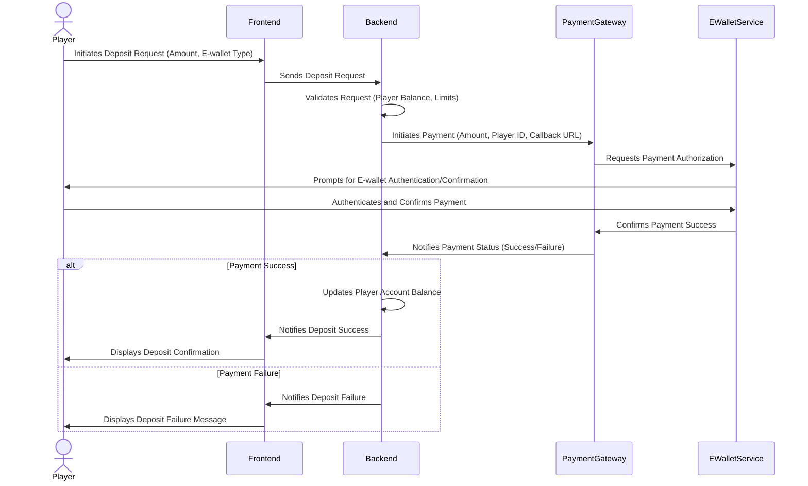

# Product Requirements Document: Foregate X Lucky Taya

**Author**: Manus AI

**Date**: March 12, 2026

**Version**: 2.0

## 1. Introduction

This Product Requirements Document (PRD) details the requirements for **Foregate X Lucky Taya**, an online gaming platform specifically designed for the Philippine market. The platform will adhere strictly to the regulations set forth by the Philippine Amusement and Gaming Corporation (PAGCOR). It will feature a customized frontend built with React, a robust backend developed in Java, and leverage a Platform as a Service (PaaS) for scalable infrastructure. The core functionality will revolve around **Polymarket-style prediction markets**, integrated with secure fiat payment acceptance and payout systems, with a strong emphasis on verifiable settlement and auditability.

## 2. Goals and Objectives

*   **Regulatory Compliance**: Ensure full compliance with all PAGCOR regulations, including Electronic Gaming Licensing, GLI-19 standards for Interactive Gaming Systems (with a focus on settlement integrity rather than RNG), Responsible Gaming Code of Practice, and comprehensive KYC/AML procedures.
*   **Market Relevance**: Deliver a highly localized and user-friendly experience for the Philippine market through a React-based frontend.
*   **Performance and Scalability**: Provide a high-performance, scalable, and reliable platform capable of handling significant user traffic and transaction volumes, powered by a Java backend on a PaaS infrastructure.
*   **Secure & Verifiable Financial Transactions**: Implement secure and efficient fiat payment and payout processes, supporting popular local payment methods, with transparent and auditable settlement mechanisms.
*   **Multi-Entity Support**: Establish a multi-tenant SaaS architecture to support multiple independent merchant entities, each with distinct branding and operational control.

## 3. Scope

**In-Scope**:
*   React-based frontend for user and merchant portals.
*   Java-based backend services for core logic, APIs, and integrations.
*   Polymarket-style prediction market modules: Market creation, trading, fees, closing conditions, and verifiable settlement.
*   User registration, authentication, and account management.
*   Fiat payment acceptance (deposits) via local payment gateways (GCash, Maya, Dragonpay, PayMongo).
*   Fiat payout (withdrawals) via local payment gateways.
*   Superadmin Backoffice Portal for global configuration.
*   Merchant Admin Portal for merchant-specific management, including a developer module.
*   KYC Management UI within the Admin Portal.
*   Dispute (Chargeback) Management Module.
*   Integration with third-party fraud and risk scoring tools (e.g., SEON).
*   Implementation of 3D Secure (3DS) with Transaction Risk Analysis (TRA) for payment security.
*   Separate internal and external API sets.
*   n8n workflow automation tool for internal processes.
*   Implementation of a 2-phase compliance approach (Checklist + Readiness, Compliance + Submission Pack Pre-check).

**Out-of-Scope**:
*   Development of native mobile applications (initially).
*   Integration with cryptocurrency payment methods (initially).
*   Development of a dedicated chat or messaging system (relying on existing communication channels).

## 4. User Stories / Use Cases

### 4.1. End-User (Player)

*   As a new player, I want to easily register and create an account so I can start participating in prediction markets.
*   As a player, I want to deposit funds using local payment methods (e.g., GCash, Maya) securely and quickly so I can place bets.
*   As a player, I want to browse various prediction markets (sports, politics, entertainment) and view real-time odds/prices.
*   As a player, I want to place bets on outcomes using the market interface.
*   As a player, I want to view my active bets, past results, and account balance.
*   As a player, I want to withdraw my winnings to my preferred local bank account or e-wallet.
*   As a player, I want to manage my personal information and set responsible gaming limits (e.g., deposit limits, self-exclusion).
*   As a player, I want to understand how market outcomes are determined and how payouts are calculated.
*   As a player, I want to be able to dispute a market outcome if I believe it was settled incorrectly.

### 4.2. Merchant (Lucky Taya Admin)

*   As a merchant admin, I want to log in to my dedicated portal to manage my platform.
*   As a merchant admin, I want to view real-time analytics and reports on user activity, deposits, withdrawals, and market performance.
*   As a merchant admin, I want to configure and launch new prediction markets for my users, defining game rules, fees, and closing conditions.
*   As a merchant admin, I want to manage user accounts, including KYC verification status and responsible gaming settings.
*   As a merchant admin, I want to access a developer module to manage API keys, configure webhooks, and set security rules (e.g., IP-based limits).
*   As a merchant admin, I want to manage disputes and chargebacks efficiently.
*   As a merchant admin, I want to define and manage settlement sources/oracles for markets.
*   As a merchant admin, I want to review and approve/reject market outcome disputes.

### 4.3. Superadmin

*   As a Superadmin, I want to access a central backoffice portal to manage all merchant entities.
*   As a Superadmin, I want to configure global settings, such as supported currencies, design templates, and content for all merchants.
*   As a Superadmin, I want to monitor overall platform performance and compliance across all entities.
*   As a Superadmin, I want to manage the n8n workflow automation tool for internal operational processes.
*   As a Superadmin, I want to oversee the compliance process, including readiness assessments and pre-submission checks for regulatory bodies.

## 5. Functional Requirements

### 5.1. User Management

*   **User Registration**: Secure registration process with email/phone verification.
*   **Authentication**: Multi-factor authentication (MFA) support.
*   **Profile Management**: Users can update personal details, change passwords, and view transaction history.
*   **Responsible Gaming**: Implementation of self-exclusion, deposit limits, and session time limits.

### 5.2. Prediction Market Modules

*   **Market Creation**: Functionality for authorized users (e.g., merchants, creators) to define new prediction markets, including:
    *   Market title, description, and event details.
    *   Specific outcomes for prediction.
    *   Market opening and closing conditions.
    *   Trading fees and other associated costs.
*   **Trading Mechanics**: Users can place bets/trades on market outcomes. This includes:
    *   **Automated Market Maker (AMM)**: System for automated liquidity provision and pricing of prediction outcomes.
    *   **Orderbook**: Real-time display and execution of buy/sell orders for outcome shares.
*   **Settlement Process**: A robust and transparent process for determining market outcomes and distributing payouts:
    *   **Outcome Determination**: Clear definition of how market outcomes are determined, utilizing verifiable external data sources or designated oracles.
    *   **Payout Calculation**: Automated calculation of payouts based on market rules, odds, user stakes, rounding rules, and deduction of platform fees.
    *   **Dispute Resolution**: Mechanism for users to submit disputes regarding market outcomes, with a defined process for review, appeal, and final decision by platform administrators.
*   **Rapid Settlement**: Automated settlement of markets upon event conclusion, with payouts processed swiftly.

### 5.3. Payment System

*   **Deposit**: Integration with PayMongo, Dragonpay, and Maya Business for PHP deposits via e-wallets, online banking, and OTC.
*   **Withdrawal**: Secure withdrawal process to linked bank accounts or e-wallets.
*   **Transaction History**: Detailed record of all deposits, withdrawals, and betting activities.
*   **Fraud Detection**: Real-time integration with third-party fraud scoring tools (e.g., SEON) to flag suspicious transactions [2].
*   **3DS with TRA**: Implementation of standalone 3D Secure with Transaction Risk Analysis for enhanced payment security [8].

### 5.4. Admin Portals

*   **Superadmin Backoffice**: Centralized control panel for global settings, merchant onboarding, and platform oversight.
*   **Merchant Admin Portal**: Dashboard for merchant-specific operations, user management, market configuration, and reporting.
*   **KYC Management UI**: Dedicated interface within the Admin Portal to manage customer ID verification, compliance questions, verification status, and documentation [2].
*   **Developer Module**: API key management, webhook configuration, and security rule settings (e.g., IP-based frequency/velocity limits) for merchants [5].
*   **Dispute Management**: Tools for both merchant and platform administrators to manage and resolve chargebacks and disputes [3], including market outcome disputes.

### 5.5. API Services

*   **Internal APIs**: Private APIs for communication between backend services.
*   **External (Public) APIs**: Well-documented APIs for merchant integrations, including a payment widget/component (JavaScript library) [6] [7].

### 5.6. Workflow Automation

*   **n8n Integration**: Utilize n8n for automating various internal operational workflows, such as reporting, alerts, and data synchronization.

## 6. Non-Functional Requirements

*   **Performance**: Low latency for real-time market updates and transaction processing. The system should handle a minimum of [X] transactions per second and [Y] concurrent users.
*   **Scalability**: The architecture must support horizontal scaling to accommodate future growth in users and market volume.
*   **Security**: Adherence to industry best practices for data encryption, access control, and vulnerability management. Regular security audits and penetration testing.
*   **Reliability**: High availability (e.g., 99.9% uptime) with robust error handling and disaster recovery mechanisms.
*   **Maintainability**: Clean, modular code with comprehensive documentation and automated testing.
*   **Compliance**: Full adherence to PAGCOR regulations, including data privacy (e.g., GDPR-like principles), KYC/AML, and responsible gaming guidelines. **Emphasis on auditability of settlement processes and financial transactions.**
*   **Localization**: Support for Philippine Peso (PHP) and English/Filipino languages.

## 7. Technical Specifications

*   **Frontend**: React.js for building dynamic and responsive user interfaces.
*   **Backend**: Java (e.g., Spring Boot framework) for developing robust, scalable, and secure microservices.
*   **Database**: MySQL for relational data storage, ensuring data integrity and transactional consistency. Potentially NoSQL databases for specific use cases requiring flexible schemas or high-speed data ingestion.
*   **PaaS**: Deployment on a major cloud provider (e.g., AWS Elastic Beanstalk, Google App Engine, Azure App Service) for managed infrastructure, auto-scaling, and simplified operations.
*   **Messaging/Queuing**: Utilize message brokers (e.g., Apache Kafka, RabbitMQ) for asynchronous communication between microservices and event-driven architectures.
*   **Caching**: Implement caching mechanisms (e.g., Redis, Memcached) to improve performance and reduce database load.
*   **Monitoring & Logging**: Comprehensive monitoring and logging solutions for system health, performance, and security auditing.

## 8. User Flows and Merchant Flows

### 8.1. End-User (Player) Flow: Deposit Funds

1.  Player logs into the platform.
2.  Player navigates to the "Deposit" section.
3.  Player selects a preferred payment method (e.g., GCash, Maya, Bank Transfer).
4.  Player enters the deposit amount.
5.  Player is redirected to the payment gateway's secure page or prompted to complete the transaction via their e-wallet app.
6.  Player completes the payment.
7.  Payment gateway notifies the platform of the transaction status.
8.  Platform updates the player's account balance upon successful deposit.
9.  Player receives a confirmation notification.

### 8.2. End-User (Player) Flow: Place a Bet on a Prediction Market

1.  Player logs into the platform.
2.  Player browses available prediction markets.
3.  Player selects a market (e.g., "2026 FIFA World Cup Winner").
4.  Player views available outcomes and their respective odds/prices.
5.  Player selects an outcome (e.g., "Spain to Win").
6.  Player enters the bet amount.
7.  Platform validates the bet (e.g., sufficient balance, market open).
8.  Player confirms the bet.
9.  Platform processes the bet and updates the player's active bets and balance.
10. Player receives a bet confirmation.

### 8.3. Merchant Admin Flow: Launch a New Prediction Market

1.  Merchant Admin logs into the Merchant Admin Portal.
2.  Merchant Admin navigates to the "Market Management" section.
3.  Merchant Admin selects "Create New Market."
4.  Merchant Admin inputs market details (e.g., title, description, event date, outcomes, initial odds, settlement source).
5.  Merchant Admin configures market type (e.g., AMM, Orderbook).
6.  Merchant Admin reviews and confirms market details.
7.  Platform creates the new market and makes it visible to end-users.
8.  Merchant Admin receives a confirmation.

### 8.4. Superadmin Flow: Configure Global Currency Settings

1.  Superadmin logs into the Superadmin Backoffice Portal.
2.  Superadmin navigates to the "Global Settings" section.
3.  Superadmin selects "Currency Management."
4.  Superadmin views the list of currently supported currencies.
5.  Superadmin adds a new currency or modifies an existing one (e.g., exchange rates, display format).
6.  Superadmin saves the changes.
7.  Platform updates global currency settings, affecting all merchant entities.
8.  Superadmin receives a confirmation.

## 9. Mockups / Wireframes

*(To be provided in a separate deliverable, illustrating key user interfaces for the User Portal, Merchant Admin Portal, and Superadmin Backoffice Portal. This will include layouts for registration, deposit/withdrawal forms, market browsing, bet placement, KYC management, and global settings configuration.)*

## 10. Comparison Table: Payment Gateways

| Feature             | PayMongo                               | Dragonpay                                  | Maya Business                              |
| :------------------ | :------------------------------------- | :----------------------------------------- | :----------------------------------------- |
| **Supported Methods** | Cards, E-wallets, QR Ph                | E-wallets, Online Banking, OTC, Cards      | E-wallets, QR Ph, Cards                    |
| **API Integration** | Modern RESTful API                     | Comprehensive API                          | RESTful API                                |
| **Fraud Tools**     | Basic built-in, integrates with others | Basic built-in, integrates with others     | Basic built-in, integrates with others     |
| **KYC/AML Support** | Yes                                    | Yes                                        | Yes                                        |
| **Gaming Industry** | Requires specific merchant approval    | Requires specific merchant approval        | Requires specific merchant approval        |
| **Ease of Integration** | High                                   | Moderate                                   | High                                       |

## 11. Sequence Diagram: Player Deposit via E-wallet

## 12. Optional Enhancements for Consideration

*   **Gamification Elements**: Leaderboards, achievements, and loyalty programs to enhance user engagement.
*   **Social Features**: In-platform chat, friend invites, and social sharing of market predictions.
*   **Advanced Analytics**: More sophisticated reporting and business intelligence tools for merchants and superadmins.
*   **Multi-language Support**: Expansion beyond English/Filipino to other regional languages.
*   **Push Notifications/SMS Alerts**: Real-time updates for market changes, bet outcomes, and promotions.

## 13. References

1.  [Foregate Project Acronym Clarification: BC = Betting](https://www.manus.im/knowledge/Foregate-Project-Acronym-Clarification-BC-Betting)
2.  [Payment Gateway Requirement: External Fraud Tool Integration and KYC/AML Compliance](https://www.manus.im/knowledge/Payment-Gateway-Requirement-External-Fraud-Tool-Integration-and-KYC-AML-Compliance)
3.  [Dispute (Chargeback) Management Module Requirement](https://www.manus.im/knowledge/Dispute-Chargeback-Management-Module-Requirement)
4.  [Multi-Entity SaaS Platform Architecture Preference](https://www.manus.im/knowledge/Multi-Entity-SaaS-Platform-Architecture-Preference)
5.  [Merchant Pricing Structure and Developer Module Requirements](https://www.manus.im/knowledge/Merchant-Pricing-Structure-and-Developer-Module-Requirements)
6.  [API Architecture Separation: Internal vs. External](https://www.manus.im/knowledge/API-Architecture-Separation-Internal-vs-External)
7.  [Payment Widget/Component for Merchant Integration](https://www.manus.im/knowledge/Payment-Widget-Component-for-Merchant-Integration)
8.  [European Payment Flow Requirement: Standalone 3DS with TRA](https://www.manus.im/knowledge/European-Payment-Flow-Requirement-Standalone-3DS-with-TRA)
